# DE1-Soc

USER MANUAL

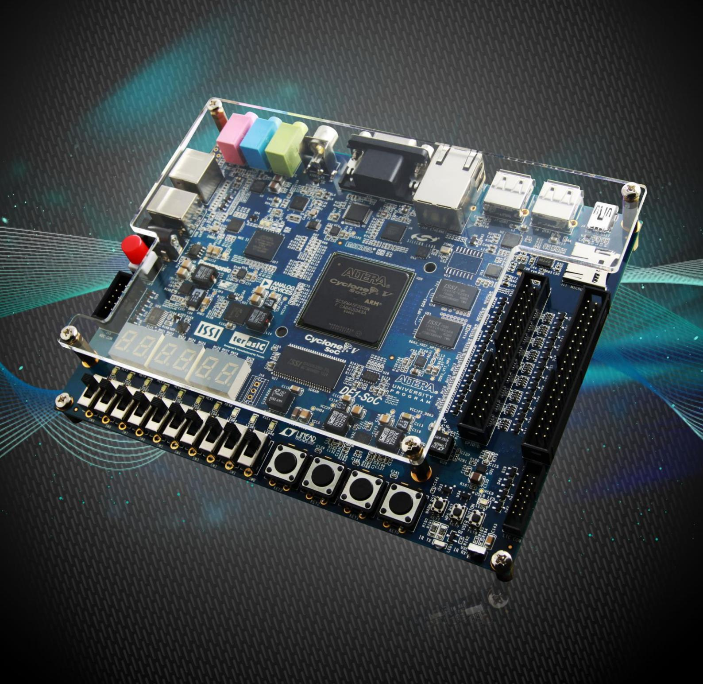


## **CONTENTS**

| CHAPTER 1     | DE1-SOC DEVELOPMENT KIT                 | 3  |
|---------------|-----------------------------------------|----|
| 1.1 PACKAGE   | e Contents                              | 3  |
| 1.2 DE1-Soc   | C System CD                             | 4  |
| 1.3 GETTING   | G HELP                                  | 4  |
| CHAPTER 2     | INTRODUCTION OF THE DE1-SOC BOARD       | 5  |
| 2.1 LAYOUT    | AND COMPONENTS                          | 5  |
| 2.2 BLOCK D   | DIAGRAM OF THE DE1-SOC BOARD            | 7  |
| CHAPTER 3     | USING THE DE1-SOC BOARD                 |    |
| 3.1 BOARD S   | Setup                                   | 10 |
| 3.1.1 FPGA    | CONFIGURATION MODE SETTING              | 10 |
| 3.1.2 HPS B   | OOTSEL AND CLKSEL SETTING               | 11 |
| 3.2 CONFIGU   | JRING THE CYCLONE V SOC FPGA            | 13 |
| 3.3 BOARD S   | STATUS ELEMENTS                         | 18 |
| 3.4 BOARD R   | RESET ELEMENTS                          | 19 |
| 3.5 CLOCK C   | Circuitry                               | 20 |
| 3.6 INTERFAC  | CE ON FPGA                              | 21 |
| 3.6.1 USER P  | PUSH-BUTTONS, SWITCHES AND LEDS ON FPGA | 22 |
| 3.6.2 USING   | THE 7-SEGMENT DISPLAYS                  | 25 |
| 3.6.3 USING   | THE 2x20 GPIO EXPANSION HEADERS         | 27 |
| 3.6.4 USING   | THE 24-BIT AUDIO CODEC                  | 29 |
| 3.6.5 I2C Mt  | ULTIPLEXER                              | 30 |
| 3.6.6 VGA     |                                         | 31 |
| 3.6.7 TV DE   | CODER                                   | 34 |
| 3.6.8 IR REC  | CEIVER                                  | 36 |
| 3.6.9 IR Emi  | ITTER LED                               | 36 |
| 3.6.10 SDRA   | AM MEMORY ON FPGA                       | 37 |
| 3.6.11 PS/2 S | SERIAL PORT                             | 39 |
| 3.6.12 A/D C  | Converter and 2x5 Header                | 41 |
|               | CE ON HARD PROCESSOR SYSTEM (HPS)       |    |
|               | PUSH-BUTTON AND LED ON HPS              |    |
| 3.7.2 GIGABI  | IT ETHERNET                             | 43 |
|               |                                         |    |
| 3.7.4 DDR3    | MEMORY ON HPS                           | 45 |
|               | FLASH                                   |    |
| -             |                                         |    |


| 3.7.6 MICRO  | SD                                                        | 48             |
|--------------|-----------------------------------------------------------|----------------|
| 3.7.7 2-PORT | USB Host                                                  | 49             |
| 3.7.8 G-SENS | SOR                                                       | 50             |
| 3.7.9 LTC Co | ONNECTOR                                                  | 51             |
| CHAPTER 4    | DE1-SOC SYSTEM BUILDER                                    | 53             |
| 4.1 Introdu  | CTION                                                     | 53             |
| 4.2 GENERAL  | DESIGN FLOW                                               | 53             |
| 4.3 Using DI | E1-SoC System Builder                                     | 54             |
| CHAPTER 5    | EXAMPLES FOR FPGA                                         | 60             |
| 5.1 DE1-SoC  | C FACTORY CONFIGURATION                                   | 60             |
| 5.2 Audio Ri | ECORDING AND PLAYING                                      | 61             |
| 5.3 A KARAO  | KE MACHINE                                                | 64             |
| 5.4 SDRAM    | TEST BY NIOS II                                           | 66             |
| 5.5 SDRAM    | RTL TEST                                                  | 69             |
| 5.6 TV Box 1 | DEMONSTRATION                                             | 71             |
| 5.7 PS/2 MO  | USE DEMONSTRATION                                         | 74             |
| 5.8 IR EMITT | ER LED AND RECEIVER DEMONSTRATION                         | 7 <del>6</del> |
| 5.9 ADC REA  | ADING                                                     | 82             |
| CHAPTER 6    | EXAMPLES FOR HPS SOC                                      | 85             |
| 6.1 HELLO PI | ROGRAM                                                    | 85             |
| 6.2 Users LI | ED AND KEY                                                | 87             |
| 6.3 I2C INTE | RFACED G-SENSOR                                           | 93             |
| 6.4 I2C MUX  | (Test                                                     | 96             |
| CHAPTER 7    | EXAMPLES FOR USING BOTH HPS SOC AND FGPA                  | 99             |
| 7.1 HPS CON  | TROL LED AND HEX                                          | 99             |
| CHAPTER 8    | STEPS OF PROGRAMMING THE QUAD SERIAL CONFIGURATION DEVICE | 103            |
| 8.1 Before y | YOU BEGIN                                                 | 103            |
|              | SOF FILE TO .JIC FILE                                     |                |
| 8.3 Write JI | C File into Quad Serial Configuration Device              | 108            |
|              | IE QUAD SERIAL CONFIGURATION DEVICE                       |                |
| CHAPTER 9    | APPENDIX                                                  | 112            |
| 9.1 REVISION | HISTORY                                                   | 112            |
|              | HT STATEMENT                                              | 110            |


## Chapter 1 DE1-SoC Development Kit

<span id="page-3-0"></span>The DE1-SoC Development Kit presents a robust hardware design platform built around the Altera System-on-Chip (SoC) FPGA, which combines the latest dual-core Cortex-A9 embedded cores with industry-leading programmable logic for ultimate design flexibility. Users can now leverage the power of tremendous re-configurability paired with a high-performance, low-power processor system. Altera's SoC integrates an ARM-based hard processor system (HPS) consisting of processor, peripherals and memory interfaces tied seamlessly with the FPGA fabric using a high-bandwidth interconnect backbone. The DE1-SoC development board includes hardware such as high-speed DDR3 memory, video and audio capabilities, Ethernet networking, and much more.

The DE1-SoC Development Kit contains all components needed to use the board in conjunction with a computer that runs the Microsoft Windows XP or later.

## <span id="page-3-1"></span>1.1 Package Contents

**[Figure 1-1](#page-3-2)** shows a photograph of the DE1-SoC package.

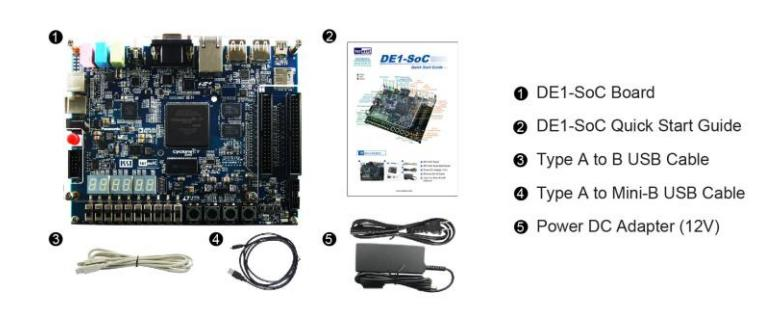

<span id="page-3-2"></span>**Figure 1-1 The DE1-SoC package contents**


The DE1-SoC package includes:

- The DE1-SoC development board
- DE1-SoC Quick Start Guide
- USB Cable (Type A to B) for FPGA programming and control
- USB Cable (Type A to Mini-B) for UART control
- DE1-SoC System CD-ROM
- <span id="page-4-0"></span>12V DC power adapter

## 1.2 DE1-SoC System CD

The DE1-SoC System CD containing the DE1-SoC documentation and supporting materials, including the User Manual, System Builder, reference designs and device datasheets. User can download this System CD form the link : http://de1-soc.terasic.com.

## <span id="page-4-1"></span>1.3 Getting Help

Here are the addresses where you can get help if you encounter any problem:

- Altera Corporation
- 101 Innovation Drive San Jose, California, 95134 USA

Email: [university@altera.com](file:///C:/Users/User/AppData/Roaming/Microsoft/Word/參考/12.06.2013/參考/12.03.2013/參考/11.26.2013/參考/09.17.2013/參考/09.14.2013/參考/09.14.2013/參考/08.14.2013/university@altera.com)

- Terasic Technologies
- 9F., No.176, Sec.2, Gongdao 5th Rd, East Dist, Hsinchu City, 30070. Taiwan

Email: [support@terasic.com](mailto:support@terasic.com)

Tel.: +886-3-575-0880

Web: [de1-soc.terasic.com](http://www.terasic.com.tw/cgi-bin/page/archive.pl?Language=English&No=836)


<span id="page-5-0"></span>

## Chapter 2 Introduction of the DE1-SoC Board

This chapter presents the features and design characteristics of the board.

## <span id="page-5-1"></span>2.1 Layout and Components

A photograph of the board is shown in **[Figure 2-1.](#page-5-2)** It depicts the layout of the board and indicates the location of the connectors and key components.

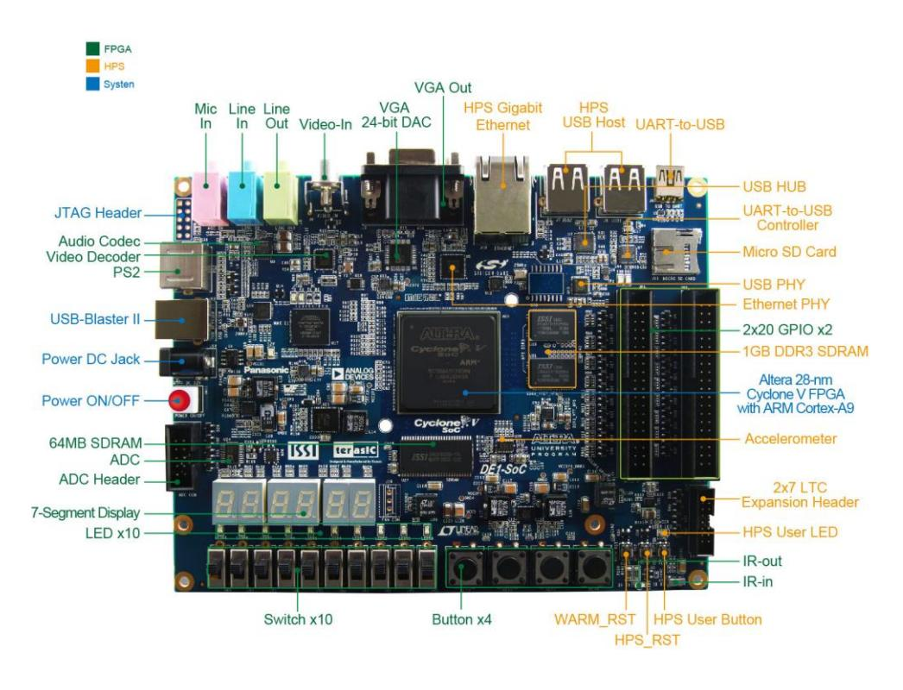

<span id="page-5-2"></span>**Figure 2-1 Development Board (top view)**


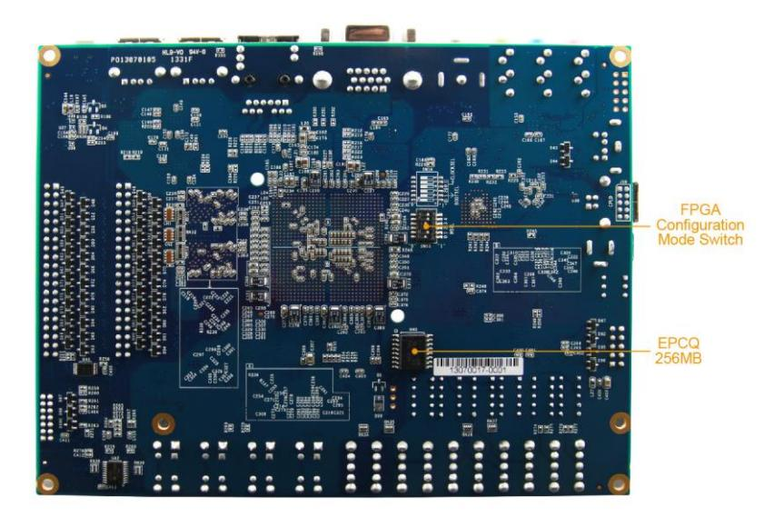

**Figure 2-2 Development Board (bottom view)**

The DE1-SoC board has many features that allow users to implement a wide range of designed circuits, from simple circuits to various multimedia projects.

The following hardware is provided on the board:

#### **FPGA**

- Altera Cyclone® V SE 5CSEMA5F31C6N device
- Altera Serial Configuration device EPCQ256
- USB Blaster II(on board) for programming; JTAG Mode
- 64MB SDRAM (16-bit data bus)
- 4 Push-buttons
- 10 Slide switches
- 10 Red user LEDs
- Six 7-segment displays
- Four 50MHz clock sources from clock generator
- 24-bit CD-quality audio CODEC with line-in, line-out, and microphone-in jacks
- VGA DAC (8-bit high-speed triple DACs) with VGA-out connector
- TV Decoder (NTSC/PAL/SECAM) and TV-in connector
- PS/2 mouse/keyboard connector
- IR receiver and IR emitter
- Two 40-pin Expansion Header with diode protection
- A/D Converter, 4-pin SPI interface with FPGA


#### **HPS (Hard Processor System)**

- 800MHz Dual-core ARM Cortex-A9 MPCore processor
- 1GB DDR3 SDRAM (32-bit data bus)
- 1 Gigabit Ethernet PHY with RJ45 connector
- 2-port USB Host, Normal Type-A USB connector
- Micro SD card socket
- Accelerometer (I2C interface + interrupt)
- UART to USB, USB Mini-B connector
- Warm reset button and cold reset button
- One user button and one user LED
- <span id="page-7-0"></span>LTC 2x7 expansion header

## 2.2 Block Diagram of the DE1-SoC Board

**[Figure 2-3](#page-7-1)** gives the block diagram of the board. To provide maximum flexibility for the user, all connections are made through the Cyclone V SoC FPGA device. Thus, the user can configure the FPGA to implement any system design.

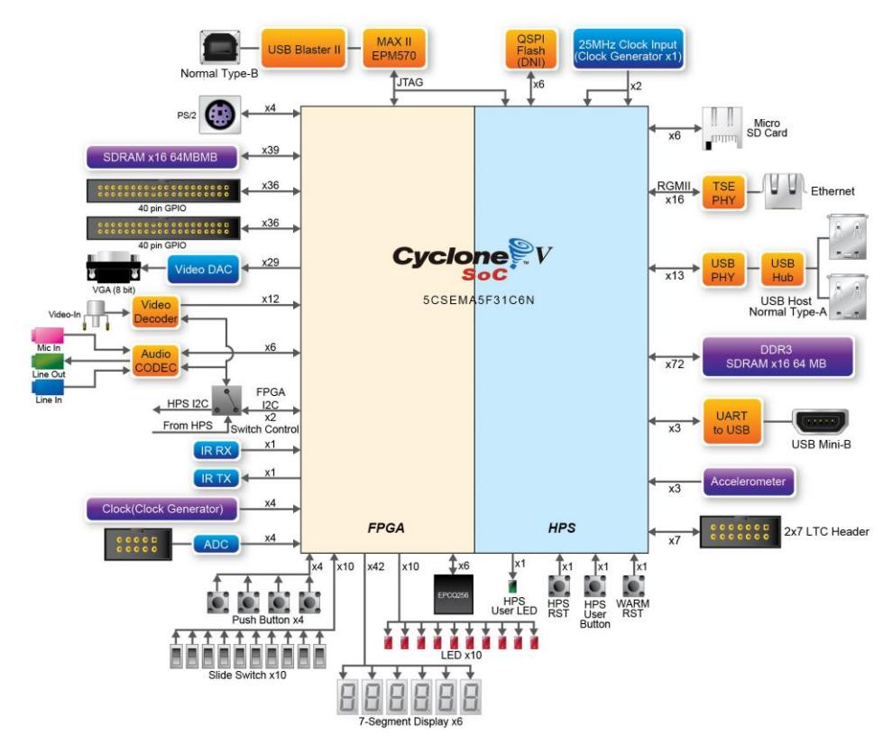

<span id="page-7-1"></span>**Figure 2-3 Board Block Diagram**


Following is more detailed information about the blocks in **[Figure 2-3](#page-7-1)**:

## **FPGA Device**

- Cyclone V SoC 5CSEMA5F31 Device
- Dual-core ARM Cortex-A9 (HPS)
- 85K Programmable Logic Elements
- 4,450 Kbits embedded memory
- 6 Fractional PLLs
- 2 Hard Memory Controllers

## **Configuration and Debug**

- Quad Serial Configuration device EPCQ256 on FPGA
- On-Board USB Blaster II (Normal type B USB connector)

## **Memory Device**

- 64MB (32Mx16) SDRAM on FPGA
- 1GB (2x256Mx16) DDR3 SDRAM on HPS
- 128MB QSPI Flash on HPS
- Micro SD Card Socket on HPS

## **Communication**

- Two Port USB 2.0 Host (ULPI interface with USB type A connector)
- UART to USB (USB Mini-B connector)
- 10/100/1000 Ethernet
- PS/2 mouse/keyboard
- IR Emitter/Receiver
- I2C Multiplexer

## **Connectors**

- Two 40-pin Expansion Headers
- One 10-pin ADC Input Header
- One LTC connector (One Serial Peripheral Interface (SPI) Master ,one I2C and one GPIO interface )


## **Display**

24-bit VGA DAC

## **Audio**

24-bit CODEC, Line-in, line-out, and microphone-in jacks

## **Video Input**

TV Decoder (NTSC/PAL/SECAM) and TV-in connector

## **Switches, Buttons and Indicators**

- 5 User Keys (FPGA x4, HPS x1)
- 10 User switches (FPGA x10)
- 11 User LEDs (FPGA x10, HPS x 1)
- 2 HPS Reset Buttons (HPS\_RESET\_n and HPS\_WARM\_RST\_n)
- Six 7-segment displays

## **Sensors**

G-Sensor on HPS

## **Power**

12V DC input


## Chapter 3 Using the DE1-SoC Board

<span id="page-10-0"></span>This chapter gives instructions for using the board and describes each of its peripherals.

## <span id="page-10-1"></span>3.1 Board Setup

This section will explain the settings of FPGA configuration modes, HPS boot source select and HPS flash controller clock frequency in detail.

## <span id="page-10-2"></span>3.1.1 FPGA Configuration Mode Setting

**[Table 3-1](#page-10-3)** gives the MSEL pins setting for each configuration scheme of Cyclone V SoC devices. FPGA default works in ASx4 Fast mode with MSEL[4:0] = 10010.

**Table 3-1 MSEL pin Settings for each Scheme of Cyclone V Device**

<span id="page-10-3"></span>

| Configuration<br>Scheme | Compression Feature | Design Security<br>Feature | POR Delay | Valid MSEL[4:0] |
|-------------------------|---------------------|----------------------------|-----------|-----------------|
|                         | Disabled            | Disabled                   | Fast      | 10100           |
|                         |                     |                            | Standard  | 11000           |
|                         | Disabled            | Enabled                    | Fast      | 10101           |
| FPPx8                   |                     |                            | Standard  | 11001           |
|                         | Enabled             | Disabled                   | Fast      | 10110           |
|                         |                     |                            | Standard  | 11010           |
|                         |                     | Enabled                    | Fast      | 00000           |
|                         | Disabled            |                            | Standard  | 00100           |
|                         | Disabled            | Disabled                   | Fast      | 00001           |
| FPPx16                  |                     |                            | Standard  | 00101           |
|                         | Enabled<br>Enabled  |                            | Fast      | 00010           |
|                         |                     |                            | Standard  | 00110           |


|                                    | Enabled/ Disabled | Disabled | Fast     | 10000 |
|------------------------------------|-------------------|----------|----------|-------|
| PS                                 |                   |          | Standard | 10001 |
|                                    |                   | Enabled  | Fast     | 10010 |
| AS(X1 and X4)<br>Enabled/ Disabled |                   |          | Standard | 10011 |

**Table 3-2** shows the switch controls and descriptions for MSEL.

**Table 3-2 SW10 FPGA Configuration Mode Switch**

| Board Reference | Signal Name | Description                             | Default |
|-----------------|-------------|-----------------------------------------|---------|
| SW10.1          | MSEL0       |                                         | On      |
| SW10.2          | MSEL1       | Sets the Cyclone V MSEL[4:0] pins.      | Off     |
| SW10.3          | MSEL2       | Use these pins to set the configuration | On      |
| SW10.4          | MSEL3       | scheme and POR delay.                   | On      |
| SW10.5          | MSEL4       |                                         | Off     |
| SW10.6          | N/A         | N/A                                     | N/A     |

## <span id="page-11-0"></span>3.1.2 HPS BOOTSEL and CLKSEL Setting

The processor in the HPS can be boot from many sources such as the SD card, QSPI Flash or FPGA. Selecting the boot source for the HPS can be set using the BOOTSEL signal. **[Figure 3-1](#page-13-1)** lists the settings for selecting a suitable boot source. The default boot source for the HPS is from SD card with fixing BOOTSEL[2:0] = 101. HPS flash controller clock frequency can be set using CLOCKSEL signal. **[Table 3-3](#page-11-1)** lists the setting for SD/MMC controller CLOCKSEL pins. The default CLOCKSEL setting is CLOCKSEL[1:0] = 00.

If users need to change BOOTSEL[2:0] and CLOCKSEL[1:0] setting, since we make our schematic/layout flexible, users can change BOOTSEL[2:0] and CLOCKSEL[1:0] by :

- Change the BOOTSEL and CLOCKSEL resistors on the board
- By soldering or removing the resistors (R97~R100, R106~R111) will change the value of BOOTSEL and CLOCKSEL.
- Add a x6 dip switch (SW16) on the board
- <span id="page-11-1"></span> Solder SW16, R97, R98, R107 and remove R99, R100, R110, will let MSEL[4:0] value to be changed by switching SW16. **[Table 3-4](#page-12-0)** shows the switch controls and descriptions for MSEL

**Table 3-3 BOOTSEL[2:0] Setting Values and Flash Device Selection**

| BOOTSEL[2:0] Setting Value | Flash Device              |
|----------------------------|---------------------------|
| 000                        | Reserved                  |
| 001                        | FPGA (HPS-to-FPGA bridge) |


| 010 | 1.8 V NAND Flash memory (*1)           |
|-----|----------------------------------------|
| 011 | 3.0 V NAND Flash memory(*1)            |
| 100 | 1.8 V SD/MMC Flash memory(*1)          |
| 101 | 3.0 V SD/MMC Flash memory              |
| 110 | 1.8 V SPI or quad SPI Flash memory(*1) |
| 111 | 3.0 V SPI or quad SPI Flash memory     |

## (\*1): Not supported on DE1-SoC board

Table 3-4 SD/MMC Controller CSEL Pin Settings

<span id="page-12-0"></span>

| Setting                     |                                                  | CSEL Pin                       |                             |                             |                              |
|-----------------------------|--------------------------------------------------|--------------------------------|-----------------------------|-----------------------------|------------------------------|
|                             |                                                  | 0                              | 1                           | 2                           | 3                            |
| Osc1_clk (EOSC1 pin) range  |                                                  | 10-50MHz                       | 10-12.5MHz                  | 12.5-25MHz                  | 25-50MHz                     |
| ID mode                     | sdmmc_cclk_out device<br>clock                   | Osc1_clk/128,<br>391 KHz max   | Osc1_clk/32,<br>391 KHz max | Osc1_clk/64,<br>391 KHz max | Osc1_clk/128,<br>391 KHz max |
|                             | Controller baud rate divisor                     | 32                             | 32                          | 32                          | 32                           |
| Data<br>transfer<br>mode    | sdmmc_cclk_out device clock                      | Osc1_clk/4, 391<br>12.5MHz max | Osc1_clk*1,<br>12.5MHz max  | Osc1_clk/2,<br>12.5MHz max  | Osc1_clk/4,<br>12.5MHz max   |
|                             | Controller baud rate divisor (even numbers only) | 1 (bypass)                     | 1 (bypass                   | 1 (bypass                   | 1 (bypass                    |
| sdmmc_clk controller clock: |                                                  | Osc1_clk,<br>50MHz max         | Osc1_clk,<br>50MHz max      | Osc1_clk,<br>50MHz max      | Osc1_clk*2,<br>50MHz max     |
| mpu_clk                     |                                                  | Osc1_clk,<br>50MHz max         | Osc1_clk*32,<br>400MHz max  | Osc1_clk*16,<br>400MHz max  | Osc1_clk*8,<br>400MHz max    |
| PLL modes                   |                                                  | Bypassed                       | Locked                      | Locked                      | Locked                       |

Table 3-5 SW16 HPS BOOTSEL and CLKSEL Setting

| Board Reference | Signal Name | Description                       | Default |
|-----------------|-------------|-----------------------------------|---------|
| SW16.1          | BOOTSEL0    |                                   | Off     |
| SW16.2          | BOOTSEL1    | Octo the October V DOOTSELISES    | On      |
| SW16.3          | BOOTSEL2    | Sets the Cyclone V BOOTSEL[2:0] a | Off     |
| SW16.4          | CLOCKSEL0   | CLOCKSEL[1.0] pills.              | On      |
| SW16.5          | CLOCKSEL1   |                                   | On      |
| SW16.6          | N/A         | N/A                               | N/A     |


## <span id="page-13-0"></span>3.2 Configuring the Cyclone V SoC FPGA

The DE1-SoC board contains a serial configuration device that stores configuration data for the Cyclone V SoC FPGA. This configuration data is automatically loaded from the configuration device into the FPGA every time while power is applied to the board. Using the Quartus II software, it is possible to reconfigure the FPGA at any time, and it is also possible to change the non-volatile data that is stored in the serial configuration device. Both types of programming methods are described below.

- 1. JTAG programming: In this method of programming, named after the IEEE standards Joint Test Action Group, the configuration bit stream is downloaded directly into the Cyclone V SoC FPGA. The FPGA will retain this configuration as long as power is applied to the board; the configuration information will be lost when the power is turned off.
- 2. AS programming: In this method, called Active Serial programming, the configuration bit stream is downloaded into the quad serial configuration device (EPCQ256). It provides non-volatile storage of the bit stream, so that the information is retained even when the power supply to the DE1-SoC board is turned off. When the board's power is turned on, the configuration data in the EPCQ256 device is automatically loaded into the Cyclone V SoC FPGA.

#### **JTAG Chain on DE1-SoC Board**

To use JTAG interface for configuring FPGA device, the JTAG chain on DE1-SoC must form a close loop that allows Quartus II programmer to detect FPGA device. **[Figure 3-1](#page-13-1)** illustrates the JTAG chain on DE1-SoC board.

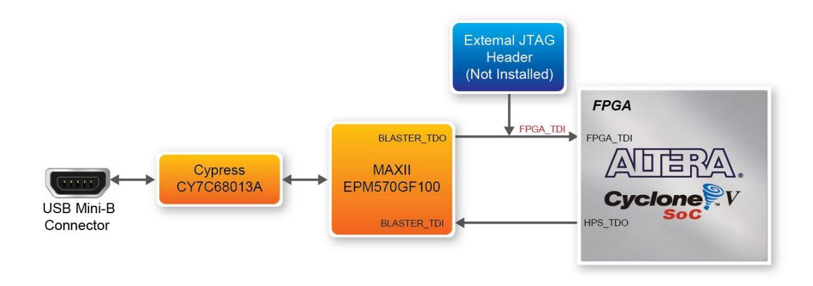

<span id="page-13-1"></span>**Figure 3-1 The JTAG chain on the board**


### **Configuring the FPGA in JTAG Mode**

There are two devices (FPGA and HPS) on the JTAG Chain, the configure flow is different from DE1. The following shows the programming flow with JTAG mode step by step.

Open Programmer and click "Auto Detect " as **[Figure 3-2](#page-14-0)**

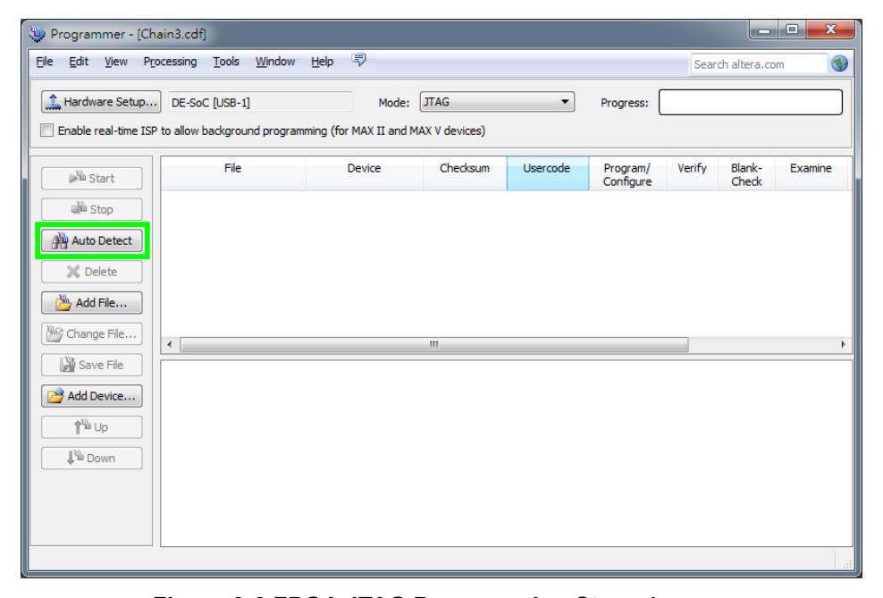

**Figure 3-2 FPGA JTAG Programming Steps 1**

Select detected device as **[Figure 3-3](#page-14-1)** (Please select device as same as which shows on the board)

<span id="page-14-1"></span><span id="page-14-0"></span>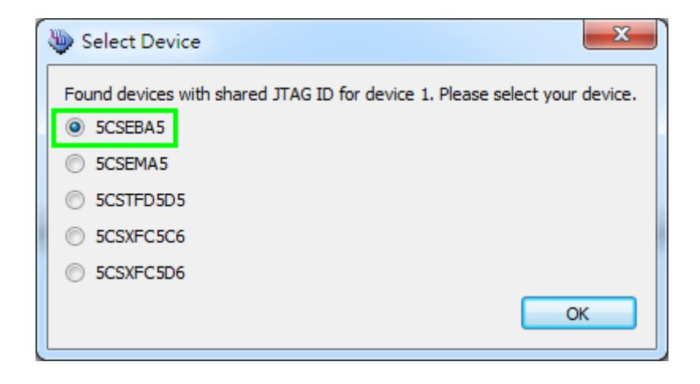

**Figure 3-3 FPGA JTAG Programming Steps 2**


Both FPGA and HPS will be detected as **[Figure 3-4](#page-15-0)**

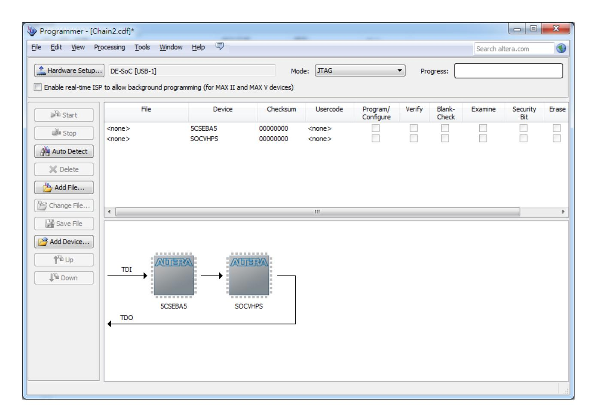

**Figure 3-4 FPGA JTAG Programming Steps 3**

<span id="page-15-0"></span> Click the FPGA device, right click mouse to popup the manual, and then select .sof file for FPGA as **[Figure 3-5](#page-16-0)**


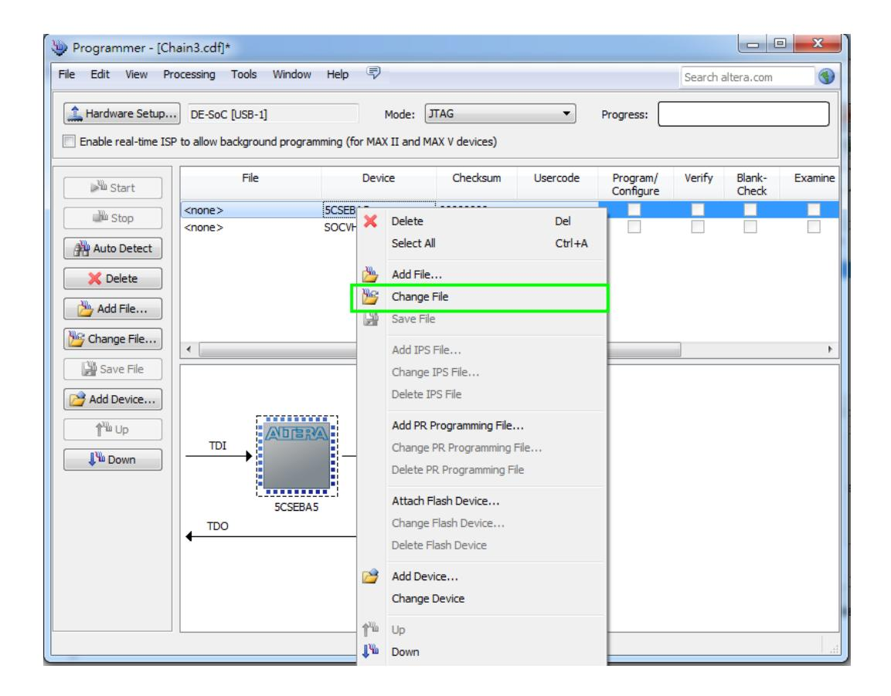

**Figure 3-5 FPGA JTAG Programming Steps 4**

<span id="page-16-0"></span>Select .sof file for FPGA as **[Figure 3-6](#page-16-1)**

<span id="page-16-1"></span>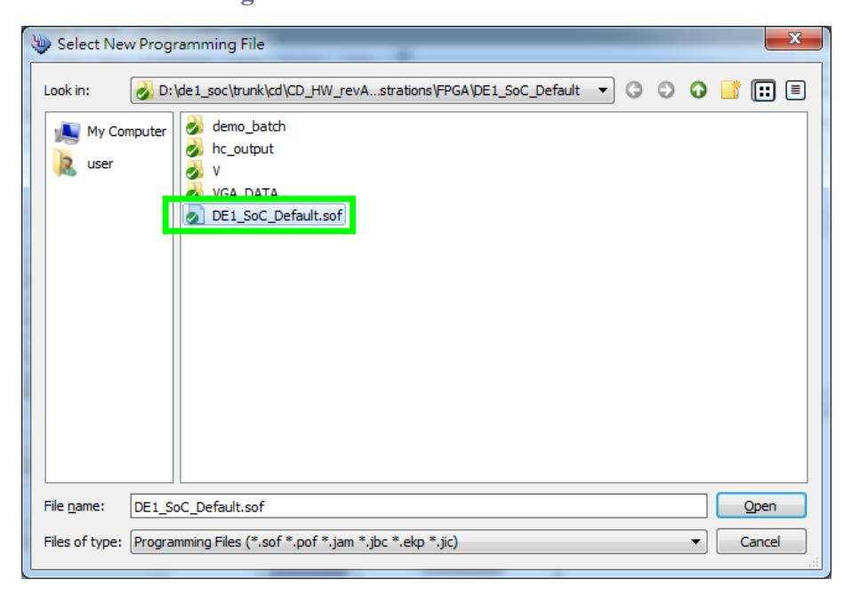

**Figure 3-6 FPGA JTAG Programming Steps 5**


 Click "Program/Configure" check box, and then click "Start" button to download .sof file into FPGA as **[Figure 3-7](#page-17-0)**

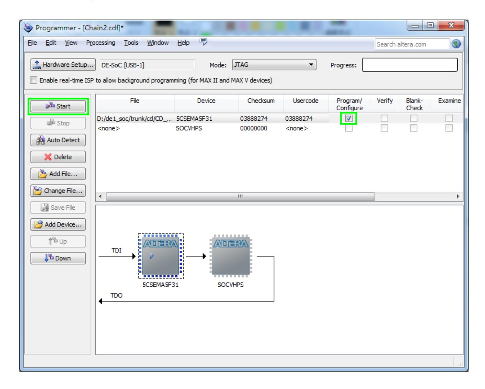

<span id="page-17-0"></span>**Figure 3-7 FPGA JTAG Programming Steps 6**

## **Configuring the FPGA in AS Mode (from EPCQ256)**

- The board contains a quad serial configuration device (EPCQ256) that stores configuration data for the Cyclone V SoC FPGA. This configuration data is automatically loaded from the quad serial configuration device chip into the FPGA when the board is powered up.
- To program the configuration device, users will need to use a Serial Flash Loader (SFL) function to program the quad serial configuration device via the JTAG interface. The


FPGA-based SFL is a soft intellectual property (IP) core within the FPGA that bridges the JTAG and flash interfaces. The SFL mega-function is available from Quartus II software. **[Figure 3-8](#page-18-1)** shows the programming method when adopting a SFL solution

 Please refer to Chapter 9: Steps of Programming the Quad Serial Configuration Device for the basic programming instruction on the serial configuration device

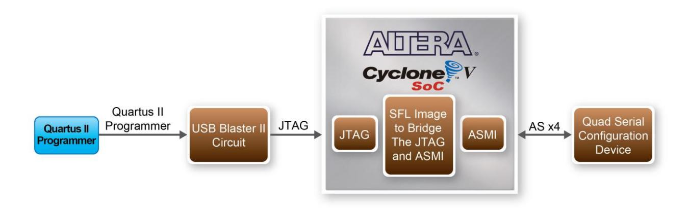

**Figure 3-8 Programming a Quad Serial Configuration Device with the SFL Solution**

## <span id="page-18-1"></span><span id="page-18-0"></span>3.3 Board Status Elements

The board includes status LEDs. Please refer t**o [Table 3-6](#page-18-2)** for the status of the LED indicator.

**Table 3-6 LED Indicators**

<span id="page-18-2"></span>

| Board Reference | LED Name   | Description                                    |
|-----------------|------------|------------------------------------------------|
| D14             | 12-V Power | Illuminates when 12-V power is active.         |
| TXD             | UART TXD   | Illuminates when data from FT232R to USB Host. |
| RXD             | UART RXD   | Illuminates when data from USB Host to FT232R. |
| D5              | JTAG_RX    | Reserved                                       |
| D4              | JTAG_TX    |                                                |


## <span id="page-19-0"></span>3.4 Board Reset Elements

The board equips two HPS reset circuits (See **[Figure 3-9](#page-19-1)**). **[Table 3-7](#page-19-2)** shows the buttons references and its descriptions. **[Figure 3-10](#page-20-1)** shows the reset tree on the board.

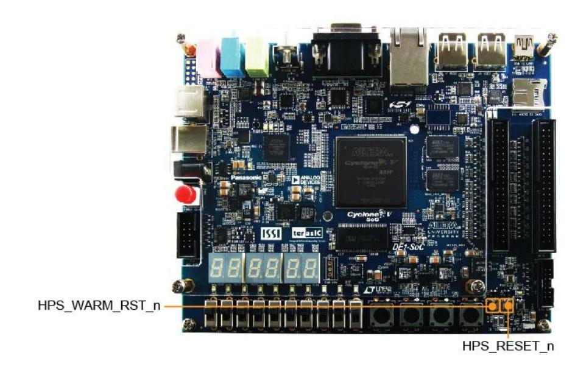

**Figure 3-9 Board Reset Elements**

**Table 3-7 Reset Elements**

<span id="page-19-2"></span><span id="page-19-1"></span>

| Board Reference | Signal Name    | Description                                                                                                                                                                                               |
|-----------------|----------------|-----------------------------------------------------------------------------------------------------------------------------------------------------------------------------------------------------------|
| KEY5            | HPS_RESET_N    | Cold reset to the HPS , Ethernet PHY and USB host device .<br>Active low input that will reset all HPS logics that can be reset.<br>Places the HPS in a default state sufficient for software to<br>boot. |
| KEY7            | HPS_WARM_RST_N | Warm reset to the HPS block. Active low input affects the<br>system reset domains which allows debugging to operate.                                                                                      |


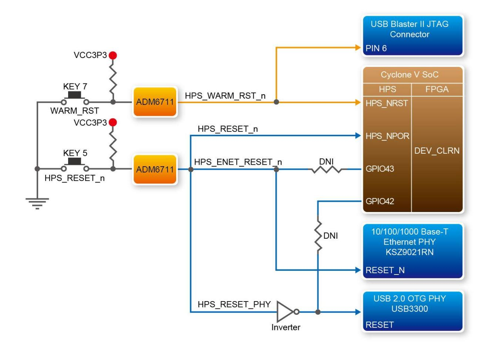

**Figure 3-10 Reset Tree on the Development Board**

## <span id="page-20-0"></span>3.5 Clock Circuitry

<span id="page-20-1"></span>

**[Figure 3-11](#page-21-1)** is a diagram showing the default frequencies of all of the external clocks going to the Cyclone V SoC FPGA. A clock generator is used to distribute clock signals with low jitter to FPGA. The four distributing 50MHz clock signals are connected to the FPGA that are used for clocking the user logic. One distributing 25MHz clock signal is connected to HPS clock inputs, the other distributing 25MHz clock signal is connected to the clock input of Gigabit Ethernet Transceiver. Two distributing 24MHz clock signals are connected to clock inputs of USB Host/OTG PHY and USB Hub controller, respectively. The associated pin assignments for clock inputs to FPGA I/O pins are listed in **[Table 3-8](#page-21-2)**.


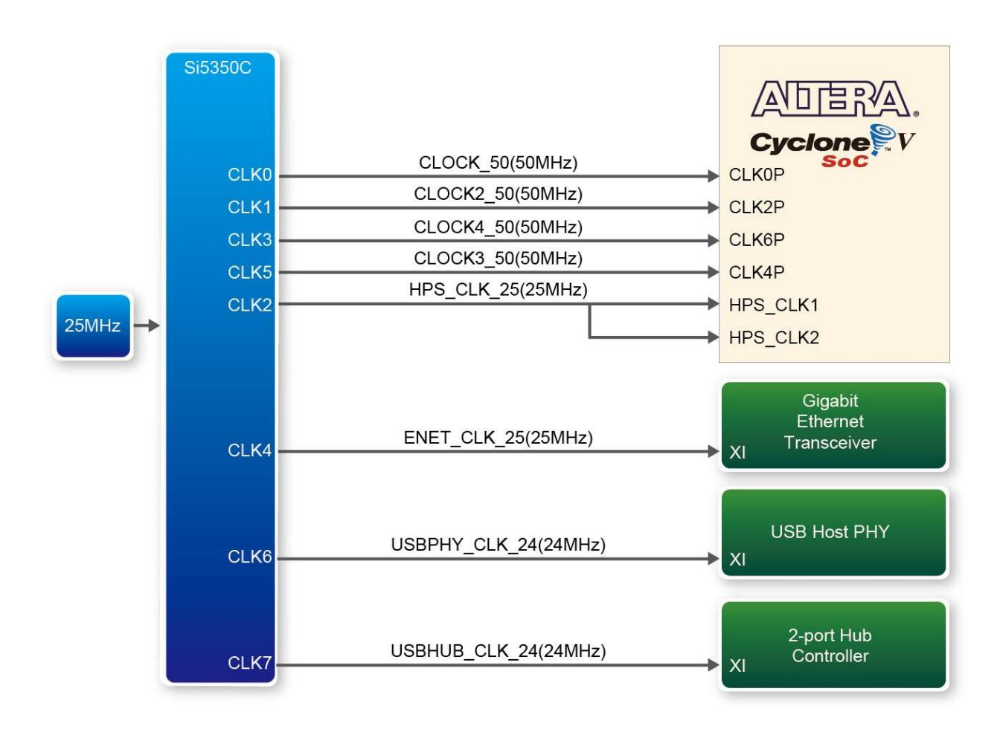

**Figure 3-11 Block diagram of the clock distribution**

**Table 3-8 Pin Assignments for Clock Inputs**

<span id="page-21-2"></span><span id="page-21-1"></span>

| Signal Name   | FPGA Pin No. | Description        | I/O Standard |
|---------------|--------------|--------------------|--------------|
| CLOCK_50      | PIN_AF14     | 50 MHz clock input | 3.3V         |
| CLOCK2_50     | PIN_AA16     | 50 MHz clock input | 3.3V         |
| CLOCK3_50     | PIN_Y26      | 50 MHz clock input | 3.3V         |
| CLOCK4_50     | PIN_K14      | 50 MHz clock input | 3.3V         |
| HPS_CLOCK1_25 | PIN_D25      | 25 MHz clock input | 3.3V         |
| HPS_CLOCK2_25 | PIN_F25      | 25 MHz clock input | 3.3V         |

## <span id="page-21-0"></span>3.6 Interface on FPGA

This section describes the interfaces to the FPGA. Users can control or monitor the different interfaces with user logic on the FPGA.


## <span id="page-22-0"></span>3.6.1 User Push-buttons, Switches and LEDs on FPGA

The board provides four push-button switches connected to FPGA as shown in **[Figure 3-12](#page-22-1)** [Connections between the push-button and Cyclone V SoC FPGA](#page-22-1). Each of these switches is debounced using a Schmitt Trigger circuit, as indicated in **[Figure 3-13](#page-22-2)**. The four outputs called KEY0, KEY1, KEY2, and KEY3 of the Schmitt Trigger devices are connected directly to the Cyclone V SoC FPGA. Each push-button switch provides a high logic level when it is not pressed, and provides a low logic level when depressed. Since the push-button switches are debounced, they are appropriate for using as clock or reset inputs in a circuit.

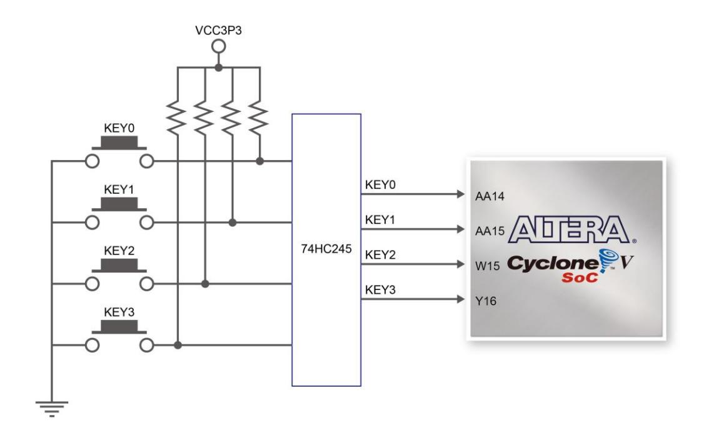

**Figure 3-12 Connections between the push-button and Cyclone V SoC FPGA**

<span id="page-22-1"></span>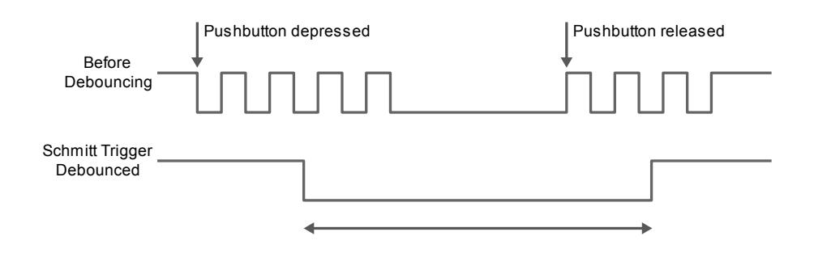

**Figure 3-13 Switch debouncing**

<span id="page-22-2"></span>


There are ten slide switches connected to FPGA on the board (See **[Figure 3-14](#page-23-0)**). These switches are not debounced, and are assumed for use as level-sensitive data inputs to a circuit. Each switch is connected directly to a pin on the Cyclone V SoC FPGA. When the switch is in the DOWN position (closest to the edge of the board), it provides a low logic level to the FPGA, and when the switch is in the UP position it provides a high logic level.

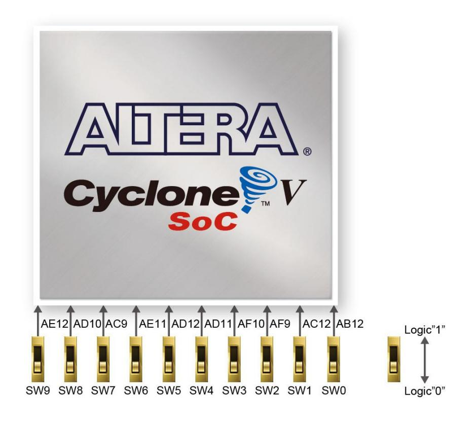

**Figure 3-14 Connections between the slide switches and Cyclone V SoC FPGA**

<span id="page-23-0"></span>There are also ten user-controllable LEDs connected to FPGA on the board. Each LED is driven directly by a pin on the Cyclone V SoC FPGA; driving its associated pin to a high logic level turns the LED on, and driving the pin low turns it off. **[Figure 3-15](#page-24-0)** shows the connections between LEDs and Cyclone V SoC FPGA. **[Table 3-9](#page-24-1)**, **[Table 3-10](#page-24-2)** and **[Table 3-11](#page-25-1)** list the pin assignments of these user interfaces.


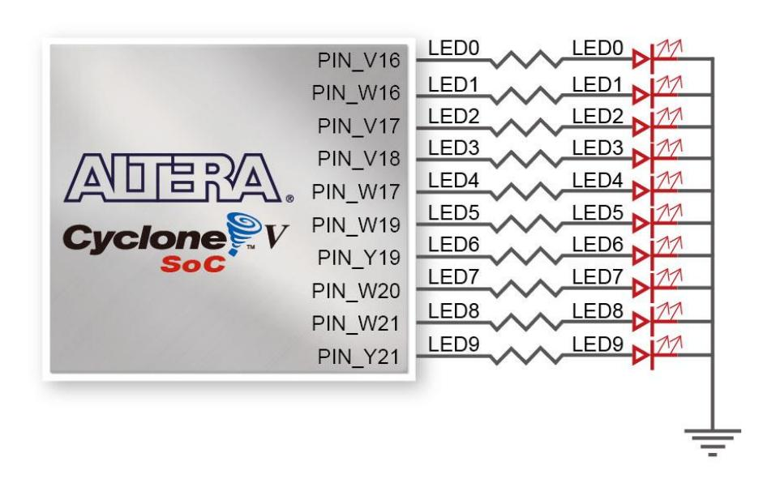

**Figure 3-15 Connections between the LEDs and Cyclone V SoC FPGA**

**Table 3-9 Pin Assignments for Slide Switches**

<span id="page-24-1"></span><span id="page-24-0"></span>

| Signal Name | FPGA Pin No. | Description     | I/O Standard |
|-------------|--------------|-----------------|--------------|
| SW[0]       | PIN_AB12     | Slide Switch[0] | 3.3V         |
| SW[1]       | PIN_AC12     | Slide Switch[1] | 3.3V         |
| SW[2]       | PIN_AF9      | Slide Switch[2] | 3.3V         |
| SW[3]       | PIN_AF10     | Slide Switch[3] | 3.3V         |
| SW[4]       | PIN_AD11     | Slide Switch[4] | 3.3V         |
| SW[5]       | PIN_AD12     | Slide Switch[5] | 3.3V         |
| SW[6]       | PIN_AE11     | Slide Switch[6] | 3.3V         |
| SW[7]       | PIN_AC9      | Slide Switch[7] | 3.3V         |
| SW[8]       | PIN_AD10     | Slide Switch[8] | 3.3V         |
| SW[9]       | PIN_AE12     | Slide Switch[9] | 3.3V         |

**Table 3-10 Pin Assignments for Push-buttons**

<span id="page-24-2"></span>

| Signal Name | FPGA Pin No. | Description    | I/O Standard |
|-------------|--------------|----------------|--------------|
| KEY[0]      | PIN_AA14     | Push-button[0] | 3.3V         |
| KEY[1]      | PIN_AA15     | Push-button[1] | 3.3V         |
| KEY[2]      | PIN_W15      | Push-button[2] | 3.3V         |
| KEY[3]      | PIN_Y16      | Push-button[3] | 3.3V         |


**Table 3-11 Pin Assignments for LEDs**

<span id="page-25-1"></span>

| Signal Name | FPGA Pin No. | Description | I/O Standard |
|-------------|--------------|-------------|--------------|
| LEDR[0]     | PIN_V16      | LED [0]     | 3.3V         |
| LEDR[1]     | PIN_W16      | LED [1]     | 3.3V         |
| LEDR[2]     | PIN_V17      | LED [2]     | 3.3V         |
| LEDR[3]     | PIN_V18      | LED [3]     | 3.3V         |
| LEDR[4]     | PIN_W17      | LED [4]     | 3.3V         |
| LEDR[5]     | PIN_W19      | LED [5]     | 3.3V         |
| LEDR[6]     | PIN_Y19      | LED [6]     | 3.3V         |
| LEDR[7]     | PIN_W20      | LED [7]     | 3.3V         |
| LEDR[8]     | PIN_W21      | LED [8]     | 3.3V         |
| LEDR[9]     | PIN_Y21      | LED [9]     | 3.3V         |

## <span id="page-25-0"></span>3.6.2 Using the 7-segment Displays

The DE1-SoC board has six 7-segment displays. These displays are arranged into three pairs, behaving the intent of displaying numbers of various sizes. As indicated in the schematic in **[Figure](#page-25-2)  [3-16](#page-25-2)**, the seven segments (common anode) are connected to pins on Cyclone V SoC FPGA. Applying a low logic level to a segment will light it up and applying a high logic level turns it off.

Each segment in a display is identified by an index from 0 to 6, with the positions given in **[Figure](#page-25-2)  [3-16](#page-25-2)**.**[Table 3-12](#page-25-3)** shows the assignments of FPGA pins to the 7-segment displays.

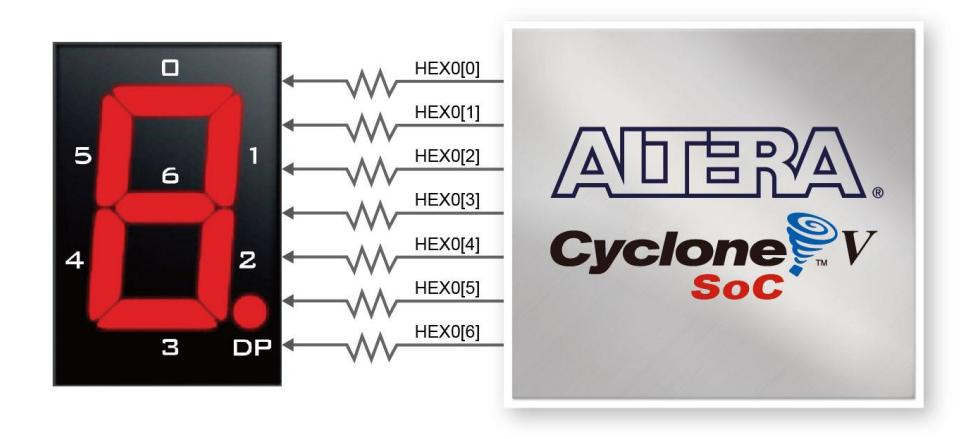

**Figure 3-16 Connections between the 7-segment display HEX0 and Cyclone V SoC FPGA**

**Table 3-12 Pin Assignments for 7-segment Displays**

<span id="page-25-3"></span><span id="page-25-2"></span>

| Signal Name | FPGA Pin No. | Description              | I/O Standard |
|-------------|--------------|--------------------------|--------------|
| HEX0[0]     | PIN_AE26     | Seven Segment Digit 0[0] | 3.3V         |


|          |                                                                                                                                  | 3.3V                                                                                                                                                                                                                                                                                                             |
|----------|----------------------------------------------------------------------------------------------------------------------------------|------------------------------------------------------------------------------------------------------------------------------------------------------------------------------------------------------------------------------------------------------------------------------------------------------------------|
|          |                                                                                                                                  | 3.3V                                                                                                                                                                                                                                                                                                             |
|          |                                                                                                                                  | 3.3V                                                                                                                                                                                                                                                                                                             |
|          |                                                                                                                                  | 3.3V                                                                                                                                                                                                                                                                                                             |
|          |                                                                                                                                  | 3.3V                                                                                                                                                                                                                                                                                                             |
|          |                                                                                                                                  | 3.3V                                                                                                                                                                                                                                                                                                             |
|          |                                                                                                                                  | 3.3V                                                                                                                                                                                                                                                                                                             |
|          |                                                                                                                                  | 3.3V                                                                                                                                                                                                                                                                                                             |
|          |                                                                                                                                  | 3.3V                                                                                                                                                                                                                                                                                                             |
|          |                                                                                                                                  | 3.3V                                                                                                                                                                                                                                                                                                             |
|          |                                                                                                                                  | 3.3V                                                                                                                                                                                                                                                                                                             |
| PIN_AF30 | Seven Segment Digit 1[5]                                                                                                         | 3.3V                                                                                                                                                                                                                                                                                                             |
| PIN_AD27 | Seven Segment Digit 1[6]                                                                                                         | 3.3V                                                                                                                                                                                                                                                                                                             |
| PIN_AB23 | Seven Segment Digit 2[0]                                                                                                         | 3.3V                                                                                                                                                                                                                                                                                                             |
| PIN_AE29 | Seven Segment Digit 2[1]                                                                                                         | 3.3V                                                                                                                                                                                                                                                                                                             |
| PIN_AD29 | Seven Segment Digit 2[2]                                                                                                         | 3.3V                                                                                                                                                                                                                                                                                                             |
| PIN_AC28 | Seven Segment Digit 2[3]                                                                                                         | 3.3V                                                                                                                                                                                                                                                                                                             |
| PIN_AD30 | Seven Segment Digit 2[4]                                                                                                         | 3.3V                                                                                                                                                                                                                                                                                                             |
| PIN_AC29 | Seven Segment Digit 2[5]                                                                                                         | 3.3V                                                                                                                                                                                                                                                                                                             |
| PIN_AC30 | Seven Segment Digit 2[6]                                                                                                         | 3.3V                                                                                                                                                                                                                                                                                                             |
| PIN_AD26 | Seven Segment Digit 3[0]                                                                                                         | 3.3V                                                                                                                                                                                                                                                                                                             |
| PIN_AC27 | Seven Segment Digit 3[1]                                                                                                         | 3.3V                                                                                                                                                                                                                                                                                                             |
| PIN_AD25 | Seven Segment Digit 3[2]                                                                                                         | 3.3V                                                                                                                                                                                                                                                                                                             |
| PIN_AC25 | Seven Segment Digit 3[3]                                                                                                         | 3.3V                                                                                                                                                                                                                                                                                                             |
| PIN_AB28 | Seven Segment Digit 3[4]                                                                                                         | 3.3V                                                                                                                                                                                                                                                                                                             |
| PIN_AB25 | Seven Segment Digit 3[5]                                                                                                         | 3.3V                                                                                                                                                                                                                                                                                                             |
| PIN_AB22 | Seven Segment Digit 3[6]                                                                                                         | 3.3V                                                                                                                                                                                                                                                                                                             |
| PIN_AA24 | Seven Segment Digit 4[0]                                                                                                         | 3.3V                                                                                                                                                                                                                                                                                                             |
| PIN_Y23  | Seven Segment Digit 4[1]                                                                                                         | 3.3V                                                                                                                                                                                                                                                                                                             |
| PIN_Y24  | Seven Segment Digit 4[2]                                                                                                         | 3.3V                                                                                                                                                                                                                                                                                                             |
| PIN_W22  | Seven Segment Digit 4[3]                                                                                                         | 3.3V                                                                                                                                                                                                                                                                                                             |
| PIN_W24  | Seven Segment Digit 4[4]                                                                                                         | 3.3V                                                                                                                                                                                                                                                                                                             |
| PIN_V23  | Seven Segment Digit 4[5]                                                                                                         | 3.3V                                                                                                                                                                                                                                                                                                             |
| PIN_W25  | Seven Segment Digit 4[6]                                                                                                         | 3.3V                                                                                                                                                                                                                                                                                                             |
| PIN_V25  | Seven Segment Digit 5[0]                                                                                                         | 3.3V                                                                                                                                                                                                                                                                                                             |
| PIN_AA28 | Seven Segment Digit 5[1]                                                                                                         | 3.3V                                                                                                                                                                                                                                                                                                             |
| PIN_Y27  | Seven Segment Digit 5[2]                                                                                                         | 3.3V                                                                                                                                                                                                                                                                                                             |
| PIN_AB27 | Seven Segment Digit 5[3]                                                                                                         | 3.3V                                                                                                                                                                                                                                                                                                             |
| PIN_AB26 | Seven Segment Digit 5[4]                                                                                                         | 3.3V                                                                                                                                                                                                                                                                                                             |
| PIN_AA26 | Seven Segment Digit 5[5]                                                                                                         | 3.3V                                                                                                                                                                                                                                                                                                             |
| PIN_AA25 | Seven Segment Digit 5[6]                                                                                                         | 3.3V                                                                                                                                                                                                                                                                                                             |
|          | PIN_AE27<br>PIN_AE28<br>PIN_AG27<br>PIN_AF28<br>PIN_AG28<br>PIN_AH28<br>PIN_AJ29<br>PIN_AH29<br>PIN_AH30<br>PIN_AG30<br>PIN_AF29 | Seven Segment Digit 0[1]<br>Seven Segment Digit 0[2]<br>Seven Segment Digit 0[3]<br>Seven Segment Digit 0[4]<br>Seven Segment Digit 0[5]<br>Seven Segment Digit 0[6]<br>Seven Segment Digit 1[0]<br>Seven Segment Digit 1[1]<br>Seven Segment Digit 1[2]<br>Seven Segment Digit 1[3]<br>Seven Segment Digit 1[4] |


## <span id="page-27-0"></span>3.6.3 Using the 2x20 GPIO Expansion Headers

The Board provides two 40-pin expansion headers. The header connects directly to 36 pins of the Cyclone V SoC FPGA, and also provides DC +5V (VCC5), DC +3.3V (VCC3P3), and two GND pins. The maximum power consumption of the daughter card that connects to GPIO port is shown in **[Table 3-13](#page-27-1)**.

**Table 3-13 Power Supply of the Expansion Header**

<span id="page-27-1"></span>

| Supplied Voltage | Max. Current Limit |
|------------------|--------------------|
| 5V               | 1A                 |
| 3.3V             | 1.5A               |

Each pin on the expansion headers is connected to two diodes and a resistor that provides protection against high and low voltages. **[Figure 3-17](#page-27-2)** shows the protection circuitry for only one of the pin on the header, but this circuitry is included for all 72 data pins. **[Table 3-14](#page-27-3)** shows all the pin assignments of the GPIO connector.

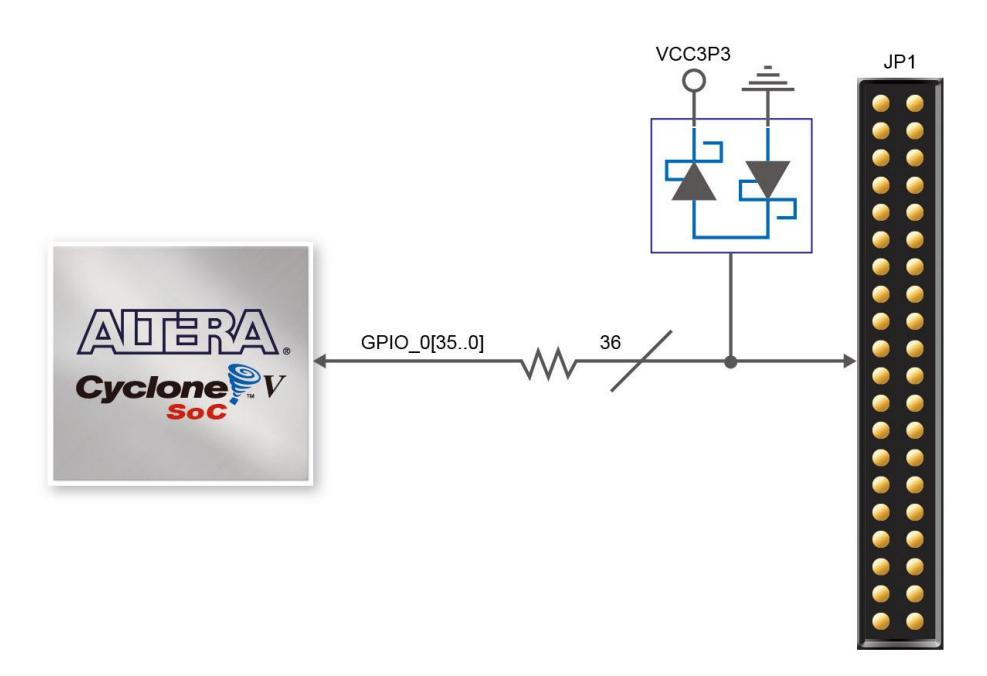

**Figure 3-17 Connections between the GPIO connector and Cyclone V SoC FPGA**

**Table 3-14 Pin Assignments for Expansion Headers**

<span id="page-27-3"></span><span id="page-27-2"></span>

| Signal Name | FPGA Pin No. | Description          | I/O Standard |
|-------------|--------------|----------------------|--------------|
| GPIO_0[0]   | PIN_AC18     | GPIO Connection 0[0] | 3.3V         |
| GPIO_0 [1]  | PIN_Y17      | GPIO Connection 0[1] | 3.3V         |
| GPIO_0 [2]  | PIN_AD17     | GPIO Connection 0[2] | 3.3V         |
| GPIO_0 [3]  | PIN_Y18      | GPIO Connection 0[3] | 3.3V         |


| GPIO_0<br>[4]  | PIN_AK16 | GPIO Connection<br>0[4]          | 3.3V     |
|----------------|----------|----------------------------------|----------|
| GPIO_0<br>[5]  | PIN_AK18 | GPIO Connection<br>0[5]          | 3.3V     |
| GPIO_0<br>[6]  | PIN_AK19 | GPIO Connection<br>0[6]          | 3.3V     |
| GPIO_0<br>[7]  | PIN_AJ19 | GPIO Connection<br>0[7]          | 3.3V     |
| GPIO_0<br>[8]  | PIN_AJ17 | GPIO Connection<br>0[8]          | 3.3V     |
| GPIO_0<br>[9]  | PIN_AJ16 | GPIO Connection<br>0[9]          | 3.3V     |
| GPIO_0<br>[10] | PIN_AH18 | GPIO Connection<br>0[10]         | 3.3V     |
| GPIO_0<br>[11] | PIN_AH17 | GPIO Connection<br>0[11]         | 3.3V     |
| GPIO_0<br>[12] | PIN_AG16 | GPIO Connection<br>0[12]         | 3.3V     |
| GPIO_0<br>[13] | PIN_AE16 | GPIO Connection<br>0[13]         | 3.3V     |
| GPIO_0<br>[14] | PIN_AF16 | GPIO Connection<br>0[14]         | 3.3V     |
| GPIO_0<br>[15] | PIN_AG17 | GPIO Connection<br>0[15]         | 3.3V     |
| GPIO_0<br>[16] | PIN_AA18 | GPIO Connection<br>0[16]         | 3.3V     |
| GPIO_0<br>[17] | PIN_AA19 | GPIO Connection<br>0[17]         | 3.3V     |
| GPIO_0<br>[18] | PIN_AE17 | GPIO Connection<br>0[18]         | 3.3V     |
| GPIO_0<br>[19] | PIN_AC20 | GPIO Connection<br>0[19]         | 3.3V     |
| GPIO_0<br>[20] | PIN_AH19 | GPIO Connection<br>0[20]         | 3.3V     |
| GPIO_0<br>[21] | PIN_AJ20 | GPIO Connection<br>0[21]         | 3.3V     |
| GPIO_0<br>[22] | PIN_AH20 | GPIO Connection<br>0[22]         | 3.3V     |
| GPIO_0<br>[23] | PIN_AK21 | GPIO Connection<br>0[23]         | 3.3V     |
| GPIO_0<br>[24] | PIN_AD19 | GPIO Connection<br>0[24]         | 3.3V     |
| GPIO_0<br>[25] | PIN_AD20 | GPIO Connection<br>0[25]         | 3.3V     |
| GPIO_0<br>[26] | PIN_AE18 | GPIO Connection<br>0[26]         | 3.3V     |
| GPIO_0<br>[27] | PIN_AE19 | GPIO Connection<br>0[27]         | 3.3V     |
| GPIO_0<br>[28] | PIN_AF20 | GPIO Connection<br>0[28]         | 3.3<br>V |
| GPIO_0<br>[29] | PIN_AF21 | GPIO Connection<br>0[29]         | 3.3V     |
| GPIO_0<br>[30] | PIN_AF19 | GPIO Connection<br>0[30]         | 3.3V     |
| GPIO_0<br>[31] | PIN_AG21 | GPIO Connection<br>0[31]         | 3.3V     |
| GPIO_0<br>[32] | PIN_AF18 | GPIO Connection<br>0[3<br>2<br>] | 3.3V     |
| GPIO_0<br>[33] | PIN_AG20 | GPIO Connection<br>0[3<br>3<br>] | 3.3V     |
| GPIO_0<br>[34] | PIN_AG18 | GPIO Connection<br>0[3<br>4<br>] | 3.3V     |
| GPIO_0<br>[35] | PIN_AJ21 | GPIO Connection<br>0[3<br>5<br>] | 3.3V     |
| GPIO_1<br>[0]  | PIN_AB17 | GPIO Connection<br>1[0]          | 3.3V     |
| GPIO_1<br>[1]  | PIN_AA21 | GPIO Connection<br>1[1]          | 3.3V     |
| GPIO_1<br>[2]  | PIN_AB21 | GPIO Connection<br>1[2]          | 3.3V     |
| GPIO_1<br>[3]  | PIN_AC23 | GPIO Connection<br>1[3]          | 3.3V     |
|                |          |                                  |          |
| GPIO_1<br>[4]  | PIN_AD24 | GPIO Connection<br>1[4]          | 3.3V     |
| GPIO_1<br>[5]  | PIN_AE23 | GPIO Connection<br>1[5]          | 3.3V     |
| GPIO_1<br>[6]  | PIN_AE24 | GPIO Connection<br>1[6]          | 3.3V     |
| GPIO_1<br>[7]  | PIN_AF25 | GPIO Connection<br>1[7]          | 3.3V     |
| GPIO_1<br>[8]  | PIN_AF26 | GPIO Connection<br>1[8]          | 3.3V     |
| GPIO_1<br>[9]  | PIN_AG25 | GPIO Connection<br>1[9]          | 3.3V     |
| GPIO_1<br>[10] | PIN_AG26 | GPIO Connection<br>1[10]         | 3.3V     |
| GPIO_1<br>[11] | PIN_AH24 | GPIO Connection<br>1[11]         | 3.3V     |


| GPIO_1 [12] | PIN_AH27 | GPIO Connection 1[12] | 3.3V |
|-------------|----------|-----------------------|------|
| GPIO_1 [13] | PIN_AJ27 | GPIO Connection 1[13] | 3.3V |
| GPIO_1 [14] | PIN_AK29 | GPIO Connection 1[14] | 3.3V |
| GPIO_1 [15] | PIN_AK28 | GPIO Connection 1[15] | 3.3V |
| GPIO_1 [16] | PIN_AK27 | GPIO Connection 1[16] | 3.3V |
| GPIO_1 [17] | PIN_AJ26 | GPIO Connection 1[17] | 3.3V |
| GPIO_1 [18] | PIN_AK26 | GPIO Connection 1[18] | 3.3V |
| GPIO_1 [19] | PIN_AH25 | GPIO Connection 1[19] | 3.3V |
| GPIO_1 [20] | PIN_AJ25 | GPIO Connection 1[20] | 3.3V |
| GPIO_1 [21] | PIN_AJ24 | GPIO Connection 1[21] | 3.3V |
| GPIO_1 [22] | PIN_AK24 | GPIO Connection 1[22] | 3.3V |
| GPIO_1 [23] | PIN_AG23 | GPIO Connection 1[23] | 3.3V |
| GPIO_1 [24] | PIN_AK23 | GPIO Connection 1[24] | 3.3V |
| GPIO_1 [25] | PIN_AH23 | GPIO Connection 1[25] | 3.3V |
| GPIO_1 [26] | PIN_AK22 | GPIO Connection 1[26] | 3.3V |
| GPIO_1 [27] | PIN_AJ22 | GPIO Connection 1[27] | 3.3V |
| GPIO_1 [28] | PIN_AH22 | GPIO Connection 1[28] | 3.3V |
| GPIO_1 [29] | PIN_AG22 | GPIO Connection 1[29] | 3.3V |
| GPIO_1 [30] | PIN_AF24 | GPIO Connection 1[30] | 3.3V |
| GPIO_1 [31] | PIN_AF23 | GPIO Connection 1[31] | 3.3V |
| GPIO_1 [32] | PIN_AE22 | GPIO Connection 1[32] | 3.3V |
| GPIO_1 [33] | PIN_AD21 | GPIO Connection 1[33] | 3.3V |
| GPIO_1 [34] | PIN_AA20 | GPIO Connection 1[34] | 3.3V |
| GPIO_1 [35] | PIN_AC22 | GPIO Connection 1[35] | 3.3V |
|             |          |                       |      |

## <span id="page-29-0"></span>3.6.4 Using the 24-bit Audio CODEC

The DE1-SoC board provides high-quality 24-bit audio via the Wolfson WM8731 audio CODEC (Encoder/Decoder). This chip supports microphone-in, line-in, and line-out ports, with a sample rate adjustable from 8 kHz to 96 kHz. The WM8731 is controlled via by a serial I2C bus, which is connected to HPS or Cyclone V SoC FPGA through a I2C multiplexer. A schematic diagram of the audio circuitry is shown in **[Figure 3-18](#page-30-1)**, and the FPGA pin assignments are listed in **[Table 3-15](#page-30-2)**. Detailed information for using the WM8731 codec is available in its datasheet, which can be found on the manufacturer's website, or in the *DE1\_SOC\_datasheets\Audio CODEC* folder on the DE1-SoC System CD.


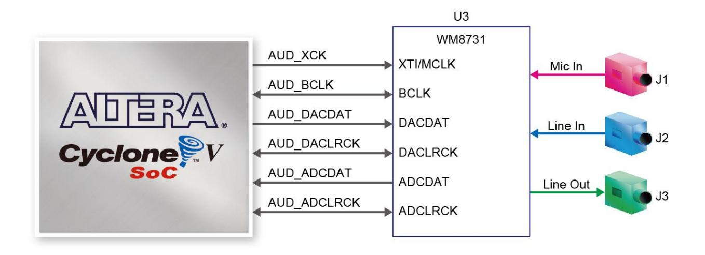

**Figure 3-18 Connections between FPGA and Audio CODEC**

**Table 3-15 Audio CODEC Pin Assignments**

<span id="page-30-2"></span><span id="page-30-1"></span>

| Signal Name | FPGA Pin No.       | Description                  | I/O Standard |  |
|-------------|--------------------|------------------------------|--------------|--|
| AUD_ADCLRCK | PIN_K8             | Audio CODEC ADC LR Clock     | 3.3V         |  |
| AUD_ADCDAT  | PIN_K7             | Audio CODEC ADC Data         | 3.3V         |  |
| AUD_DACLRCK | PIN_H8             | Audio CODEC DAC LR Clock     | 3.3V         |  |
| AUD_DACDAT  | PIN_J7             | Audio CODEC DAC Data         | 3.3V         |  |
| AUD_XCK     | PIN_G7             | Audio CODEC Chip Clock       | 3.3V         |  |
| AUD_BCLK    | PIN_H7             | Audio CODEC Bit-Stream Clock | 3.3V         |  |
| I2C_SCLK    | PIN_J12 or PIN_E23 | I2C Clock                    | 3.3V         |  |
| I2C_SDAT    | PIN_K12 or PIN_C24 | I2C Data                     | 3.3V         |  |

## <span id="page-30-0"></span>3.6.5 I2C Multiplexer

The DE1-SoC board implements an I2C multiplexer so that HPS can access the I2C bus originally owned by FPGA. **[Figure 3-19](#page-31-1)** shows the connection of I2C multiplexer. HPS will own I2C bus and then can access Audio CODEC and TV Decoder when the HPS\_I2C\_CONTROL signal is set to high. By default, FPGA owns the I2C bus. The FPGA pin assignments of I2C bus are listed in **[Table](#page-31-2)  [3-16](#page-31-2)** .


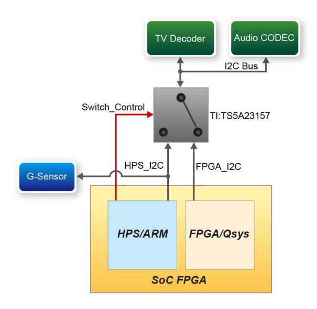

**Figure 3-19 Connections of I2C Multiplexer**

**Table 3-16 I2C Bus Pin Assignments**

<span id="page-31-2"></span><span id="page-31-1"></span>

| Signal Name   | FPGA Pin No. | Description                                   | I/O Standard |
|---------------|--------------|-----------------------------------------------|--------------|
| FPGA_I2C_SCLK | PIN_J12      | FPGA I2C Clock                                | 3.3V         |
| FPGA_I2C_SDAT | PIN_K12      | FPGA I2C Data                                 | 3.3V         |
| HPS_I2C1_SCLK | PIN_E23      | I2C Clock of the first HPS I2C concontroller  | 3.3V         |
| HPS_I2C1_SDAT | PIN_C24      | I2C Data of the first HPS I2C concontroller   | 3.3V         |
| HPS_I2C2_SCLK | PIN_H23      | I2C Clock of the second HPS I2C concontroller | 3.3V         |
| HPS_I2C2_SDAT | PIN_A25      | I2C Data of the second HPS I2C concontroller  | 3.3V         |

## <span id="page-31-0"></span>3.6.6 VGA

The DE1-SoC board includes a 15-pin D-SUB connector for VGA output. The VGA synchronization signals are provided directly from the Cyclone V SoC FPGA, and the Analog Devices ADV7123 triple 10-bit high-speed video DAC (only the higher 8-bits are used) is used to produce the analog data signals (red, green, and blue). It could support the SXGA standard (1280\*1024) with a bandwidth of 100MHz. **[Figure 3-20](#page-32-0)** gives the associated schematic.


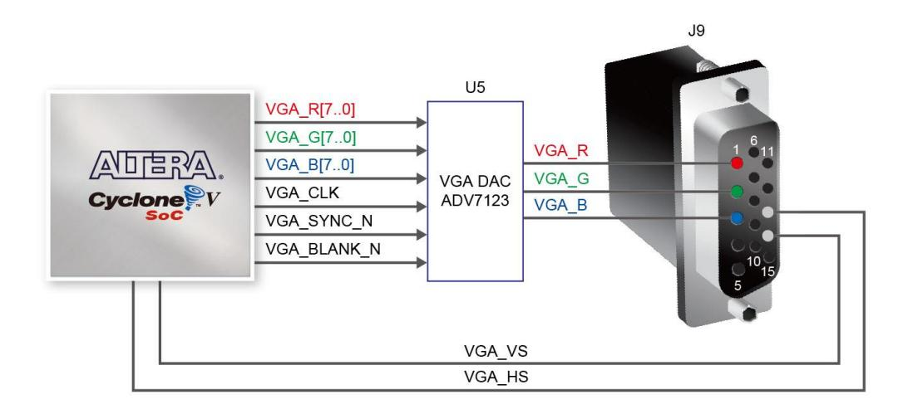

**Figure 3-20 VGA Connections between FPGA and VGA**

<span id="page-32-0"></span>The timing specification for VGA synchronization and RGB (red, green, blue) data can be found on various educational website (for example, search for "VGA signal timing"). **[Figure 3-20](#page-32-0)** illustrates the basic timing requirements for each row (horizontal) that is displayed on a VGA monitor. An active-low pulse of specific duration (time (a) in the figure) is applied to the horizontal synchronization (hsync) input of the monitor, which signifies the end of one row of data and the start of the next. The data (RGB) output to the monitor must be off (driven to 0 V) for a time period called the back porch (b) after the hsync pulse occurs, which is followed by the display interval (c). During the data display interval the RGB data drives each pixel in turn across the row being displayed. Finally, there is a time period called the front porch (d) where the RGB signals must again be off before the next hsync pulse can occur. The timing of the vertical synchronization (vsync) is the similar as shown in **[Figure 3-21](#page-33-0)**, except that a vsync pulse signifies the end of one frame and the start of the next, and the data refers to the set of rows in the frame (horizontal timing). **[Table 3-17](#page-33-1)** and **[Table 3-18](#page-33-2)** show different resolutions and durations of time periods a, b, c, and d for both horizontal and vertical timing.

Detailed information for using the ADV7123 video DAC is available in its datasheet, which can be found on the manufacturer's website, or in the Datasheets\VIDEO DAC folder on the DE1-SoC System CD. The pin assignments between the Cyclone V SoC FPGA and the ADV7123 are listed in **[Table 3-19.](#page-34-1)**


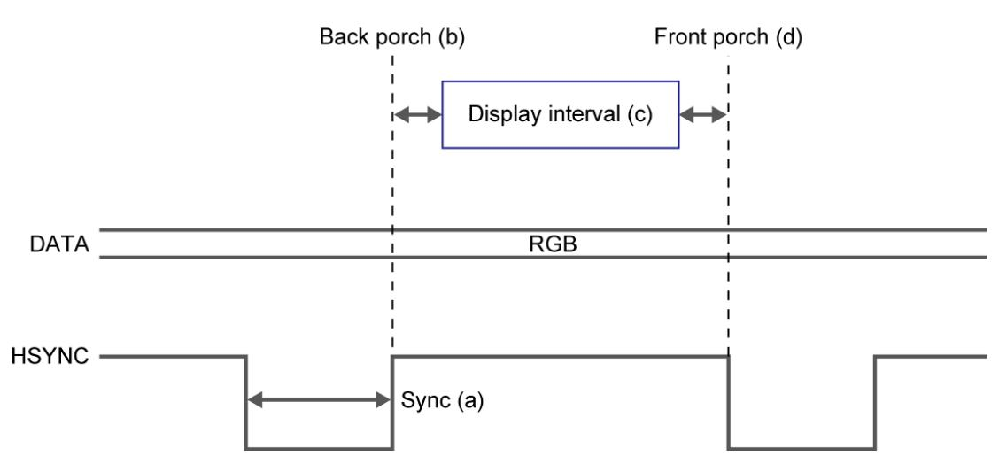

**Figure 3-21 VGA horizontal timing specification**

**Table 3-17 VGA Horizontal Timing Specification**

<span id="page-33-1"></span><span id="page-33-0"></span>

| VGA mode        |                 |       | Horizontal Timing Spec |       |       |                  |
|-----------------|-----------------|-------|------------------------|-------|-------|------------------|
| Configuration   | Resolution(HxV) | a(us) | b(us)                  | c(us) | d(us) | Pixel clock(MHz) |
| VGA(60Hz)       | 640x480         | 3.8   | 1.9                    | 25.4  | 0.6   | 25               |
| VGA(85Hz)       | 640x480         | 1.6   | 2.2                    | 17.8  | 1.6   | 36               |
| SVGA(60Hz)      | 800x600         | 3.2   | 2.2                    | 20    | 1     | 40               |
| SVGA(75Hz)      | 800x600         | 1.6   | 3.2                    | 16.2  | 0.3   | 49               |
| SVGA(85Hz)      | 800x600         | 1.1   | 2.7                    | 14.2  | 0.6   | 56               |
| XGA(60Hz)       | 1024x768        | 2.1   | 2.5                    | 15.8  | 0.4   | 65               |
| XGA(70Hz)       | 1024x768        | 1.8   | 1.9                    | 13.7  | 0.3   | 75               |
| XGA(85Hz)       | 1024x768        | 1.0   | 2.2                    | 10.8  | 0.5   | 95               |
| 1280x1024(60Hz) | 1280x1024       | 1.0   | 2.3                    | 11.9  | 0.4   | 108              |

**Table 3-18 VGA Vertical Timing Specification**

<span id="page-33-2"></span>

| VGA mode        |                 | Vertical Timing Spec |          |          |          |                  |
|-----------------|-----------------|----------------------|----------|----------|----------|------------------|
| Configuration   | Resolution(HxV) | a(lines)             | b(lines) | c(lines) | d(lines) | Pixel clock(MHz) |
| VGA(60Hz)       | 640x480         | 2                    | 33       | 480      | 10       | 25               |
| VGA(85Hz)       | 640x480         | 3                    | 25       | 480      | 1        | 36               |
| SVGA(60Hz)      | 800x600         | 4                    | 23       | 600      | 1        | 40               |
| SVGA(75Hz)      | 800x600         | 3                    | 21       | 600      | 1        | 49               |
| SVGA(85Hz)      | 800x600         | 3                    | 27       | 600      | 1        | 56               |
| XGA(60Hz)       | 1024x768        | 6                    | 29       | 768      | 3        | 65               |
| XGA(70Hz)       | 1024x768        | 6                    | 29       | 768      | 3        | 75               |
| XGA(85Hz)       | 1024x768        | 3                    | 36       | 768      | 1        | 95               |
| 1280x1024(60Hz) | 1280x1024       | 3                    | 38       | 1024     | 1        | 108              |


**Table 3-19 Pin Assignments for VGA**

<span id="page-34-1"></span>

| Signal Name | FPGA Pin No. | Description  | I/O Standard |
|-------------|--------------|--------------|--------------|
| VGA_R[0]    | PIN_A13      | VGA Red[0]   | 3.3V         |
| VGA_R[1]    | PIN_C13      | VGA Red[1]   | 3.3V         |
| VGA_R[2]    | PIN_E13      | VGA Red[2]   | 3.3V         |
| VGA_R[3]    | PIN_B12      | VGA Red[3]   | 3.3V         |
| VGA_R[4]    | PIN_C12      | VGA Red[4]   | 3.3V         |
| VGA_R[5]    | PIN_D12      | VGA Red[5]   | 3.3V         |
| VGA_R[6]    | PIN_E12      | VGA Red[6]   | 3.3V         |
| VGA_R[7]    | PIN_F13      | VGA Red[7]   | 3.3V         |
| VGA_G[0]    | PIN_J9       | VGA Green[0] | 3.3V         |
| VGA_G[1]    | PIN_J10      | VGA Green[1] | 3.3V         |
| VGA_G[2]    | PIN_H12      | VGA Green[2] | 3.3V         |
| VGA_G[3]    | PIN_G10      | VGA Green[3] | 3.3V         |
| VGA_G[4]    | PIN_G11      | VGA Green[4] | 3.3V         |
| VGA_G[5]    | PIN_G12      | VGA Green[5] | 3.3V         |
| VGA_G[6]    | PIN_F11      | VGA Green[6] | 3.3V         |
| VGA_G[7]    | PIN_E11      | VGA Green[7] | 3.3V         |
| VGA_B[0]    | PIN_B13      | VGA Blue[0]  | 3.3V         |
| VGA_B[1]    | PIN_G13      | VGA Blue[1]  | 3.3V         |
| VGA_B[2]    | PIN_H13      | VGA Blue[2]  | 3.3V         |
| VGA_B[3]    | PIN_F14      | VGA Blue[3]  | 3.3V         |
| VGA_B[4]    | PIN_H14      | VGA Blue[4]  | 3.3V         |
| VGA_B[5]    | PIN_F15      | VGA Blue[5]  | 3.3V         |
| VGA_B[6]    | PIN_G15      | VGA Blue[6]  | 3.3V         |
| VGA_B[7]    | PIN_J14      | VGA Blue[7]  | 3.3V         |
| VGA_CLK     | PIN_A11      | VGA Clock    | 3.3V         |
| VGA_BLANK_N | PIN_F10      | VGA BLANK    | 3.3V         |
| VGA_HS      | PIN_B11      | VGA H_SYNC   | 3.3V         |
| VGA_VS      | PIN_D11      | VGA V_SYNC   | 3.3V         |
| VGA_SYNC_N  | PIN_C10      | VGA SYNC     | 3.3V         |
|             |              |              |              |

## <span id="page-34-0"></span>3.6.7 TV Decoder

The DE1-SoC board is equipped with an Analog Device ADV7180 TV decoder chip. The ADV7180 is an integrated video decoder that automatically detects and converts a standard analog baseband television signals (NTSC, PAL, and SECAM) into 4:2:2 component video data compatible with the 8-bit ITU-R BT.656 interface standard. The ADV7180 is compatible with a broad range of video devices, including DVD players, tape-based sources, broadcast sources, and security/surveillance cameras.


The registers in the TV decoder can be programmed by a serial I2C bus, which is connected to HPS or Cyclone V SoC FPGA through a I2C multiplexer as indicated in **[Figure 3-22](#page-35-0)**. Note that the I2C address W/R of the TV decoder (U4) is 0x40/0x41. The pin assignments are listed in **[Table 3-20](#page-35-1)**. Detailed information of the ADV7180 is available on the manufacturer's website, or in the *DE1\_SOC\_datasheets\Video Decoder* folder on the DE2-115 System CD.

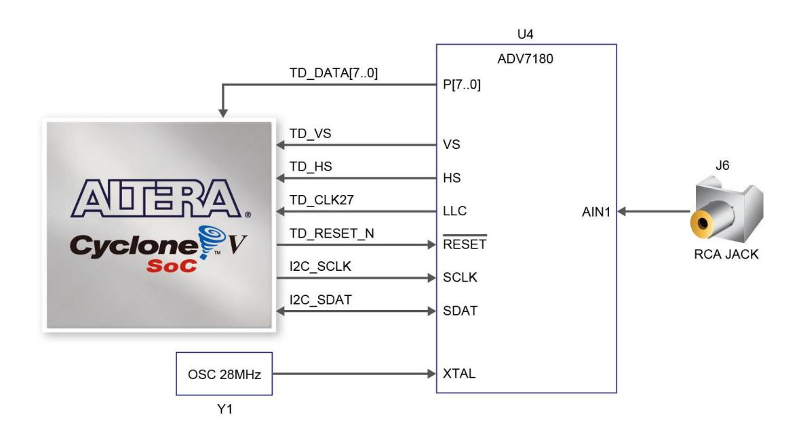

**Figure 3-22 Connections between FPGA and TV Decoder**

**Table 3-20 TV Decoder Pin Assignments**

<span id="page-35-1"></span><span id="page-35-0"></span>

| Signal Name | FPGA Pin No.       | Description             | I/O Standard |
|-------------|--------------------|-------------------------|--------------|
| TD_DATA [0] | PIN_D2             | TV Decoder<br>Data[0]   | 3.3V         |
| TD_DATA [1] | PIN_B1             | TV Decoder<br>Data[1]   | 3.3V         |
| TD_DATA [2] | PIN_E2             | TV Decoder<br>Data[2]   | 3.3V         |
| TD_DATA [3] | PIN_B2             | TV Decoder<br>Data[3]   | 3.3V         |
| TD_DATA [4] | PIN_D1             | TV Decoder<br>Data[4]   | 3.3V         |
| TD_DATA [5] | PIN_E1             | TV Decoder<br>Data[5]   | 3.3V         |
| TD_DATA [6] | PIN_C2             | TV Decoder<br>Data[6]   | 3.3V         |
| TD_DATA [7] | PIN_B3             | TV Decoder<br>Data[7]   | 3.3V         |
| TD_HS       | PIN_A5             | TV Decoder<br>H_SYNC    | 3.3V         |
| TD_VS       | PIN_A3             | TV Decoder<br>V_SYNC    | 3.3V         |
| TD_CLK27    | PIN_H15            | TV Decoder Clock Input. | 3.3V         |
| TD_RESET_N  | PIN_F6             | TV Decoder<br>Reset     | 3.3V         |
| I2C_SCLK    | PIN_J12 or PIN_E23 | I2C Clock               | 3.3V         |
| I2C_SDAT    | PIN_K12 or PIN_C24 | I2C Data                | 3.3V         |


## <span id="page-36-0"></span>3.6.8 IR Receiver

The board provides an infrared remote-control receiver module (model: IRM-V538/TR1), whose datasheet is offered in the Datasheets\ IR Receiver and Emitter folder on DE1-SoC System CD. The accompanied remote controller with an encoding chip of uPD6121G is very suitable of generating expected infrared signals. **[Figure 3-23](#page-36-2)** shows the related schematic of the IR receiver. **[Table 3-21](#page-36-3)** shows the IR receiver interface pin assignments.

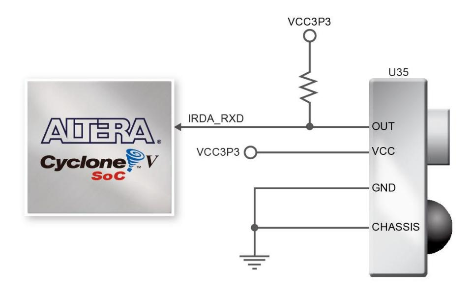

**Figure 3-23 Connection between FPGA and IR Receiver**

**Table 3-21 Pin Assignments for IR**

<span id="page-36-3"></span><span id="page-36-2"></span>

| Signal Name | FPGA Pin No. | Description | I/O Standard |
|-------------|--------------|-------------|--------------|
| IRDA_RXD    | PIN_ AA30    | IR Receiver | 3.3V         |

## <span id="page-36-1"></span>3.6.9 IR Emitter LED

The board provides an IR Emitter LED for IR communication which is widely used for operating the television device wirelessly from a short line-of-sight distance. Match this IR Emitter LED with an IR receiver will allow the board to communicate with similarly equipped system. **[Figure 3-24](#page-37-1)** shows the related schematic of the IR emitter LED. **[Table 3-22](#page-37-2)** shows the IR emitter interface pin assignments.


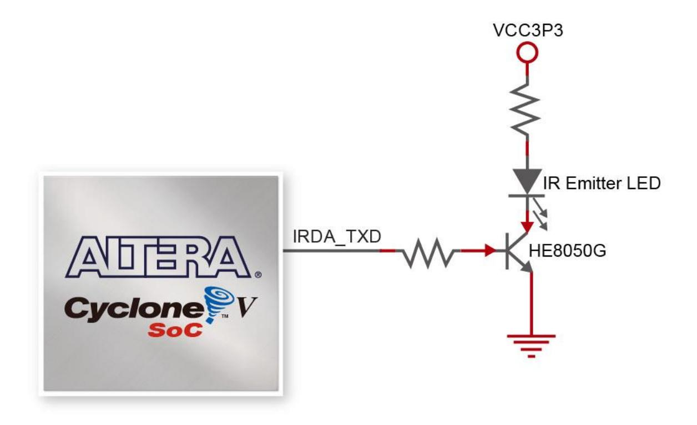

**Figure 3-24 Connection between FPGA and IR Emitter LED**

**Table 3-22 Pin Assignments for IR**

<span id="page-37-2"></span><span id="page-37-1"></span>

| Signal Name | FPGA Pin No. | Description | I/O Standard |
|-------------|--------------|-------------|--------------|
| IRDA_TXD    | PIN_ AB30    | IR Emitter  | 3.3V         |

## <span id="page-37-0"></span>3.6.10 SDRAM Memory on FPGA

The board features 64MB of SDRAM, implemented using a 64MB (32Mx16) SDRAM device. The device consists of 16-bit data line, control line and address line connected to the FPGA. This chip use the 3.3V LVCMOS signaling standard. Connections between FPGA and SDRAM are shown in **[Figure 3-25](#page-38-0)**, while the pin assignments are listed in **[Table 3-23](#page-38-1)**.


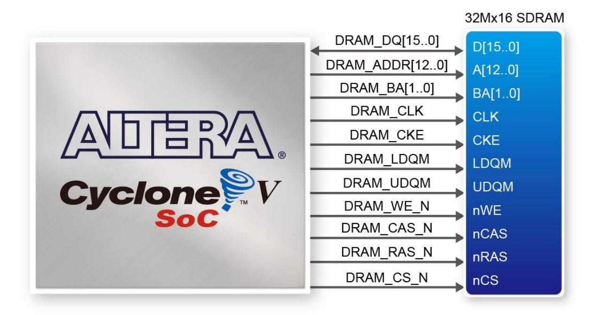

**Figure 3-25 Connections between FPGA and SDRAM**

**Table 3-23 SDRAM Pin Assignments**

<span id="page-38-1"></span><span id="page-38-0"></span>

| Signal Name   | FPGA Pin No. | Description       | I/O Standard |
|---------------|--------------|-------------------|--------------|
| DRAM_ADDR[0]  | PIN_AK14     | SDRAM Address[0]  | 3.3V         |
| DRAM_ADDR[1]  | PIN_AH14     | SDRAM Address[1]  | 3.3V         |
| DRAM_ADDR[2]  | PIN_AG15     | SDRAM Address[2]  | 3.3V         |
| DRAM_ADDR[3]  | PIN_AE14     | SDRAM Address[3]  | 3.3V         |
| DRAM_ADDR[4]  | PIN_AB15     | SDRAM Address[4]  | 3.3V         |
| DRAM_ADDR[5]  | PIN_AC14     | SDRAM Address[5]  | 3.3V         |
| DRAM_ADDR[6]  | PIN_AD14     | SDRAM Address[6]  | 3.3V         |
| DRAM_ADDR[7]  | PIN_AF15     | SDRAM Address[7]  | 3.3V         |
| DRAM_ADDR[8]  | PIN_AH15     | SDRAM Address[8]  | 3.3V         |
| DRAM_ADDR[9]  | PIN_AG13     | SDRAM Address[9]  | 3.3V         |
| DRAM_ADDR[10] | PIN_AG12     | SDRAM Address[10] | 3.3V         |
| DRAM_ADDR[11] | PIN_AH13     | SDRAM Address[11] | 3.3V         |
| DRAM_ADDR[12] | PIN_AJ14     | SDRAM Address[12] | 3.3V         |
| DRAM_DQ[0]    | PIN_AK6      | SDRAM Data[0]     | 3.3V         |
| DRAM_DQ[1]    | PIN_AJ7      | SDRAM Data[1]     | 3.3V         |
| DRAM_DQ[2]    | PIN_AK7      | SDRAM Data[2]     | 3.3V         |
| DRAM_DQ[3]    | PIN_AK8      | SDRAM Data[3]     | 3.3V         |
| DRAM_DQ[4]    | PIN_AK9      | SDRAM Data[4]     | 3.3V         |
| DRAM_DQ[5]    | PIN_AG10     | SDRAM Data[5]     | 3.3V         |
| DRAM_DQ[6]    | PIN_AK11     | SDRAM Data[6]     | 3.3V         |


| DRAM_DQ[7]  | PIN_AJ11 | SDRAM Data[7]               | 3.3V |
|-------------|----------|-----------------------------|------|
| DRAM_DQ[8]  | PIN_AH10 | SDRAM Data[8]               | 3.3V |
| DRAM_DQ[9]  | PIN_AJ10 | SDRAM Data[9]               | 3.3V |
| DRAM_DQ[10] | PIN_AJ9  | SDRAM Data[10]              | 3.3V |
| DRAM_DQ[11] | PIN_AH9  | SDRAM Data[11]              | 3.3V |
| DRAM_DQ[12] | PIN_AH8  | SDRAM Data[12]              | 3.3V |
| DRAM_DQ[13] | PIN_AH7  | SDRAM Data[13]              | 3.3V |
| DRAM_DQ[14] | PIN_AJ6  | SDRAM Data[14]              | 3.3V |
| DRAM_DQ[15] | PIN_AJ5  | SDRAM Data[15]              | 3.3V |
| DRAM_BA[0]  | PIN_AF13 | SDRAM Bank Address[0]       | 3.3V |
| DRAM_BA[1]  | PIN_AJ12 | SDRAM Bank Address[1]       | 3.3V |
| DRAM_LDQM   | PIN_AB13 | SDRAM byte Data Mask[0]     | 3.3V |
| DRAM_UDQM   | PIN_AK12 | SDRAM byte Data Mask[1]     | 3.3V |
| DRAM_RAS_N  | PIN_AE13 | SDRAM Row Address Strobe    | 3.3V |
| DRAM_CAS_N  | PIN_AF11 | SDRAM Column Address Strobe | 3.3V |
| DRAM_CKE    | PIN_AK13 | SDRAM Clock Enable          | 3.3V |
| DRAM_CLK    | PIN_AH12 | SDRAM Clock                 | 3.3V |
| DRAM_WE_N   | PIN_AA13 | SDRAM Write Enable          | 3.3V |
| DRAM_CS_N   | PIN_AG11 | SDRAM Chip Select           | 3.3V |
|             |          |                             |      |

## <span id="page-39-0"></span>3.6.11 PS/2 Serial Port

The DE1-SoC board includes a standard PS/2 interface and a connector for a PS/2 keyboard or mouse. **[Figure 3-26](#page-40-0)** shows the schematic of the PS/2 circuit. In addition, users can use the PS/2 keyboard and mouse on the DE1-SoC board simultaneously by plugging an extension PS/2 Y-Cable (See **[Figure 3-27](#page-40-1)**). Instructions for using a PS/2 mouse or keyboard can be found by performing an appropriate search on various educational websites. The pin assignments for the associated interface are shown in **[Table 3-24](#page-40-2)**.

Note: If users connect only one PS/2 equipment, the PS/2 interface between FPGA I/O should be "PS2\_CLK" and "PS2\_DAT".


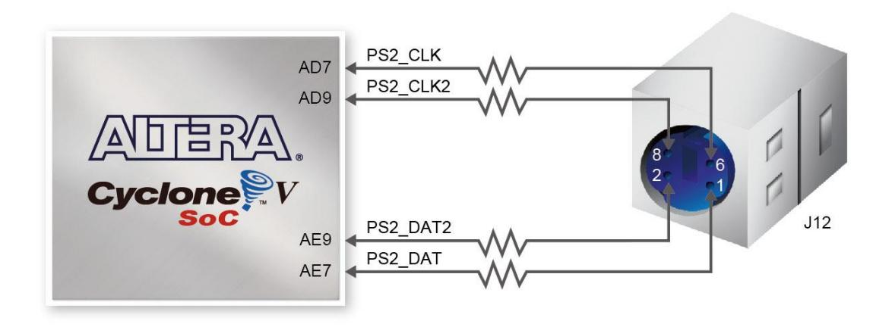

**Figure 3-26 Connection between FPGA and PS/2**

<span id="page-40-0"></span>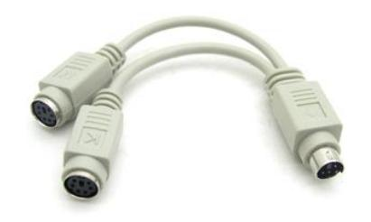

**Figure 3-27 Y-Cable use for both Keyboard and Mouse**

**Table 3-24 PS/2 Pin Assignments**

<span id="page-40-2"></span><span id="page-40-1"></span>

| Signal Name | FPGA Pin No. | Description                                  | I/O Standard |
|-------------|--------------|----------------------------------------------|--------------|
| PS2_CLK     | PIN_AD7      | PS/2 Clock                                   | 3.3V         |
| PS2_DAT     | PIN_AE7      | PS/2 Data                                    | 3.3V         |
| PS2_CLK2    | PIN_AD9      | PS/2 Clock (reserved for second PS/2 device) | 3.3V         |
| PS2_DAT2    | PIN_AE9      | PS/2 Data (reserved for second PS/2 device)  | 3.3V         |


## <span id="page-41-0"></span>3.6.12 A/D Converter and 2x5 Header

The DE1-SoC contains an AD7928 lower power, eight-channel CMOS 12-bit analog-to-digital converter. This A-to-D provides conversion throughput rates up to 1MSPS. It can be configured to accept eight input signals at inputs ADC\_IN0 through ADC\_IN7. This eight input signals are connected to the 2x5 header, as shown in **[Figure 3-28](#page-41-1)**.

For more detailed information on the A/D converter chip, please refer to its datasheet which is available on manufacturer's website or under the /datasheet folder of the system CD.

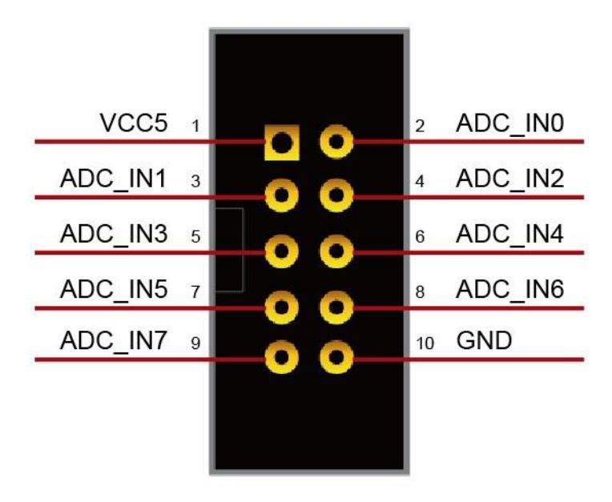

**Figure 3-28 Pin distribution of the 2x5 Header**

<span id="page-41-1"></span>**[Figure 3-29](#page-42-2)** shows the connections on the 2x5 header, A/D converter and Cyclone V SoC device.


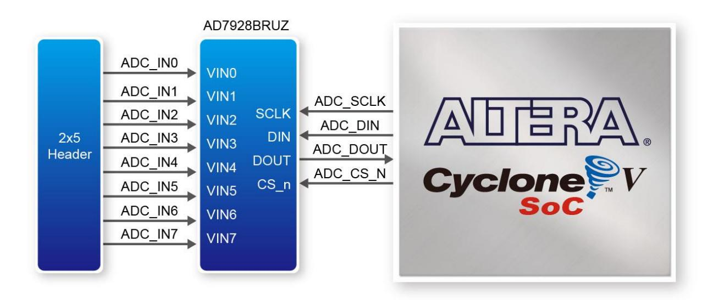

**Figure 3-29 Wiring for 2x5 header and A/D converter**

**Table 3-25 Pin Assignments for ADC**

<span id="page-42-3"></span><span id="page-42-2"></span>

| Signal Name | FPGA Pin No. | Description         | I/O Standard |
|-------------|--------------|---------------------|--------------|
| ADC_CS_N    | PIN_AJ4      | Chip select         | 3.3V         |
| ADC_DOUT    | PIN_AK3      | Digital data input  | 3.3V         |
| ADC_DIN     | PIN_AK4      | Digital data output | 3.3V         |
| ADC_SCLK    | PIN_AK2      | Digital clock input | 3.3V         |

## <span id="page-42-0"></span>3.7 Interface on Hard Processor System (HPS)

This section introduces the interfaces connected to the HPS section of the FPGA. Users can access these interfaces via the HPS processor.

## <span id="page-42-1"></span>3.7.1 User Push-button and LED on HPS

Like the FPGA, the HPS also features its own set of switches, buttons, LEDs, and other user interfaces. Users can control these interfaces for observing HPS status and debugging.

**[Table 3-26](#page-43-1)** gives the all the pin assignments of all the user interfaces.


**Table 3-26 Pin Assignments for LEDs, Switches and Buttons**

<span id="page-43-1"></span>

| Signal Name | HPS GPIO | Register/bit | Function |
|-------------|----------|--------------|----------|
| HPS_KEY     | GPIO54   | GPIO1[25]    | I/O      |
| HPS_LED     | GPIO53   | GPIO1[24]    | I/O      |

## <span id="page-43-0"></span>3.7.2 Gigabit Ethernet

The board provides Ethernet support via an external Micrel KSZ9021RN PHY chip and HPS Ethernet MAC function. The KSZ9021RN chip with integrated 10/100/1000 Mbps Gigabit Ethernet transceiver support RGMII MAC interfaces. **[Figure 3-30](#page-43-2)** shows the connection setup between the Gigabit Ethernet PHY and Cyclone V SoC FPGA.

The associated pin assignments are listed in **[Table 3-27](#page-43-3)**. For detailed information on how to use the KSZ9021RN refers to its datasheet and application notes, which are available on the manufacturer's website.

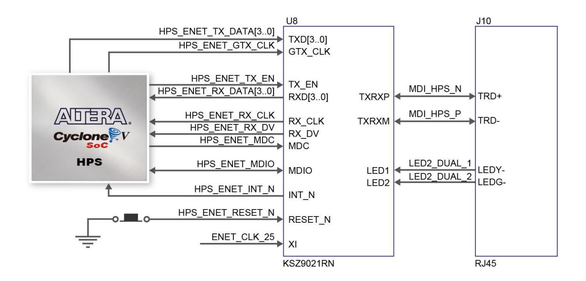

**Figure 3-30 Connections between Cyclone V SoC FPGA and Ethernet**

**Table 3-27 Pin Assignments for Ethernet PHY**

<span id="page-43-3"></span><span id="page-43-2"></span>

| Signal Name         | FPGA Pin No. | Description                  | I/O Standard |
|---------------------|--------------|------------------------------|--------------|
| HPS_ENET_TX_EN      | PIN_A20      | GMII and MII transmit enable | 3.3V         |
| HPS_ENET_TX_DATA[0] | PIN_F20      | MII transmit data[0]         | 3.3V         |


| HPS_ENET_TX_DATA[1] | PIN_J19 | MII transmit data[1]            | 3.3V |
|---------------------|---------|---------------------------------|------|
| HPS_ENET_TX_DATA[2] | PIN_F21 | MII transmit data[2]            | 3.3V |
| HPS_ENET_TX_DATA[3] | PIN_F19 | MII transmit data[3]            | 3.3V |
| HPS_ENET_RX_DV      | PIN_K17 | GMII and MII receive data valid | 3.3V |
| HPS_ENET_RX_DATA[0] | PIN_A21 | GMII and MII receive data[0]    | 3.3V |
| HPS_ENET_RX_DATA[1] | PIN_B20 | GMII and MII receive data[1]    | 3.3V |
| HPS_ENET_RX_DATA[2] | PIN_B18 | GMII and MII receive data[2]    | 3.3V |
| HPS_ENET_RX_DATA[3] | PIN_D21 | GMII and MII receive data[3]    | 3.3V |
| HPS_ENET_RX_CLK     | PIN_G20 | GMII and MII receive clock      | 3.3V |
| HPS_ENET_RESET_N    | PIN_E18 | Hardware Reset Signal           | 3.3V |
| HPS_ENET_MDIO       | PIN_E21 | Management Data                 | 3.3V |
| HPS_ENET_MDC        | PIN_B21 | Management Data Clock Reference | 3.3V |
| HPS_ENET_INT_N      | PIN_C19 | Interrupt Open Drain Output     | 3.3V |
| HPS_ENET_GTX_CLK    | PIN_H19 | GMII Transmit Clock             | 3.3V |

Additionally, the Ethernet PHY (KSZ9021RNI) LED status has been set to two LED mode. The LED control signals are connected to LEDs (yellow and green) on the RJ45 connector. States and definitions can be found in **[Table 3-28,](#page-44-1)** which can display the current status of the Ethernet. For example once the green LED lights on , the board has been connected to Giga bit Ethernet.

<span id="page-44-1"></span>*LED (State) LED (Definition) Link /Activity LEDG LEDY LEDG LEDY* **H H OFF OFF Link off L H ON OFF 1000 Link / No Activity Toggle H Blinking OFF 1000 Link / Activity (RX, TX) H L OFF ON 100 Link / No Activity H Toggle OFF Blinking 100 Link / Activity (RX, TX) L L ON ON 10 Link/ No Activity Toggle Toggle Blinking Blinking 10 Link / Activity (RX, TX)**

**Table 3-28 LED Mode-Pin Definition**

## <span id="page-44-0"></span>3.7.3 UART

The board has one UART interface connected for communication with the HPS. This interface wouldn't support HW flow control signals. The physical interface is done using UART-USB onboard bridge from an FT232R chip and connects to the host using an USB Mini-B connector. For detailed information on how to use the transceiver, please refer to the datasheet, which is available on the manufacturer's website, or in the Datasheets\UART TO USB folder on the DE1-SoC System CD. **[Figure 3-31](#page-45-1)** shows the related schematics, and **[Table 3-29](#page-45-2)** lists the pin assignments of HPS in Cyclone V SoC FPGA.


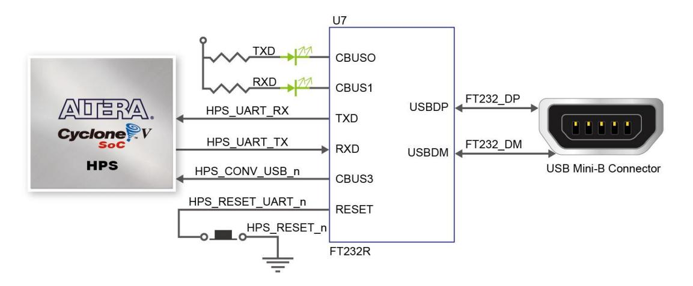

**Figure 3-31 Connections between the Cyclone V SoC FPGA and FT232R Chip**

**Table 3-29 UART Interface I/O**

<span id="page-45-2"></span><span id="page-45-1"></span>

| Signal Name    | FPGA Pin No. | Description          | I/O Standard |
|----------------|--------------|----------------------|--------------|
| HPS_UART_RX    | PIN_B25      | HPS UART Receiver    | 3.3V         |
| HPS_UART_TX    | PIN_C25      | HPS UART Transmitter | 3.3V         |
| HPS_CONV_USB_N | PIN_B15      | Reserve              | 3.3V         |

## <span id="page-45-0"></span>3.7.4 DDR3 Memory on HPS

The DDR3 devices that are connected to the HPS are the exact same devices connected to the FPGA in capacity (1GB) and data-width (32-bit), comprised of two x16 devices with a single address/command bus. This interface connects to dedicate Hard Memory Controller for HPS I/O banks and the target speed is 400 MHz. **[Table 3-30](#page-45-3)** lists DDR3 pin assignments, I/O standards and descriptions with Cyclone V SoC FPGA.

**Table 3-30 Pin Assignments for DDR3 Memory**

<span id="page-45-3"></span>

| Signal Name    | FPGA Pin No. | Description          | I/O Standard    |
|----------------|--------------|----------------------|-----------------|
| HPS_DDR3_A[0]  | PIN_F26      | HPS DDR3 Address[0]  | SSTL-15 Class I |
| HPS_DDR3_A[1]  | PIN_G30      | HPS DDR3 Address[1]  | SSTL-15 Class I |
| HPS_DDR3_A[2]  | PIN_F28      | HPS DDR3 Address[2]  | SSTL-15 Class I |
| HPS_DDR3_A[3]  | PIN_F30      | HPS DDR3 Address[3]  | SSTL-15 Class I |
| HPS_DDR3_A[4]  | PIN_J25      | HPS DDR3 Address[4]  | SSTL-15 Class I |
| HPS_DDR3_A[5]  | PIN_J27      | HPS DDR3 Address[5]  | SSTL-15 Class I |
| HPS_DDR3_A[6]  | PIN_F29      | HPS DDR3 Address[6]  | SSTL-15 Class I |
| HPS_DDR3_A[7]  | PIN_E28      | HPS DDR3 Address[7]  | SSTL-15 Class I |
| HPS_DDR3_A[8]  | PIN_H27      | HPS DDR3 Address[8]  | SSTL-15 Class I |
| HPS_DDR3_A[9]  | PIN_G26      | HPS DDR3 Address[9]  | SSTL-15 Class I |
| HPS_DDR3_A[10] | PIN_D29      | HPS DDR3 Address[10] | SSTL-15 Class I |


| HPS_DDR3_A[11]  | PIN_C30 | HPS DDR3 Address[11]                       | SSTL-15 Class I                 |
|-----------------|---------|--------------------------------------------|---------------------------------|
| HPS_DDR3_A[12]  | PIN_B30 | HPS DDR3 Address[12]                       | SSTL-15 Class I                 |
| HPS_DDR3_A[13]  | PIN_C29 | HPS DDR3 Address[13]                       | SSTL-15 Class I                 |
| HPS_DDR3_A[14]  | PIN_H25 | HPS DDR3 Address[14]                       | SSTL-15 Class I                 |
| HPS_DDR3_BA[0]  | PIN_E29 | HPS DDR3 Bank Address[0]                   | SSTL-15 Class I                 |
| HPS_DDR3_BA[1]  | PIN_J24 | HPS DDR3 Bank Address[1]                   | SSTL-15 Class I                 |
| HPS_DDR3_BA[2]  | PIN_J23 | HPS DDR3 Bank Address[2]                   | SSTL-15 Class I                 |
| HPS_DDR3_CAS_n  | PIN_E27 | DDR3 Column Address Strobe SSTL-15 Class I |                                 |
| HPS_DDR3_CKE    | PIN_L29 | HPS DDR3 Clock Enable                      | SSTL-15 Class I                 |
| HPS_DDR3_CK_n   | PIN_L23 | HPS DDR3 Clock                             | Differential 1.5-V SSTL Class I |
| HPS_DDR3_CK_p   | PIN_M23 | HPS DDR3 Clock p                           | Differential 1.5-V SSTL Class I |
| HPS_DDR3_CS_n   | PIN_H24 | HPS DDR3 Chip Select                       | SSTL-15 Class I                 |
| HPS_DDR3_DM[0]  | PIN_K28 | HPS DDR3 Data Mask[0]                      | SSTL-15 Class I                 |
| HPS_DDR3_DM[1]  | PIN_M28 | HPS DDR3 Data Mask[1]                      | SSTL-15 Class I                 |
| HPS_DDR3_DM[2]  | PIN_R28 | HPS DDR3 Data Mask[2]                      | SSTL-15 Class I                 |
| HPS_DDR3_DM[3]  | PIN_W30 | HPS DDR3 Data Mask[3]                      | SSTL-15 Class I                 |
| HPS_DDR3_DQ[0]  | PIN_K23 | HPS DDR3 Data[0]                           | SSTL-15 Class I                 |
| HPS_DDR3_DQ[1]  | PIN_K22 | HPS DDR3 Data[1]                           | SSTL-15 Class I                 |
| HPS_DDR3_DQ[2]  | PIN_H30 | HPS DDR3 Data[2]                           | SSTL-15 Class I                 |
| HPS_DDR3_DQ[3]  | PIN_G28 | HPS DDR3 Data[3]                           | SSTL-15 Class I                 |
| HPS_DDR3_DQ[4]  | PIN_L25 | HPS DDR3 Data[4]                           | SSTL-15 Class I                 |
| HPS_DDR3_DQ[5]  | PIN_L24 | HPS DDR3 Data[5]                           | SSTL-15 Class I                 |
| HPS_DDR3_DQ[6]  | PIN_J30 | HPS DDR3 Data[6]                           | SSTL-15 Class I                 |
| HPS_DDR3_DQ[7]  | PIN_J29 | HPS DDR3 Data[7]                           | SSTL-15 Class I                 |
| HPS_DDR3_DQ[8]  | PIN_K26 | HPS DDR3 Data[8]                           | SSTL-15 Class I                 |
| HPS_DDR3_DQ[9]  | PIN_L26 | HPS DDR3 Data[9]                           | SSTL-15 Class I                 |
| HPS_DDR3_DQ[10] | PIN_K29 | HPS DDR3 Data[10]                          | SSTL-15 Class I                 |
| HPS_DDR3_DQ[11] | PIN_K27 | HPS DDR3 Data[11]                          | SSTL-15 Class I                 |
| HPS_DDR3_DQ[12] | PIN_M26 | HPS DDR3 Data[12]                          | SSTL-15 Class I                 |
| HPS_DDR3_DQ[13] | PIN_M27 | HPS DDR3 Data[13]                          | SSTL-15 Class I                 |
| HPS_DDR3_DQ[14] | PIN_L28 | HPS DDR3 Data[14]                          | SSTL-15 Class I                 |
| HPS_DDR3_DQ[15] | PIN_M30 | HPS DDR3 Data[15]                          | SSTL-15 Class I                 |
| HPS_DDR3_DQ[16] | PIN_U26 | HPS DDR3 Data[16]                          | SSTL-15 Class I                 |
| HPS_DDR3_DQ[17] | PIN_T26 | HPS DDR3 Data[17]                          | SSTL-15 Class I                 |
|                 |         |                                            |                                 |
| HPS_DDR3_DQ[18] | PIN_N29 | HPS DDR3 Data[18]                          | SSTL-15 Class I                 |
| HPS_DDR3_DQ[19] | PIN_N28 | HPS DDR3 Data[19]                          | SSTL-15 Class I                 |
| HPS_DDR3_DQ[20] | PIN_P26 | HPS DDR3 Data[20]                          | SSTL-15 Class I                 |
| HPS_DDR3_DQ[21] | PIN_P27 | HPS DDR3 Data[21]                          | SSTL-15 Class I                 |
| HPS_DDR3_DQ[22] | PIN_N27 | HPS DDR3 Data[22]                          | SSTL-15 Class I                 |
| HPS_DDR3_DQ[23] | PIN_R29 | HPS DDR3 Data[23]                          | SSTL-15 Class I                 |
| HPS_DDR3_DQ[24] | PIN_P24 | HPS DDR3 Data[24]                          | SSTL-15 Class I                 |
| HPS_DDR3_DQ[25] | PIN_P25 | HPS DDR3 Data[25]                          | SSTL-15 Class I                 |
| HPS_DDR3_DQ[26] | PIN_T29 | HPS DDR3 Data[26]                          | SSTL-15 Class I                 |
| HPS_DDR3_DQ[27] | PIN_T28 | HPS DDR3 Data[27]                          | SSTL-15 Class I                 |


| PIN_R27 | HPS DDR3 Data[28]                           | SSTL-15 Class I                 |
|---------|---------------------------------------------|---------------------------------|
| PIN_R26 | HPS DDR3 Data[29]                           | SSTL-15 Class I                 |
| PIN_V30 | HPS DDR3 Data[30]                           | SSTL-15 Class I                 |
| PIN_W29 | HPS DDR3 Data[31]                           | SSTL-15 Class I                 |
| PIN_M19 | HPS DDR3 Data Strobe n[0]                   | Differential 1.5-V SSTL Class I |
| PIN_N24 | HPS DDR3 Data Strobe n[1]                   | Differential 1.5-V SSTL Class I |
| PIN_R18 | HPS DDR3 Data Strobe n[2]                   | Differential 1.5-V SSTL Class I |
| PIN_R21 | HPS DDR3 Data Strobe n[3]                   | Differential 1.5-V SSTL Class I |
| PIN_N18 | HPS DDR3 Data Strobe p[0]                   | Differential 1.5-V SSTL Class I |
| PIN_N25 | HPS DDR3 Data Strobe p[1]                   | Differential 1.5-V SSTL Class I |
| PIN_R19 | HPS DDR3 Data Strobe p[2]                   | Differential 1.5-V SSTL Class I |
| PIN_R22 | HPS DDR3 Data Strobe p[3]                   | Differential 1.5-V SSTL Class I |
| PIN_H28 | HPS DDR3 On-die Termination SSTL-15 Class I |                                 |
| PIN_D30 | DDR3 Row Address Strobe                     | SSTL-15 Class I                 |
| PIN_P30 | HPS DDR3 Reset                              | SSTL-15 Class I                 |
| PIN_C28 | HPS DDR3 Write Enable                       | SSTL-15 Class I                 |
| PIN_D27 | External reference ball for                 | 1.5 V                           |
|         | output drive calibration                    |                                 |
|         |                                             |                                 |

## <span id="page-47-0"></span>3.7.5 QSPI Flash

The board supports a 1G-bit serial NOR flash device for non-volatile storage of HPS boot code, user data and program. The device is connected to HPS dedicated interface. It may contain secondary boot code.

This device has a 4-bit data interface and uses 3.3V CMOS signaling standard. Connections between Cyclone V SoC FPGA and Flash are shown in **[Figure 3-32](#page-48-1)**.

To program the QSPI flash, the **HPS Flash Programmer** is provided both as part of the Altera Quartus II suite and as part of the free Altera Quartus II Programmer. The HPS Flash Programmer sends file contents over an Altera download cable, such as the USB Blaster II, to the HPS, and instructs the HPS to write the data to the flash memory.


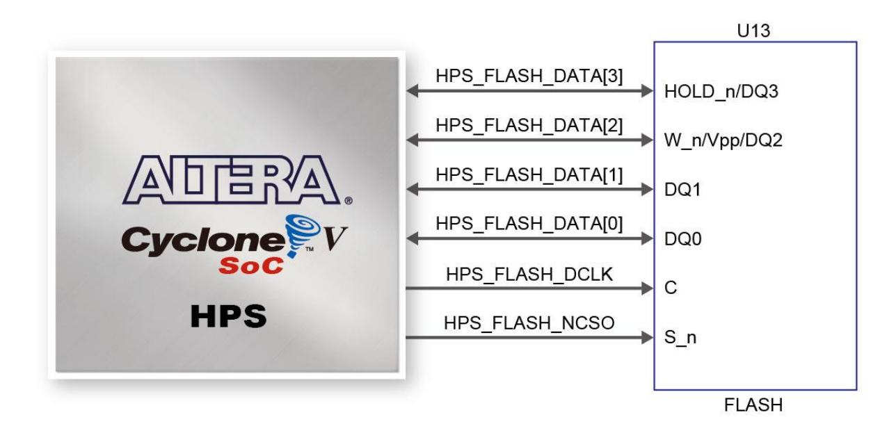

**Figure 3-32 Connections Between Cyclone V SoC FPGA and QSPI Flash**

<span id="page-48-1"></span>**[Table 3-31](#page-48-2)** below summarizes the pins on the flash device. Signal names are from the device datasheet and directions are relative to the Cyclone V SoC FPGA.

<span id="page-48-2"></span>*Signal Name FPGA Pin No. Description I/O Standard* **HPS\_FLASH\_DATA[0] PIN\_C20 HPS FLASH Data[0] 3.3V HPS\_FLASH\_DATA[1] PIN\_H18 HPS FLASH Data[1] 3.3V HPS\_FLASH\_DATA[2] PIN\_A19 HPS FLASH Data[2] 3.3V HPS\_FLASH\_DATA[3] PIN\_E19 HPS FLASH Data[3] 3.3V HPS\_FLASH\_DCLK PIN\_D19 HPS FLASH Data Clock 3.3V HPS\_FLASH\_NCSO PIN\_A18 HPS FLASH Chip Enable 3.3V**

**Table 3-31 QSPI Flash Interface I/O**

## <span id="page-48-0"></span>3.7.6 Micro SD

The board supports Micro SD card interface using x4 data lines. And it may contain secondary boot code for HPS. **[Figure 3-33](#page-49-1)** shows the related signals.

Finally, **[Table 3-32](#page-49-2)** lists all the associated pins for interfacing HPS respectively.


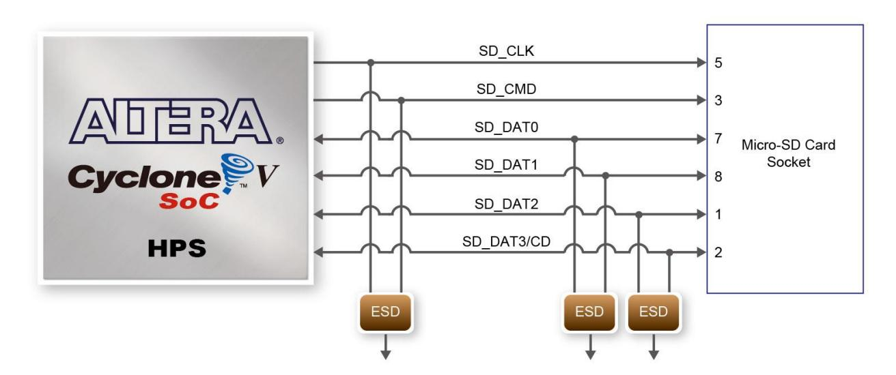

**Figure 3-33 Connections between Cyclone V SoC FPGA and SD Card Socket**

<span id="page-49-2"></span><span id="page-49-1"></span>

| Signal Name    | FPGA Pin No. | Description         | I/O Standard |  |
|----------------|--------------|---------------------|--------------|--|
| HPS_SD_CLK     | PIN_A16      | HPS SD Clock        | 3.3V         |  |
| HPS_SD_CMD     | PIN_F18      | HPS SD Command Line | 3.3V         |  |
| HPS_SD_DATA[0] | PIN_G18      | HPS SD Data[0]      | 3.3V         |  |
| HPS_SD_DATA[1] | PIN_C17      | HPS SD Data[1]      | 3.3V         |  |
| HPS_SD_DATA[2] | PIN_D17      | HPS SD Data[2]      | 3.3V         |  |
| HPS_SD_DATA[3] | PIN_B16      | HPS SD Data[3]      | 3.3V         |  |

**Table 3-32 SD Card Socket Pin Assignments**

## <span id="page-49-0"></span>3.7.7 2-port USB Host

The board provides 2-port USB 2.0 host interfaces using the SMSC USB3300 controller and 2-port hub controller. A SMSC USB3300 device in a 32-pin QFN package device is used to interface to a SMSC USB2512B. This device supports UTMI+ Low Pin Interface (ULPI) to communicate to USB 2.0 controller in HPS. By connecting the ID pin of USB3300 to ground, the PHY operates in Host mode. When operating in Host mode, the interface will supply the power to the device through the 2-port USB type-A interface. **[Figure 3-34](#page-50-1)** shows the schematic diagram of the USB circuitry; the pin assignments for the associated interface are listed in **[Table 3-33](#page-50-2)**.


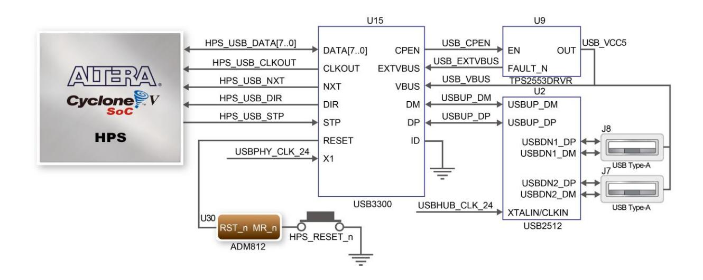

**Figure 3-34 Connections between Cyclone V SoC FPGA and USB OTG PHY**

<span id="page-50-2"></span><span id="page-50-1"></span>

| Signal Name     | FPGA Pin No. | Description                  | I/O Standard |
|-----------------|--------------|------------------------------|--------------|
| HPS_USB_CLKOUT  | PIN_N16      | 60MHz Reference Clock Output | 3.3V         |
| HPS_USB_DATA[0] | PIN_E16      | HPS USB_DATA[0]              | 3.3V         |
| HPS_USB_DATA[1] | PIN_G16      | HPS USB_DATA[1]              | 3.3V         |
| HPS_USB_DATA[2] | PIN_D16      | HPS USB_DATA[2]              | 3.3V         |
| HPS_USB_DATA[3] | PIN_D14      | HPS USB_DATA[3]              | 3.3V         |
| HPS_USB_DATA[4] | PIN_A15      | HPS USB_DATA[4]              | 3.3V         |
| HPS_USB_DATA[5] | PIN_C14      | HPS USB_DATA[5]              | 3.3V         |
| HPS_USB_DATA[6] | PIN_D15      | HPS USB_DATA[6]              | 3.3V         |
| HPS_USB_DATA[7] | PIN_M17      | HPS USB_DATA[7]              | 3.3V         |
| HPS_USB_DIR     | PIN_E14      | Direction of the Data Bus    | 3.3V         |
| HPS_USB_NXT     | PIN_A14      | Throttle the Data            | 3.3V         |
| HPS_USB_RESET   | PIN_G17      | HPS USB PHY Reset            | 3.3V         |
|                 |              |                              |              |

<span id="page-50-0"></span>**HPS\_USB\_STP PIN\_C15 Stop Data Stream on theBus 3.3V**

**Table 3-33 USB OTG PHY Pin Assignments**

## 3.7.8 G-Sensor

The board is equipped with a digital accelerometer sensor module. The ADXL345 is a small, thin, ultralow power assumption 3-axis accelerometer with high-resolution measurement. Digitalized output is formatted as 16-bit twos complement and can be accessed using I2C interface. The I2C address of the G-Sensor device is 0xA6/0xA7. For more detailed information of better using this chip, please refer to its datasheet which is available on manufacturer's website or under the Datasheet folder of the DE1-SoC System CD. **[Figure 3-35](#page-51-1)** shows the connections between ADXL345 and HPS. The associated pin assignments are listed in **[Table 3-34](#page-51-2)**.


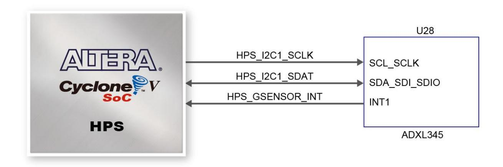

**Figure 3-35 Connections between Cyclone V SoC FPGA and G-Sensor**

**Table 3-34 G-Sensor Pin Assignments**

<span id="page-51-2"></span><span id="page-51-1"></span>

| Signal Name     | FPGA Pin No. | Description                        | I/O Standard |
|-----------------|--------------|------------------------------------|--------------|
| HPS_GSENSOR_INT | PIN_B22      | HPS GSENSOR Interrupt Output       | 3.3V         |
| HPS_I2C1_SCLK   | PIN_E23      | HPS I2C Clock (share bus with LTC) | 3.3V         |
| HPS_I2C1_SDAT   | PIN_C24      | HPS I2C Data (share bus)           | 3.3V         |

## <span id="page-51-0"></span>3.7.9 LTC Connector

The board allows connection to interface card from Linear Technology. The interface is implemented using a14-pin header that can be connected to a variety of demo boards from Linear Technology. It will be connected to SPI Master and I2C ports of the HPS to allow bidirectional communication with two types of protocols. The 14-pin header will allow for GPIO, SPI and I2C extension for user purposes if the interfaces to Linear Technology board aren't in use. Connections between the LTC connector and the HPS are shown in **[Figure 3-36,](#page-52-0)** and the functions of the 14 pins is listed in **[Table 3-25](#page-42-3)**.


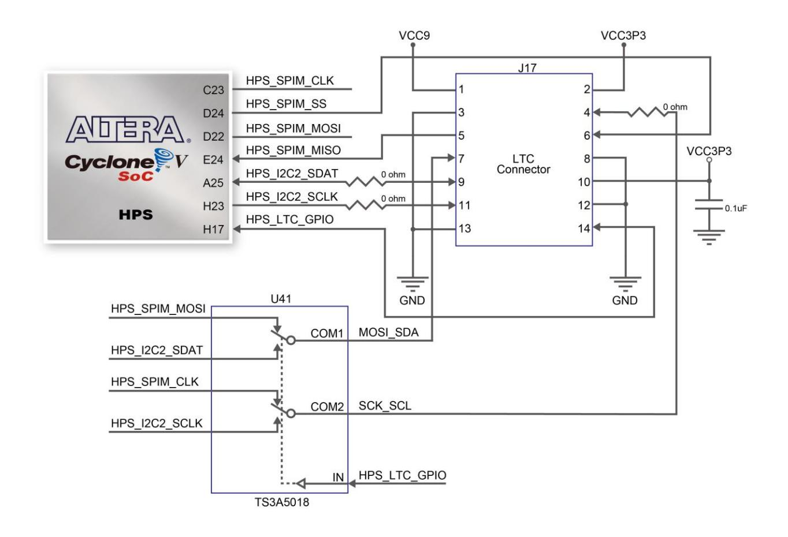

**Figure 3-36 Connections between the LTC Connector and HPS**

**Table 3-35 LTC Connector Pin Assignments**

<span id="page-52-0"></span>

| Signal Name   | FPGA Pin No. | Description                                 | I/O Standard |
|---------------|--------------|---------------------------------------------|--------------|
| HPS_LTC_GPIO  | PIN_H17      | HPS LTC GPIO                                | 3.3V         |
| HPS_I2C2_SCLK | PIN_H23      | HPS I2C2 Clock (share bus with<br>G-Sensor) | 3.3V         |
| HPS_I2C2_SDAT | PIN_A25      | HPS I2C2 Data (share bus with<br>G-Sensor)  | 3.3V         |
| HPS_SPIM_CLK  | PIN_C23      | SPI Clock                                   | 3.3V         |
| HPS_SPIM_MISO | PIN_E24      | SPI Master Input/Slave Output               | 3.3V         |
| HPS_SPIM_MOSI | PIN_D22      | SPI Master Output /Slave Input              | 3.3V         |
| HPS_SPIM_SS   | PIN_D24      | SPI Slave Select                            | 3.3V         |

<span id="page-53-0"></span>

## Chapter 4 DE1-SoC System Builder

This chapter describes how users can create a custom design project on the board by using the DE1-SoC Software Tool – DE1-SoC System Builder.

## <span id="page-53-1"></span>4.1 Introduction

The DE1-SoC System Builder is a Windows-based software utility, designed to assist users to create a Quartus II project for the board within minutes. The generated Quartus II project files include:

- Quartus II Project File (.qpf)
- Quartus II Setting File (.qsf)
- Top-Level Design File (.v)
- Synopsis Design Constraints file (.sdc)
- Pin Assignment Document (.htm)

By providing the above files, the DE1-SoC System Builder prevents occurrence of situations that are prone to errors when users manually edit the top-level design file or place pin assignments. The common mistakes that users encounter are the following:

- 1. Board damage due to wrong pin/bank voltage assignments.
- 2. Board malfunction caused by wrong device connections or missing pin counts for connected ends.
- <span id="page-53-2"></span>3. Performance degeneration due to improper pin assignments.

## 4.2 General Design Flow

This section will introduce the general design flow to build a project for the development board via the DE1-SoC System Builder. The general design flow is illustrated in **[Figure 4-1](#page-54-1)**.


Users should launch the DE1-SoC System Builder and create a new project according to their design requirements. When users complete the settings, the DE1-SoC System Builder will generate two major files, a top-level design file (.v) and a Quartus II setting file (.qsf).

The top-level design file contains top-level Verilog HDL wrapper for users to add their own design/logic. The Quartus II setting file contains information such as FPGA device type, top-level pin assignment, and the I/O standard for each user-defined I/O pin.

Finally, the Quartus II programmer must be used to download SOF file to the development board using a JTAG interface.

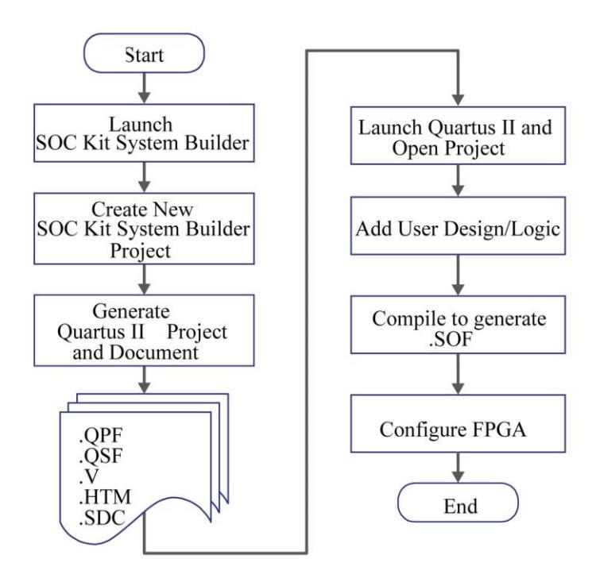

**Figure 4-1 The general design flow of building a design**

## <span id="page-54-1"></span><span id="page-54-0"></span>4.3 Using DE1-SoC System Builder

This section provides the detailed procedures on how the DE1-SoC System Builder is used.

### **Install and launch the DE1-SoC System Builder**

The DE1-SoC System Builder is located in the directory: *"Tools\SystemBuilder"* on the DE1-SoC


System CD. Users can copy the whole folder to a host computer without installing the utility. Launch the DE1-SoC System Builder by executing the DE1-SoC SystemBuilder.exe on the host computer and the GUI window will appear as shown in **[Figure 4-2](#page-55-0)**.

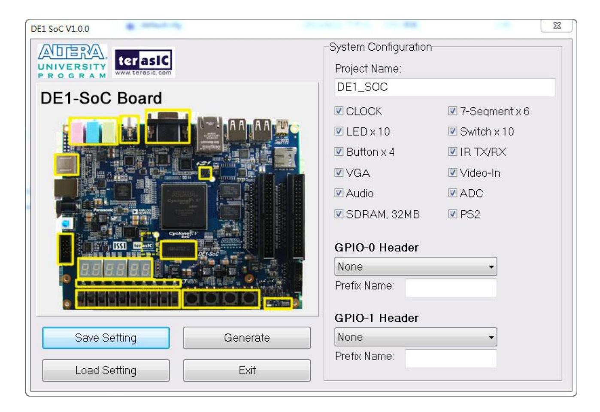

**Figure 4-2 The DE1-SoC System Builder window**

## <span id="page-55-0"></span>**Input Project Name**

Input project name as show in **[Figure 4-3](#page-56-0)**.

Project Name: Type in an appropriate name here, it will automatically be assigned as the name of your top-level design entity.


**Figure 4-3 Board Type and Project Name**

#### <span id="page-56-0"></span>**System Configuration**

Under the System Configuration users are given the flexibility of enabling their choice of included components on the board as shown in **[Figure 4-4](#page-57-0)**. Each component of the board is listed where users can enable or disable a component according to their design by simply marking a check or removing the check in the field provided. If the component is enabled, the DE1-SoC System Builder will automatically generate the associated pin assignments including the pin name, pin location, pin direction, and I/O standard.


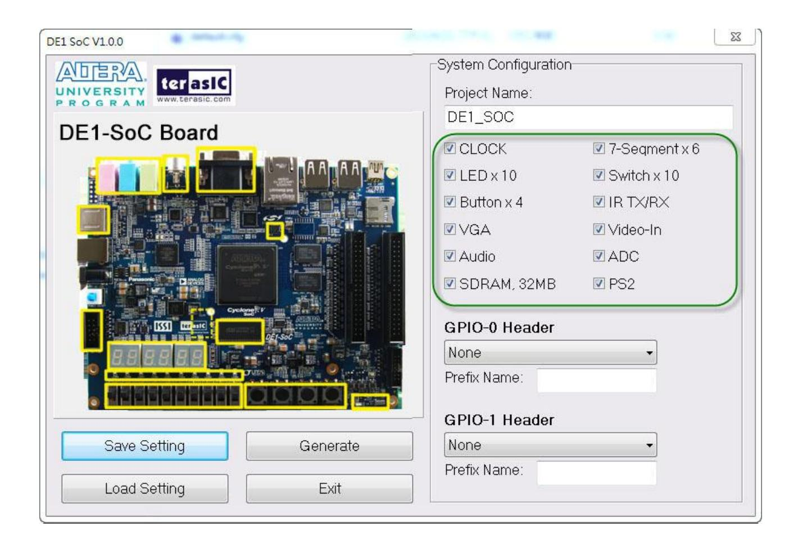

**Figure 4-4 System Configuration Group**

## <span id="page-57-0"></span>**GPIO Expansion**

Users can connect GPIO daughter cards onto the GPIO connector located on the development board shown in **[Figure 4-5](#page-58-0)**. Select the daughter card you wish to add to your design under the appropriate GPIO connector to which the daughter card is connected. The System Builder will automatically generate the associated pin assignment including pin name, pin location, pin direction, and I/O standard.


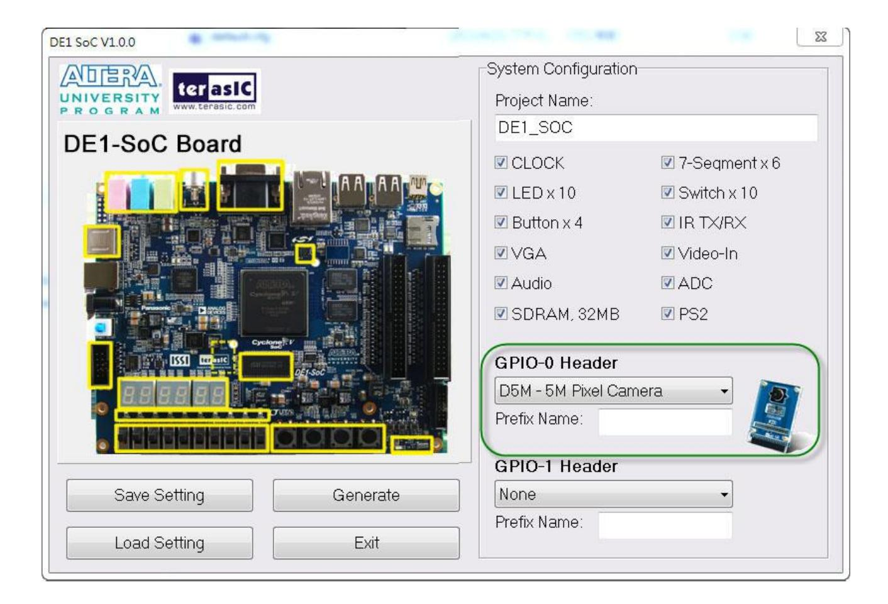

**Figure 4-5 GPIO Expansion Group**

<span id="page-58-0"></span>The "Prefix Name" is an optional feature that denotes the pin name of the daughter card assigned in your design. Users may leave this field empty.

## **Project Setting Management**

The DE1-SoC System Builder also provides functions to restore default setting, loading a setting, and saving users' board configuration file shown in **[Figure 4-6](#page-59-0)**. Users can save the current board configuration information into a .cfg file and load it to the DE1-SoC System Builder.


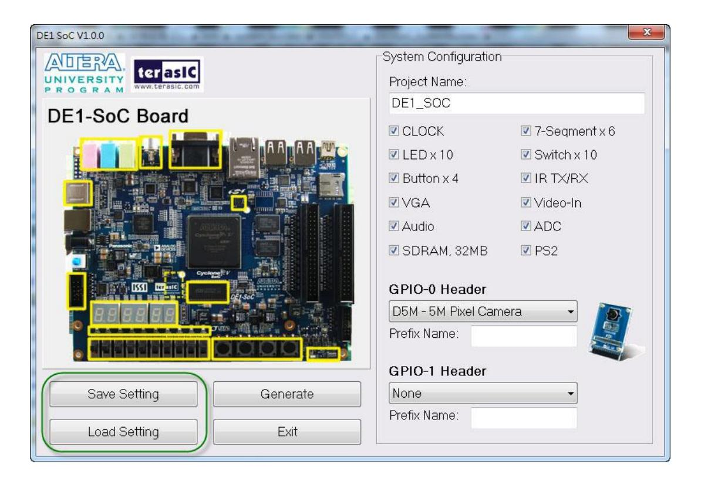

**Figure 4-6 Project Settings**

## <span id="page-59-0"></span>**Project Generation**

When users press the *Generate* button, the DE1-SoC System Builder will generate the corresponding Quartus II files and documents as listed in the **[Table 4-1](#page-59-1)**:

**Table 4-1 The files generated by DE1-SoC System Builder**

<span id="page-59-1"></span>

| No. | Filename                        | Description                                     |
|-----|---------------------------------|-------------------------------------------------|
| 1   | <project name="">.v</project>   | Top level Verilog HDL file for Quartus II       |
| 2   | <project name="">.qpf</project> | Quartus II Project File                         |
| 3   | <project name="">.qsf</project> | Quartus II Setting File                         |
| 4   | <project name="">.sdc</project> | Synopsis Design Constraints file for Quartus II |
| 5   | <project name="">.htm</project> | Pin Assignment Document                         |

Users can use Quartus II software to add custom logic into the project and compile the project to generate the SRAM Object File (.sof).


## Chapter 5

## Examples For FPGA

<span id="page-60-0"></span>This chapter provides a number of examples of advanced circuits implemented by RTL or Qsys on the DE1-SoC board. These circuits provide demonstrations of the major features which connected to FPGA interface on the board, such as audio, SDRAM and IR receiver. All of the associated files can be found in the *Demonstrations/FPGA* folder on the DE1-SoC System CD.

#### **Installing the Demonstrations**

To install the demonstrations on your computer:

Copy the directory *Demonstrations* into a local directory of your choice. It is important to ensure that the path to your local directory contains no spaces – otherwise, the Nios II software will not work. Note Quartus II v13 or later is required for all DE1-SoC demonstrations to support Cyclone V SoC device.

## <span id="page-60-1"></span>5.1 DE1-SoC Factory Configuration

The DE1-SoC board is shipped from the factory with a default configuration bit-stream that demonstrates some of the basic features of the board. The setup required for this demonstration, and the locations of its files are shown below.

## **Demonstration Setup, File Locations, and Instructions**

- Project directory: DE1\_SoC\_Default
- Bit stream used: DE1\_SoC\_Default.sof or DE1\_SoC\_Default.jic
- Power on the DE1-SoC board, with the USB cable connected to the USB Blaster port. If necessary (that is, if the default factory configuration of the DE1-SoC board is not currently stored in EPCQ device), download the bit stream to the board by using JTAG programming
- You should now be able to observe that the 7-segment displays are displaying a sequence of characters, and the red LEDs are flashing.
- Optionally connect a VGA display to the VGA D-SUB connector. When connected, the VGA


display should show a color picture

- Optionally connect a powered speaker to the stereo audio-out jack. Press KEY[1] to hear a 1 kHz humming sound from the audio-out port.
- There is a demo\_batch folder in the project. It is able to load the bit stream into the FPGA , programming or erasing .jic file to EPCQ by executing test.bat file as shown in the **[Figure 5-1](#page-61-1)**.If user want to download the new design into the EPCQ, the easy method is to copy the new .sof file into the demo\_batch folder and Execute the test.bat. Select the option "2" to covert the .sof to .jic firstly. Then using the option"3" to program .jic file into EPCQ.

**Figure 5-1 Batch file for download FPGA and EPCQ**

## <span id="page-61-1"></span><span id="page-61-0"></span>5.2 Audio Recording and Playing

This demonstration shows how to implement an audio recorder and player using the DE1-SoC board with the built-in Audio CODEC chip. This demonstration is developed based on Qsys and Eclipse. **[Figure 5-2](#page-62-0)** shows the man-machine interface of this demonstration. Two push-buttons and four slide switches are used for users to configure this audio system: SW0 is used to specify recording source to be Line-in or MIC-In. SW1, SW2, and SW3 are used to specify recording sample rate as 96K, 48K, 44.1K, 32K, or 8K. **[Table 5-1](#page-63-0)** and **[Table 5-2](#page-64-1)** summarize the usage of Slide switches for configuring the audio recorder and player.


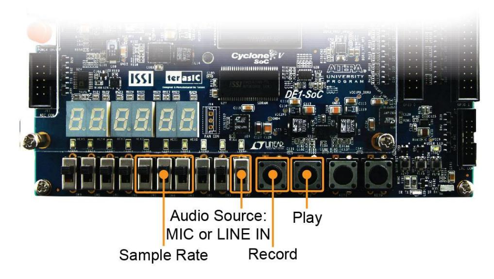

**Figure 5-2 Man-Machine Interface of Audio Recorder and Player**

<span id="page-62-1"></span><span id="page-62-0"></span>**[Figure 5-3](#page-63-1)** shows the block diagram of the Audio Recorder and Player design. There are hardware and software parts in the block diagram. The software part stores the Nios II program in the on-chip memory. The software part is built by Eclipse in C programming language. The hardware part is built by Qsys under Quartus II. The hardware part includes all the other blocks. The "AUDIO Controller" is a user-defined Qsys component. It is designed to send audio data to the audio chip or receive audio data from the audio chip.

The audio chip is programmed through I2C protocol which is implemented in C code. The I2C pins from audio chip are connected to Qsys System Interconnect Fabric through PIO controllers. In this example, the audio chip is configured in Master Mode. The audio interface is configured as I2S and 16-bit mode. 18.432MHz clock generated by the PLL is connected to the MCLK/XTI pin of the audio chip through the AUDIO Controller.


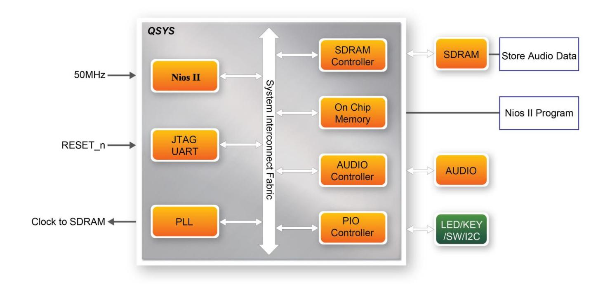

**Figure 5-3 Block diagram of the audio recorder and player**

#### <span id="page-63-1"></span>**Demonstration Setup, File Locations, and Instructions**

- Hardware Project directory: DE1\_SoC \_Audio
- Bit stream used: DE1\_SoC \_Audio.sof
- Software Project directory: DE1\_SoC \_Audio\software
- Connect an Audio Source to the LINE-IN port of the DE1-SoC board.
- Connect a Microphone to MIC-IN port on the DE1-SoC board.
- Connect a speaker or headset to LINE-OUT port on the DE1-SoC board.
- Load the bit stream into FPGA. (note \*1)
- Load the Software Execution File into FPGA. (note \*1)
- Configure audio with the Slide switches SW0 as shown in **[Table 5-1](#page-63-0)**.
- Press KEY3 on the DE1-SoC board to start/stop audio recording (note \*2)
- <span id="page-63-0"></span>Press KEY2 on the DE1-SoC board to start/stop audio playing (note \*3)

**Table 5-1 Slide switches usage for audio source**

| Slide Switches | 0 – DOWN Position | 1 – UP Position       |
|----------------|-------------------|-----------------------|
| SW0            | Audio is from MIC | Audio is from LINE-IN |

<span id="page-64-1"></span>

**Table 5-2 Slide switch setting for sample rate switching for audio recorder and player**

| SW5                  | SW4        | SW3        |             |
|----------------------|------------|------------|-------------|
| (0 – DOWN;           | (0 – DOWN; | (0 – DOWN; | Sample Rate |
| 1- UP)               | 1-UP)      | 1-UP)      |             |
| 0                    | 0          | 0          | 96K         |
| 0                    | 0          | 1          | 48K         |
| 0                    | 1          | 0          | 44.1K       |
| 0                    | 1          | 1          | 32K         |
| 1                    | 0          | 0          | 8K          |
| Unlisted combination |            | 96K        |             |


- (1). Execute DE1\_SoC \_Audio \demo\_batch\ DE1-SoC \_Audio.bat will download .sof and .elf files.
- (2). Recording process will stop if audio buffer is full.
- <span id="page-64-0"></span>(3). Playing process will stop if audio data is played completely.

## 5.3 A Karaoke Machine

This demonstration uses the microphone-in, line-in, and line-out ports on the DE1-SOC board to create a Karaoke Machine application. The WM8731 CODEC is configured in the master mode, with which the audio CODEC generates AD/DA serial bit clock (BCK) and the left/right channel clock (LRCK) automatically. As indicated in **[Figure 5-4](#page-65-0)**, the I2C interface is used to configure the Audio CODEC. The sample rate and gain of the CODEC are set in this manner, and the data input from the line-in port is then mixed with the microphone-in port and the result is sent to the line-out port.

For this demonstration the sample rate is set to 48kHz. Pressing the pushbutton KEY0 reconfigures the gain of the audio CODEC via I2C bus, cycling within ten predefined gain values (volume levels) provided by the device.


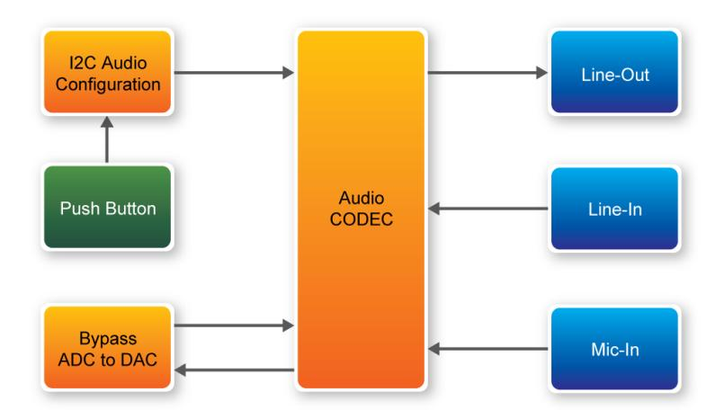

**Figure 5-4 Block diagram of the Karaoke Machine demonstration**

#### <span id="page-65-0"></span>**Demonstration Setup, File Locations, and Instructions**

- Project directory: DE1\_SOC\_i2sound
- Bit stream used: DE1\_SOC\_i2sound.sof
- Connect a microphone to the microphone-in port (pink color) on the DE1-SOC board
- Connect the audio output of a music-player, such as an MP3 player or computer, to the line-in port (blue color) on the DE1-SOC board
- Connect a headset/speaker to the line-out port (green color) on the DE1-SOC board
- Load the bit stream into the FPGA by execute the batch file 'DE1\_SOC\_i2sound' under the DE1\_SOC\_i2sound\demo\_batch folder
- You should be able to hear a mixture of the microphone sound and the sound from the music player
- Press KEY0 to adjust the volume; it cycles between volume levels 0 to 9

**[Figure 5-5](#page-66-1)** illustrates the setup for this demonstration.


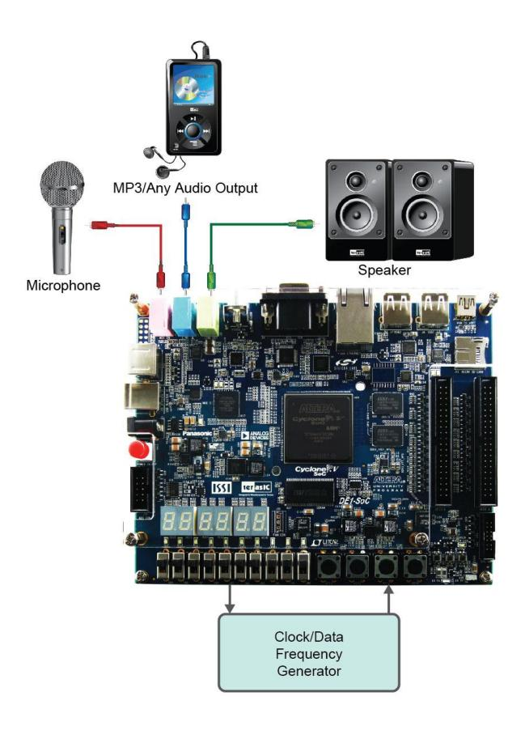

**Figure 5-5 Setup for the Karaoke Machine**

## <span id="page-66-1"></span><span id="page-66-0"></span>5.4 SDRAM Test by Nios II

Many applications use SDRAM to provide temporary storage. In this demonstration hardware and software designs are provided to illustrate how to perform memory access in QSYS. We describe how the Altera's SDRAM Controller IP is used to access a SDRAM, and how the Nios II processor is used to read and write the SDRAM for hardware verification. The SDRAM controller handles the complex aspects of using SDRAM by initializing the memory devices, managing SDRAM banks, and keeping the devices refreshed at appropriate intervals.

## **System Block Diagram**

**[Figure 5-6](#page-67-0)** shows the system block diagram of this demonstration. The system requires a 50 MHz clock provided from the board. The SDRAM controller is configured as a 64MB controller. The working frequency of the SDRAM controller is 100MHz, and the Nios II program is running in the on-chip memory.


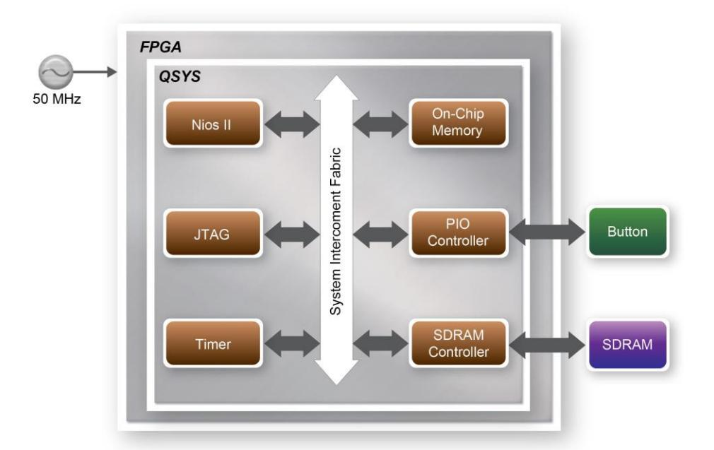

**Figure 5-6 Block diagram of the SDRAM Basic Demonstration**

<span id="page-67-0"></span>The system flow is controlled by a Nios II program. First, the Nios II program writes test patterns into the whole 64MB of SDRAM. Then, it calls Nios II system function, alt\_dcache\_flush\_all, to make sure all data has been written to SDRAM. Finally, it reads data from SDRAM for data verification. The program will show progress in JTAG-Terminal when writing/reading data to/from the SDRAM. When verification process is completed, the result is displayed in the JTAG-Terminal.

## **Design Tools**

- Quartus II 13.0
- Nios II Eclipse 13.0

#### **Demonstration Source Code**

- Quartus Project directory: DE1\_SoC\_SDRAM\_Nios\_Test
- Nios II Eclipse: DE1\_SoC\_SDRAM\_Nios\_Test \Software

### **Nios II Project Compilation**

 Before you attempt to compile the reference design under Nios II Eclipse, make sure the project is cleaned first by clicking 'Clean' from the 'Project' menu of Nios II Eclipse.


#### **Demonstration Batch File**

Demo Batch File Folder:

DE1\_SoC\_SDRAM\_Nios\_Test \demo\_batch

The demo batch file includes following files:

- Batch File for USB-Blaster (II) : DE1\_SoC\_SDRAM\_Nios\_Test.bat, DE1\_SoC\_SDRAM\_Nios\_Test\_bashrc
- FPGA Configure File : DE1\_SoC\_SDRAM\_Nios\_Test*.sof*
- Nios II Program: DE1\_SoC\_SDRAM\_Nios\_Test*.elf*

#### **Demonstration Setup**

- Make sure Quartus II and Nios II are installed on your PC.
- Power on the DE1-SoC board.
- Use USB cable to connect PC and the DE1-SoC board (J13) and install USB Blaster driver if necessary.
  - Execute the demo batch file "*DE1\_SoC\_SDRAM\_Nios\_Test.bat*" for USB-Blaster II under the batch file folder, *DE1\_SoC\_SDRAM\_Nios\_Test\demo\_batch*
- *After Nios II prog*ram is downloaded and executed successfully, a pro*mpt message will be displayed in n*ios2-terminal.
- Press **KEY3~KEY0** of the DE1-SoC board to start SDRAM verify process. Press **KEY0** for continued test**.**
- The program will display progressing and result information, as shown in **[Figure 5-7](#page-69-1)**.


<span id="page-69-1"></span>**Figure 5-7 Display Progress and Result Information for the SDRAM Demonstration**

## <span id="page-69-0"></span>5.5 SDRAM RTL Test

This demonstration presents a memory test function on the bank of SDRAM on the DE1-SoC board. The memory size of the SDRAM bank is 64MB and all the test codes on this demonstration are written in Verilog HDL.

#### **Function Block Diagram**

**[Figure 5-8](#page-70-0)** shows the function block diagram of this demonstration. The controller uses 50 MHz as a reference clock, generates one 100 MHz clock as memory clock.


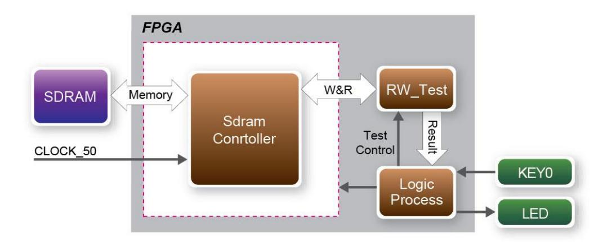

**Figure 5-8 Block Diagram of the SDRAM Demonstration**

<span id="page-70-0"></span>RW\_test modules read and write the entire memory space of the SDRAM through the interface of the controller. In this project, the read/write test module will first write the entire memory and then compare the read back data with the regenerated data (the same sequence as the write data). KEY0 will trigger test control signals for the SDRAM, and the LEDs will indicate the test results according to **[Table 5-3.](#page-71-1)**

#### **Design Tools**

Quartus 13.0

#### **Demonstration Source Code**

Project directory: DE1\_SoC\_SDRAM\_RTL\_Test

Bit stream used: DE1\_SoC\_SDRAM\_RTL\_Test.sof

#### **Demonstration Batch File**

Demo Batch File Folder: *DE1\_SoC\_SDRAM\_RTL\_Test\demo\_batch*

The demo batch file includes following files:

Batch File: DE1\_SoC\_SDRAM\_RTL\_Test.bat

FPGA Configure File: DE1\_SoC\_SDRAM\_RTL\_Test.sof

#### **Demonstration Setup**

Make sure Quartus II is installed on your PC.


- Connect the USB cable to the USB Blaster connector on the DE1\_SoC board and host PC.
- Power on the DE1\_SoC board.
- Execute the demo batch file " DE1\_SoC\_SDRAM\_RTL\_Test.bat" under the batch file folder, DE1\_SoC\_SDRAM\_RTL\_Test \demo\_batch.
- Press **KEY0** on the DE1\_SoC board to start the verification process. When **KEY0** is pressed, the **LEDs** (**LEDR** [2:0]) should turn on. At the instant of releasing **KEY0**, **LEDR1, LEDR2** should start blinking. After approximately 8 seconds, **LEDR1** should stop blinking and stay on to indicate that the SDRAM has passed the test, respectively. **[Table 5-3](#page-71-1)** lists the **LED** indicators.
- If **LEDR2** is not blinking, it means 50MHz clock source is not working.
- If **LEDR1** fail to remain on after 8 seconds, the corresponding SDRAM test has failed.
- <span id="page-71-1"></span>Press **KEY0** again to regenerate the test control signals for a repeat test.

| Table   |                           |  |
|---------|---------------------------|--|
| 5-4NAME | Description               |  |
| LEDR0   | Reset                     |  |
| LEDR1   | If light, SDRAM test pass |  |
| LEDR2   | Blinks                    |  |

**Table 5-3 LED Indicators**

## <span id="page-71-0"></span>5.6 TV Box Demonstration

This demonstration plays video and audio input from a DVD player using the VGA output, audio CODEC, and one TV decoder on the DE1-SoC board. **[Figure 5-9](#page-72-0)** shows the block diagram of the design. There are two major blocks in the circuit, called I2C\_AV\_Config and TV\_to\_VGA. The TV\_to\_VGA block consists of the ITU-R 656 Decoder, SDRAM Frame Buffer, YUV422 to YUV444, YCbCr to RGB, and VGA Controller. The figure also shows the TV Decoder (ADV7180) and the VGA DAC (ADV7123) chips used.

As soon as the bit stream is downloaded into the FPGA, the register values of the TV Decoder chip are used to configure the TV decoder via the I2C\_AV\_Config block, which uses the I2C protocol to communicate with the TV Decoder chip. Following the power-on sequence, the TV Decoder chip will be unstable for a time period; the Lock Detector is responsible for detecting this instability.

The ITU-R 656 Decoder block extracts YcrCb 4:2:2 (YUV 4:2:2) video signals from the ITU-R 656 data stream sent from the TV Decoder. It also generates a data valid control signal indicating the valid period of data output. Because the video signal from the TV Decoder is interlaced, we need to perform de-interlacing on the data source. We used the SDRAM Frame Buffer and a field selection


multiplexer (MUX) which is controlled by the VGA controller to perform the de-interlacing operation. Internally, the VGA Controller generates data request and odd/even selection signals to the SDRAM Frame Buffer and filed selection multiplexer (MUX). The YUV422 to YUV444 block converts the selected YcrCb 4:2:2 (YUV 4:2:2) video data to the YcrCb 4:4:4 (YUV 4:4:4) video data format.

Finally, the YcrCb\_to\_RGB block converts the YcrCb data into RGB data output. The VGA Controller block generates standard VGA synchronous signals VGA\_HS and VGA\_VS to enable the display on a VGA monitor.

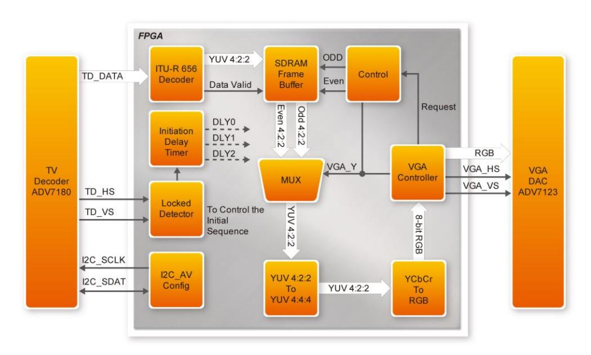

**Figure 5-9 Block diagram of the TV box demonstration**

## <span id="page-72-0"></span>**Demonstration Source Code**

 Project directory: DE1\_SoC\_TV Bit stream used: DE1\_SoC\_TV.sof

## **Demonstration Batch File**

Demo Batch File Folder: DE1\_SoC\_TV \demo\_batch

The demo batch file includes the following files:

Batch File: DE1\_SoC\_TV.bat

FPGA Configure File : DE1\_SoC\_TV.sof


## **Demonstration Setup, File Locations, and Instructions**

- Connect a DVD player's composite video output (yellow plug) to the Video-In RCA jack (J6) of the DE1-SoC board (See **[Figure 5-10](#page-73-0)**). The DVD player has to be configured to provide:
- NTSC output
- 60Hz refresh rate
- 4:3 aspect ratio
- Non-progressive video
- Connect the VGA output of the DE1-SoC board to a VGA monitor (both LCD and CRT type of monitors should work).
- Connect the audio output of the DVD player to the line-in port of the DE1-SoC board and connect a speaker to the line-out port. If the audio output jacks from the DVD player are RCA type, then an adaptor will be needed to convert to the mini-stereo plug supported on the DE1-SoC board; this is the same type of plug supported on most computers.
- Load the bit stream into FPGA by execute the batch file 'DE1\_SoC\_TV.bat' under DE1\_SoC\_TV \demo\_batch\ folder. Press KEY0 on the DE1-SoC board to reset the circuit

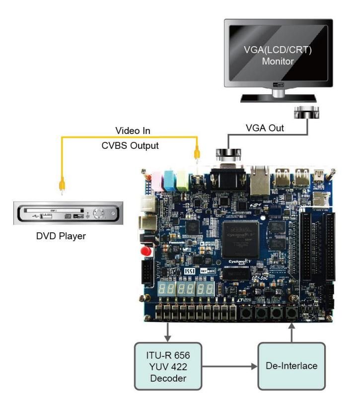

<span id="page-73-0"></span>**Figure 5-10 Setup for the TV box demonstration**


## <span id="page-74-0"></span>5.7 PS/2 Mouse Demonstration

We offer this simple PS/2 controller coded in Verilog HDL to demonstrate bidirectional communication between PS/2 controller and the device, the PS/2 mouse. You can treat it as a how-to basis and develop your own controller that could accomplish more sophisticated instructions, like setting the sampling rate or resolution, which need to transfer two data bytes.

For detailed information about the PS/2 protocol, please perform an appropriate search on various educational web sites. Here we give a brief introduction:

#### **Outline**

PS/2 protocol use two wires for bidirectional communication, one clock line and one data line. The PS/2 controller always has total control over the transmission line, but the PS/2 device generates clock signal during data transmission.

## **Data transmit from the device to controller**

After sending an enabling instruction to the PS/2 mouse at stream mode, the device starts to send displacement data out, which consists of 33 bits. The frame data is cut into three similar slices, each of them containing a start bit (always zero) and eight data bits (with LSB first), one parity check bit (odd check), and one stop bit (always one).

PS/2 controller samples the data line at the falling edge of the PS/2 clock signal. This could easily be implemented using a shift register of 33 bits, but be cautious with the clock domain crossing problem.

#### **Data transmit from the controller to device**

Whenever the controller wants to transmit data to device, it first pulls the clock line low for more than one clock cycle to inhibit the current transmit process or to indicate the start of a new transmit process, which usually be called as inhibit state. After that, it pulls low the data line then release the clock line, and this is called the request state. The rising edge on the clock line formed by the release action can also be used to indicate the sample time point as for a 'start bit. The device will detect this succession and generates a clock sequence in less than 10ms time. The transmit data consists of 12bits, one start bit (as explained before), eight data bits, one parity check bit (odd check), one stop bit (always one), and one acknowledge bit (always zero). After sending out the parity check bit, the controller should release the data line, and the device will detect any state


change on the data line in the next clock cycle. If there's no change on the data line for one clock cycle, the device will pull low the data line again as an acknowledgement which means that the data is correctly received.

After the power on cycle of the PS/2 mouse, it enters into stream mode automatically and disable data transmit unless an enabling instruction is received. **[Figure 5-11](#page-75-0)** shows the waveform while communication happening on two lines.

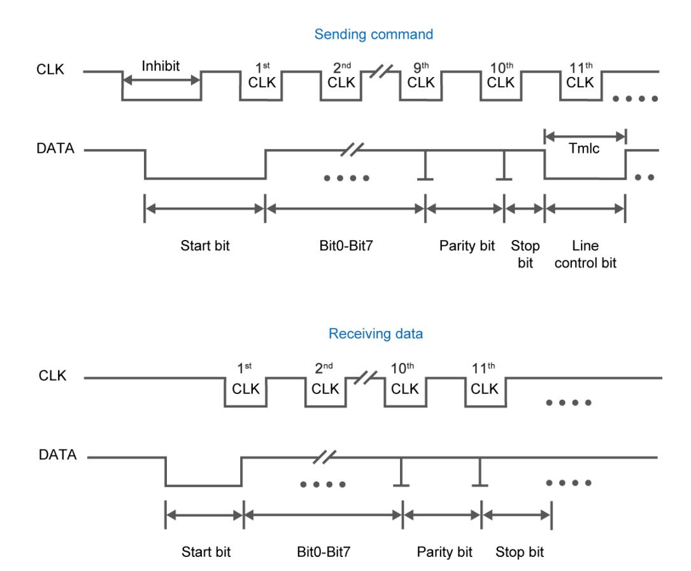

<span id="page-75-0"></span>**Figure 5-11 Waveforms on two lines while communication taking place**

## **Demonstration Source Code**

 Project directory: DE1\_SoC\_PS2\_DEMO Bit stream used: DE1\_SoC\_PS2\_DEMO.sof


## **Demonstration Batch File**

Demo Batch File Folder: DE1\_SoC\_PS2\_DEMO \demo\_batch

The demo batch file includes the following files:

Batch File: DE1\_SoC\_PS2\_DEMO.bat

FPGA Configure File : DE1\_SoC\_PS2\_DEMO.sof

## **Demonstration Setup, File Locations, and Instructions**

- Load the bit stream into FPGA by executing DE1\_SoC\_PS2\_DEMO \demo\_batch\ DE1\_SoC\_PS2\_DEMO.bat
- Plug in the PS/2 mouse
- Press KEY[0] for enabling data transfer
- Press KEY[1] to clear the display data cache
- You should see digital changes on 7-segment display when the PS/2 mouse moves, and the LEDR[2:0] will blink respectively when the left-button, right-button or middle-button is pressed. **[Table 5-5](#page-76-1)** gives the detailed information.

<span id="page-76-1"></span>*Indicator Name Description* **LEDR[0] Left button press indicator LEDR[1] Right button press indicator LEDR[2] Middle button press indicator HEX0 Low byte of X displacement HEX1 High byte of X displacement HEX2 Low byte of Y displacement HEX3 High byte of Y displacement**

**Table 5-5 Detailed information of the indicators**

## <span id="page-76-0"></span>5.8 IR Emitter LED and Receiver Demonstration

In this demonstration we show a simple example of using IR Emitter LED and IR receiver. All the codes in this demonstration are coding by verilog HDL.


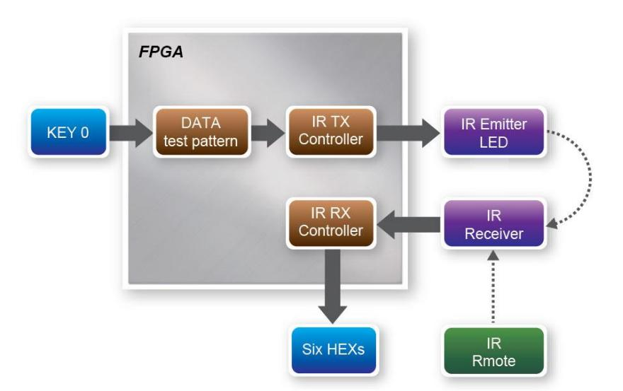

**Figure 5-12 Block Diagram of the IR Emitter LED and Receiver Demonstration**

<span id="page-77-0"></span>**[Figure 5-12](#page-77-0)** shows the block diagram of the design. It mainly implement a IR TX Controller and a IR RX Controller. When KEY0 is pressed, Data test pattern generator continuously generates data to the IR TX Controller. When IR TX Controller works, it will format the sending data into NEC IR transmission protocol and send it out through IR emitter LED. IR receiver will decode the received data and display it on six HEXs. Also, user can use a remote controller to sending data to IR Receiver. The main function of IR TX /RX controller and IR remote in this demonstration will be described in below:

#### **IR TX Controller**

User can input 8-bit address and 8-bits command into IR TX Controller. IR TX Controller will encode the the address and command first , and send it out according to NEC IR transmission protocol through IR emitter LED. Note that the input clock of the Controller should be 50MHz.

The NEC IR transmission protocol uses pulse distance encoding of the message bits. Each pulse burst is 562.5µs in length, at a carrier frequency of 38kHz (26.3µs). As shown in **[Figure 5-13](#page-78-0)**,Logical bits are transmitted as follows:

- Logical '0' a 562.5µs pulse burst followed by a 562.5µs space, with a total transmit time of 1.125ms
- Logical '1' a 562.5µs pulse burst followed by a 1.6875ms space, with a total transmit time


of 2.25ms

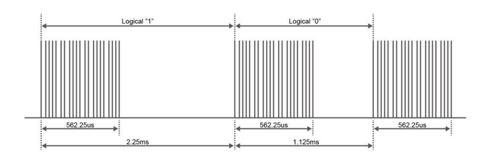

**Figure 5-13 Logical "1"and Logical "0"**

<span id="page-78-0"></span>**[Figure 5-14](#page-78-1)** shows the frame of the protocol. Protocol will send a lead code first, a 9ms leading pulse burst followed by a 4.5msThe second inversed data is sent to verify the accuracy of the information received. At last, a final 562.5µs pulse burst to signify the end of message transmission.. Because every time it is sent inversed data, the overall transmission time is constant.

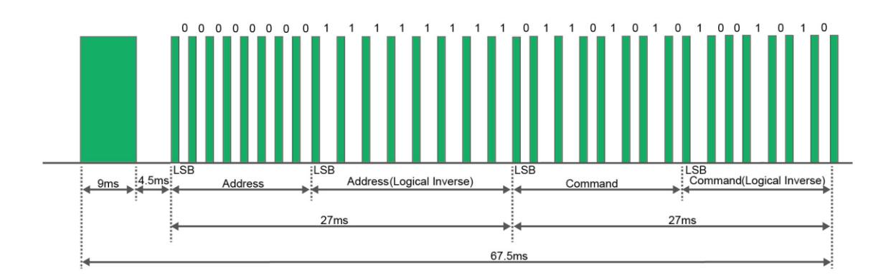

**Figure 5-14 Typical frame of NEC protocol**

<span id="page-78-1"></span>Note: IR Receiver receives the signal a inverted value(e.g. IR TX Controller send a lead code 9 ms high then 4.5 ms low, IR Receiver will receive a 9 ms low then 4.5 ms high lead code).

#### **IR Remote**

When a key on the remote controller(See **[Figure 5-15](#page-79-0)**) is pressed, the remote controller will emit a standard frame, shown in **[Table 5-6](#page-79-1)** The beginning of the frame is the lead code represents the start bit, and then is the key-related information, and the last 1 bit end code represents the end of the


frame.(This frame is descript the signal which IR Receiver Received)

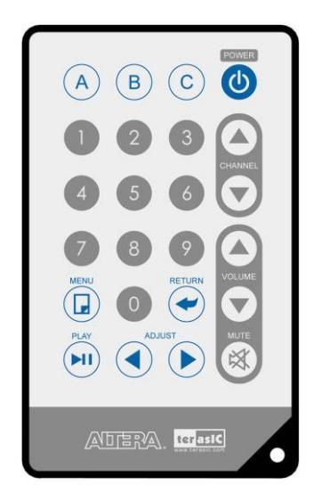

**Figure 5-15 Remote controller**

<span id="page-79-0"></span>**Table 5-6 Key code information for each Key on remote controller**

<span id="page-79-1"></span>

| Key | Key Code | Key | Key Code | Key | Key Code | Key | Key Code |
|-----|----------|-----|----------|-----|----------|-----|----------|
|     | 0x0F     |     | 0x13     |     | 0x10     |     | 0x12     |
|     | 0x01     |     | 0x02     |     | 0x03     |     | 0x1A     |
|     | 0x04     |     | 0x05     |     | 0x06     |     | 0x1E     |
|     | 0x07     |     | 0x08     |     | 0x09     |     | 0x1B     |
|     | 0x11     |     | 0x00     |     | 0x17     |     | 0x1F     |
|     | 0x16     |     | 0x14     |     | 0x18     |     | 0x0C     |


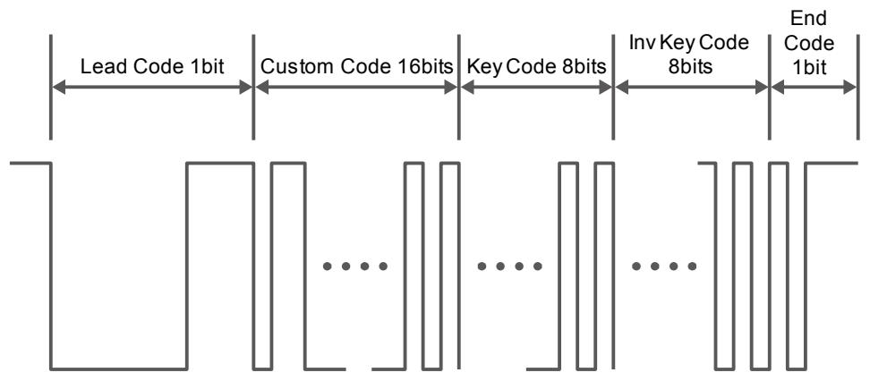

**Figure 5-16 The transmitting frame of the IR remote controller**

#### **IR RX Controller**

In this demo, the IP of IR receiver controller is implemented in the FPGA. As **[Figure 5-17](#page-80-0)** show, it includes Code Detector, State Machine, and Shift Register. First, the IR receiver demodulates the signal inputs to Code Detector block .The Code Detector block will check the Lead Code and feedback the examination result to State Machine block.

The State Machine block will change the state from IDLE to GUIDANCE once the Lead code is detected. Once the Code Detector has detected the Custom Code status, the current state will change from GUIDANCE to DATAREAD state. At this state, the Code Detector will save the receiving data and output to Shift Register then displays it on 7-segment displays. **[Figure 5-18](#page-81-0)** shows the state shift diagram of State Machine block. Note that the input clock should be 50MHz.

<span id="page-80-0"></span>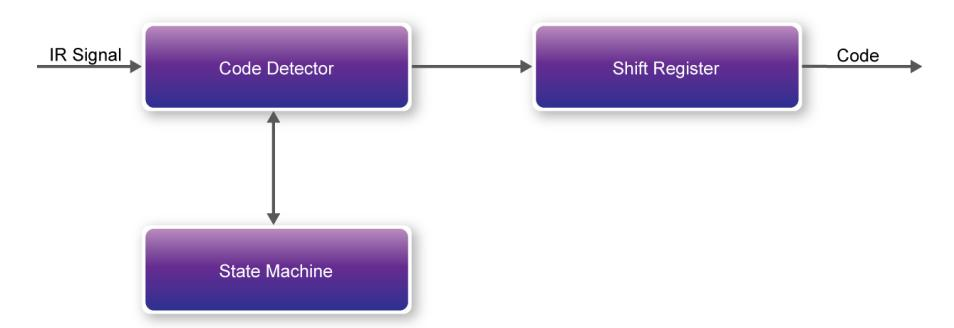

**Figure 5-17 The IR Receiver controller**


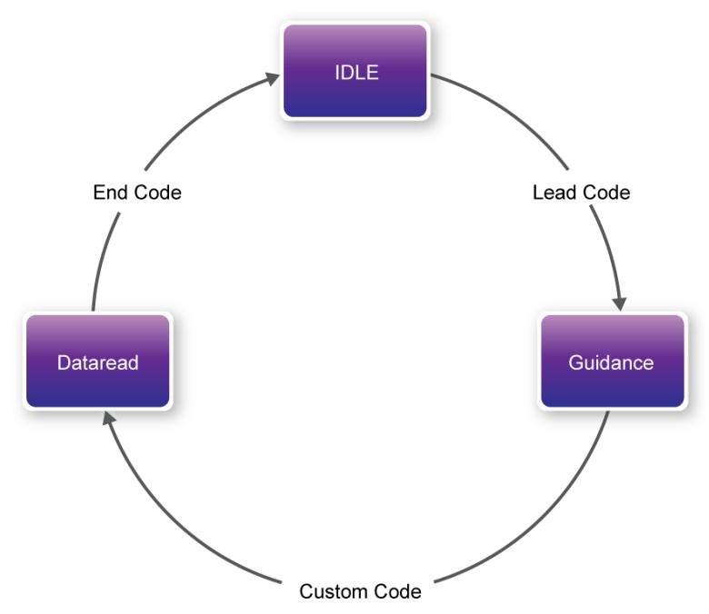

**Figure 5-18 State shift diagram of State Machine**

## <span id="page-81-0"></span>**Demonstration Source Code**

 Project directory: DE1\_SoC\_IR Bit stream used: DE1\_SOC\_IR.sof

## **Demonstration Batch File**

Demo Batch File Folder: DE1\_SoC\_IR \demo\_batch

The demo batch file includes the following files:

Batch File: DE1\_SoC\_IR.bat

FPGA Configure File : DE1\_SOC\_IR.sof

## **Demonstration Setup, File Locations, and Instructions**

- Load the bit stream into FPGA by executing DE1\_SoC\_IR \demo\_batch\ DE1\_SoC\_IR.bat
- Press KEY[0] to enable the continuously pattern sending out by IR TX Controller.
- Observe the six HEXs (See **[Table 5-7](#page-82-1)** for detail)
- Releasing KEY[0] to stop the IR TX.
- Point the IR receiver with the remote-controller and press any button
- Observe the six HEXs(See **[Table 5-7](#page-82-1)** for detail)
- And User can using Multi DE1\_SoC boards to do more IR test between boards.


**Table 5-7 Detailed information of the indicators**

<span id="page-82-1"></span>

| Indicator Name | Description                          |
|----------------|--------------------------------------|
| HEX5           | Inversed high byte of DATA(Key Code) |
| HEX4           | Inversed low byte of DATA(Key Code)  |
| HEX3           | High byte of ADDRESS(Custom Code)    |
| HEX2           | Low byte of ADDRESS(Custom Code)     |
| HEX1           | High byte of DATA(Key Code)          |
| HEX0           | Low byte of DATA (Key Code)          |

## <span id="page-82-0"></span>5.9 ADC Reading

This demonstration illustrates steps which can be used to evaluate the performance of the 8-channel 12-bit A/D Converter ADC7928. The DC 5.0V on the 2x5 header is used to drive the analog signals and by using a trimmer potentiometer, the voltage can be adjusted within the range of 0~5.0V. The 12-bit voltage measurements are indicated on the NIOS II console. **[Figure 5-19](#page-82-2)** shows the block diagram of this demonstration.

Note that,the input voltage range is 0-5V,and if your input voltage is -2.5-2.5V,you can make the pre-scale circuit to adjust their range to 0-5V.

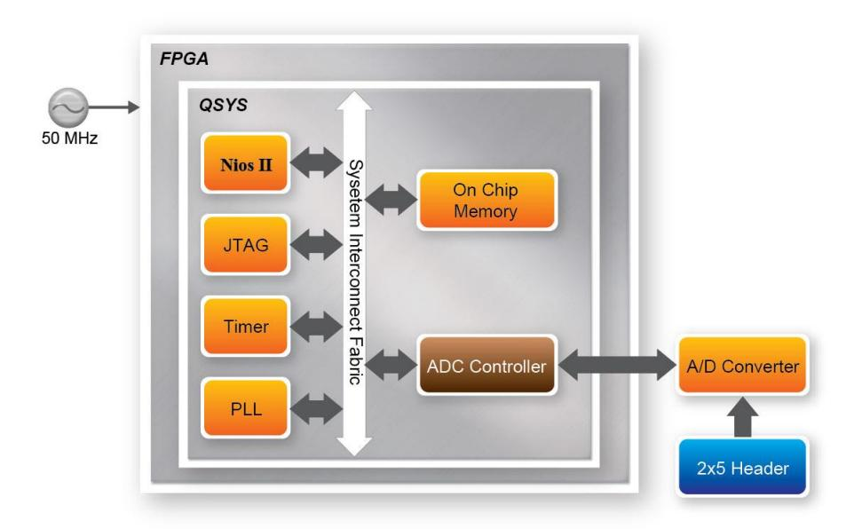

<span id="page-82-2"></span>**Figure 5-19 ADC Reading Block Diagram**


**[Figure 5-20](#page-83-0)** depicts the pin arrangement of the 2x5 header. In this demonstration, this header is the input source of ADC convertor. Users can connect a trimmer to the specified ADC channel (ADC\_IN0 ~ ADC\_IN7) that provides voltage to the ADC convert. Then FPGA will read the associated register in the convertor via serial interface and translates it to voltage value displayed on the NIOS II console

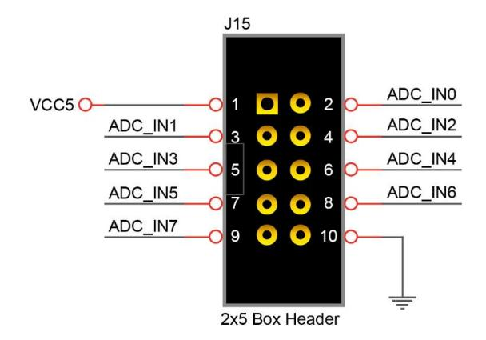

**Figure 5-20 ADC Pin distribution of the 2x5 Header**

#### <span id="page-83-0"></span>**System Requirements**

The following items are required for the ADC Reading demonstration

- o DE1-SoC board x1
- o Trimmer Potentiometer x1
- o Wire Strip x3

#### **Demonstration File Locations**

- Hardware Project directory: DE1\_SoC\_ADC
- Bit stream used: DE1\_SoC\_ADC.sof
- Software Project directory: DE1\_SoC\_ADC software
- Demo batch file : DE1\_SoC\_ADC\demo\_batch\ DE1\_SoC\_ADC.bat

#### **Demonstration Setup and Instructions**

 Connect the trimmer to corresponding ADC channel on the 2x5 header as shown in **[Figure 5-21](#page-84-0)** to read from, as well as the +5V and GND signals. (Note: the setup shown above is connected ADC channel 0).


- Execute the demo batch file DE1\_SoC\_ADC.bat to load bit stream and software execution file in FPGA.
- The NIOS II console will display the voltage of the specified channel voltage result information

<span id="page-84-0"></span>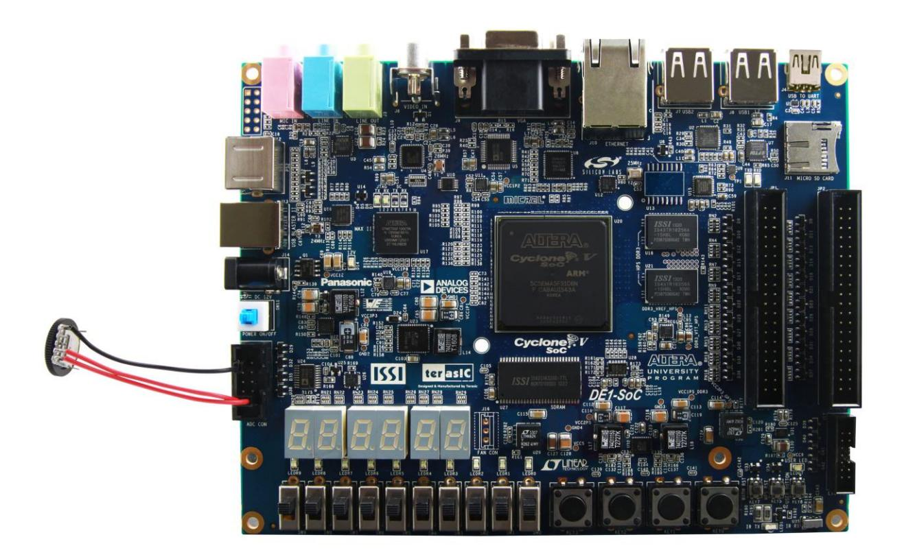

**Figure 5-21 ADC Reading hardware setup**

<span id="page-85-0"></span>

## Chapter 6 Examples for HPS SoC

This chapter provides a number of C-code examples based on the Altera SoC Linux built by Yocto Project. These examples provide demonstrations of the major features which connected to HPS interface on the board, such as users LED/KEY, I2C interfaced G-sensor and I2C MUX. All of the associated files can be found in the Demonstrations*/SOC* folder in the DE1\_SoC System CD.

#### **Installation of the Demonstrations**

To install the demonstrations on your computer:

Copy the directory *Demonstrations* into a local directory of your choice. **Altera SoC EDS v13.0 is required for users to compile the c-code project.**

## <span id="page-85-1"></span>6.1 Hello Program

This demonstration presents how to develop your first HPS program by using Altera SoC EDS tool. For operation details, please refer to My\_First\_HPS.pdf in the system CD.

Here are the major procedures to develop and build HPS project.

- Make sure Altera SoC EDS is installed on your PC.
- Create program .c/.h files with a generic text editor
- Create a "Makefile" with a generic text editor
- Build your project under Altera SoC EDS

#### **Program File**

Here is the main program of this Hello World demo.


#### **Makefile**

To compile a project, a Makefile is required. Here is the Makefile used for this demo.

#### **Compile**

To compile a project, please launch Altera SoC EDS Command Shell by executing

C:\altera\13.0\embedded**\**Embedded\_Command\_Shell.bat

Use the "cd" command to change the current directory to where the Hello World project is located. Then type "make" to build the project. The executable file "**my\_first\_hps**" will be generated after the compiling process is finished. The "clean all" command can be used to remove all temporary files.


#### **Demonstration Source Code**

Build Tool: Altera SoC EDS v13.0

Project directory: \Demonstration\SoC\my\_first\_hps

Binary file: my\_first\_hps

Build Command: make ("**make clean**" to remove all temporary files)

Execute Command: ./my\_first\_hps

#### **Demonstration Setup**

- Connect USB cable to the USB-to-UART connector (J4) on the DE1\_SoC board and host PC.
- Make sure the demo file "**my\_first\_hps**" is copied into the SD card under the "**/home/root**" folder in Linux.
- Insert the booting micro SD card into the DE1\_SoC board.
- Power on the DE1\_SoC board.
- Launch PuTTY to connect to the UART port of Putty and type "**root**" to login Altera Yocto Linux.
- In the UART terminal of PuTTY, type "**./my\_first\_hps**" to start the program, and you will see "Hello World!" message in the terminal.

## <span id="page-87-0"></span>6.2 Users LED and KEY

This demonstration presents how to control the users LED and KEY by accessing the register of GPIO controller through the memory-mapped device driver. The memory-mapped device driver allows developer to access the system physical memory.

#### **Function Block Diagram**

**[Figure 6-1](#page-88-0)** shows the function block diagram of this demonstration. The users LED and KEY are


connected to the **GPIO1** controller in HPS. The behavior of the GPIO controller is controlled by the register in the GPIO controller. The registers can be accessed by application software through the memory-mapped device driver, which is built into Altera SoC Linux.

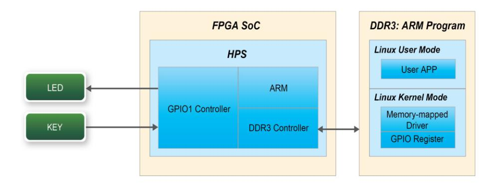

**Figure 6-1 Block Diagram of GPIO Demonstration**

#### <span id="page-88-0"></span>**GPIO Interface Block Diagram**

The HPS provides three general-purpose I/O (GPIO) interface modules. **[Figure 6-2](#page-88-1)** shows the block diagram of the GPIO Interface. GPIO[28..0] is controlled by GPIO0 controller and GPIO[57..29] is controlled by GPIO1 controller. GPIO[70..58] and input-only GPI[13..0] are controlled by GPIO2 controller.

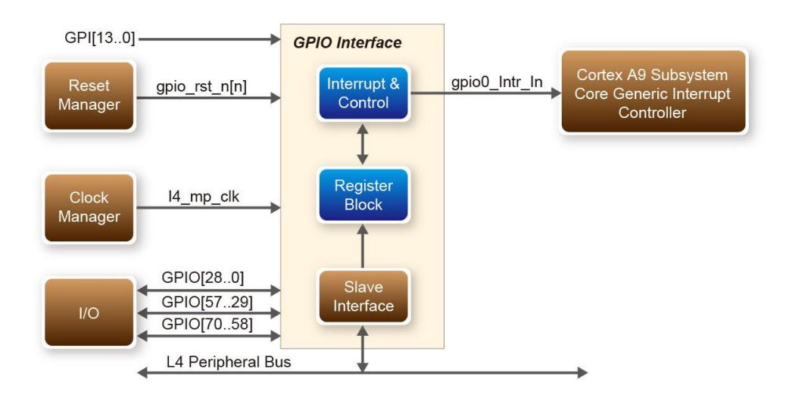

<span id="page-88-1"></span>**Figure 6-2 Block Diagram of GPIO Interface**


#### **GPIO Register Block**

The behavior of I/O pin is controlled by the registers in the register block. In this demonstration, we only use three 32-bit registers in the GPIO controller. The registers are:

- **gpio\_swporta\_dr**: used to write output data to output I/O pin
- **gpio\_swporta\_ddr**: used to configure the direction of I/O pin
- **gpio\_ext\_porta**: used to read input data of I/O input pin

For LED control, we use **gpio\_swporta\_ddr** to configure the LED pin as output pin, and drive the pin high or low by writing data to the **gpio\_swporta\_dr** register. For the **gpio\_swporta\_ddr** register, the first bit (least significant bit) controls direction of the first IO pin in the associated GPIO controller and the second bit controls the direction of second IO pin in the associated GPIO controller, and so on. The value "1" in the register bit indicates the I/O direction is output, and the value "0" in the register bit indicates the I/O direction is input.

For the **gpio\_swporta\_dr** register, the first bit controls the output value of first I/O pin in the associated GPIO controller, and the second bit controls the output value of second I/O pin in the associated GPIO controller, and so on. The value "1" in the register bit indicates the output value is high, and the value "0" indicates the output value is low.

The status of KEY can be queried by reading the value of **gpio\_ext\_porta** register. The first bit represents the input status of first IO pin in the associated GPIO controller, and the second bit represents the input status of second IO pin in the associated GPIO controller, and so on. The value "1" in the register bit indicates the input state is high, and the value "0" indicates the input state is low.

#### **GPIO Register Address Mapping**

The registers of HPS peripherals are mapped to HPS base address space 0xFC000000 with 64KB size. Registers of GPIO1 controller are mapped to the base address 0xFF208000 with 4KB size, and registers of GPIO2 controller are mapped to the base address 0xFF20A000 with 4KB size, as shown in **[Figure 6-3.](#page-90-0)**


| Slave Identifier | Slave Title               | Base Address | Size  |
|------------------|---------------------------|--------------|-------|
| STM              | STM                       | 0xFC000000   | 48 MB |
| DAP              | 200                       | 0xFF000000   | 2 MB  |
| AINUDATA         | NAND controller data      | 1.24         |       |
| GPI00            | GPI00                     | 0xFF208000   | 4 KB  |
| GPI01            | GPI01                     | 0xFF209000   | 4 KB  |
| GPI02            | GPI02                     | 0xFF20A000   | 4 KB  |
| NANDO            | " registers               | 0xFFB80000   | 64 KB |
| unuAIA           | FPGA manager              |              |       |
| CANO             | CANO controller registers | UXFFCUUUUU   | 4 KB  |
| CAN1             | CAN1 controller registers | 0xFFC01000   | 4 KB  |

**Figure 6-3 GPIO Address Map**

#### <span id="page-90-0"></span>**Software API**

Developers can use the following software API to access the register of GPIO controller.

- open: use to open memory mapped device driver
- mmap: map physical memory to user space
- alt\_read\_word: read a value from a specified register
- alt\_write\_word: write a value into a specified register
- munmap: clean up memory mapping
- close: close device driver.

Developers can also use the following MACRO to access the register

- alt\_setbits\_word: set specified bit value to zero for a specified register
- alt\_clrbits\_word: set specified bit value to one for a specified register

To use the above API to access register of GPIO controller, the program must include the following header files.

> #include <stdio.h> #include <unistd.h> #include <fcntl.h> #include <sys/mman.h> #include "hwlib.h" #include "socal/socal.h" #include "socal/hps.h"


#include "socal/alt\_gpio.h"

#### **LED and KEY Control**

**[Figure 6-4](#page-91-0)** shows the HPS users LED and KEY pin assignment for the DE1\_SoC board. The LED is connected to HPS\_GPIO53, KEY is connected to HPS\_GPIO54, which are controlled by the GPIO1 controller, which also controls HPS\_GPIO29 ~ HPS\_GPIO57.

| HPS_GPIO54 | G21 | HPS_KEY  |
|------------|-----|----------|
| HPS_GPIO53 |     | HPS_LED  |
| HPS_GP1053 |     | <u>-</u> |

**Figure 6-4 LED and KEY Pin Assignment**

<span id="page-91-0"></span>**[Figure 6-5](#page-91-1)** shows the **gpio\_swporta\_ddr** register of the GPIO1 controller. The bit-0 controls the pin direction of HPS\_GPIO29. The bit-24 controls the pin direction of HPS\_GPIO53, which connects to the HPS\_LED, the bits-25 controls the pin direction of HPS\_GPIO54 which connects to the HPS\_KEY, and so on. In summary, the pin direction of HPS\_LED, HPS\_KEY are controlled by the bit-24, bit-25 in the **gpio\_swporta\_ddr** register of the GPIO1 controller, respectively. Similarly, the output status of HPS\_LED is controlled by the bit-24 in the **gpio\_swporta\_dr** register of the GPIO1 controller. The status of KEY can be queried by reading the value of the bit-24 in the **gpio\_ext\_porta** register of the GPIO1 controller.

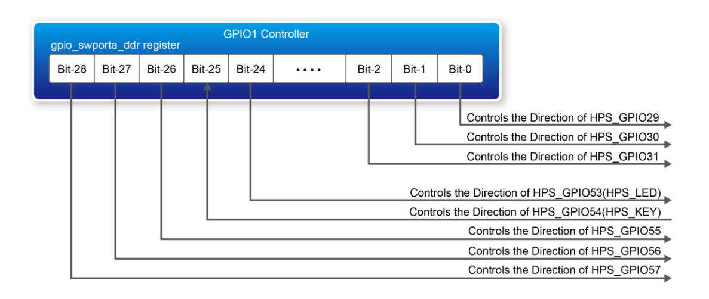

**Figure 6-5 gpio\_swporta\_ddr Register in the GPIO1**

<span id="page-91-1"></span>


In this demo code, the following mask is defined to control LED and KEY direction and LED's output value.

| #define USER_IO_DIR | (0x01000000) |
|---------------------|--------------|
| #define BIT_LED     | (0x01000000) |
| #define BUTTON_MASK | (0x02000000) |

The following statement can be used to configure the LED associated pins as output pins.

```
alt_setbits_word( ( virtual_base + 
( ( uint32_t )( ALT_GPIO1_SWPORTA_DDR_ADDR ) & 
( uint32_t )( HW_REGS_MASK ) ) ), USER_IO_DIR );
```

The following statement can be used to turn on the LED.

```
alt_setbits_word( ( virtual_base + 
( ( uint32_t )( ALT_GPIO1_SWPORTA_DR_ADDR ) & 
( uint32_t )( HW_REGS_MASK ) ) ), BIT_LED );
```

The following statement can be used to read the content of **gpio\_ext\_porta** register. The bit mask is used to check the status of the key.

```
alt_read_word( ( virtual_base + 
( ( uint32_t )( ALT_GPIO1_EXT_PORTA_ADDR ) & 
( uint32_t )( HW_REGS_MASK ) ) ) );
```

#### **Demonstration Source Code**

- Build tool: Altera SoC EDS V13.0
- Project directory: \Demonstration\SoC\hps\_gpio
- Binary file: hps\_gpio

.

- Build command: make ('make clean' to remove all temporal files)
- Execute command: ./hps\_gpio


#### **Demonstration Setup**

- Connect the USB cable to the USB-to-UART connector (J4) on the DE1\_SoC board and host PC.
- Make sure the executable file "**hps\_gpio**" is copied into the SD card under the "**/home/root**" folder in Linux.
- Insert the booting micro SD card into the DE1\_SoC board.
- Power on the DE1\_SoC board.
- Launch PuTTY to connect to the UART port of DE1\_SoC board and type "**root**" to login Altera Yocto Linux.
- In the UART terminal of PuTTY, execute "**./hps\_gpio**" to start the program.

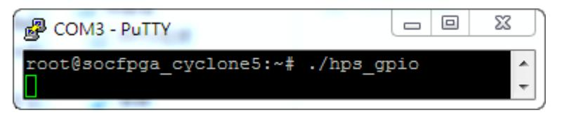

**Figure 6-6 Putty window**

- HPS\_LED will flashing 2 times first.
- Press HPS\_KEY to light up HPS\_LED ,Press "CTRL + C" to terminate the application.

## <span id="page-93-0"></span>6.3 I2C Interfaced G-sensor

This demonstration shows how to control the G-sensor by accessing its registers through the built-in I2C kernel driver in [Altera Soc Yocto Powered Embedded Linux.](http://www.altera.com/devices/processor/arm/cortex-a9/software/soc-yocto-embedded-linux.html)

#### **Function Block Diagram**

**[Figure 6-7](#page-94-0) s**hows the function block diagram of this demonstration. The G-sensor on the DE1\_SoC board is connected to the **I2C0** controller in HPS. The G-Sensor I2C 7-bit device address is 0x53. The system I2C bus driver is used to access the register files in the G-sensor. The G-sensor interrupt signal is connected to the PIO controller. In this demonstration, we use polling method to read the register data, so the interrupt method is not introduced here.


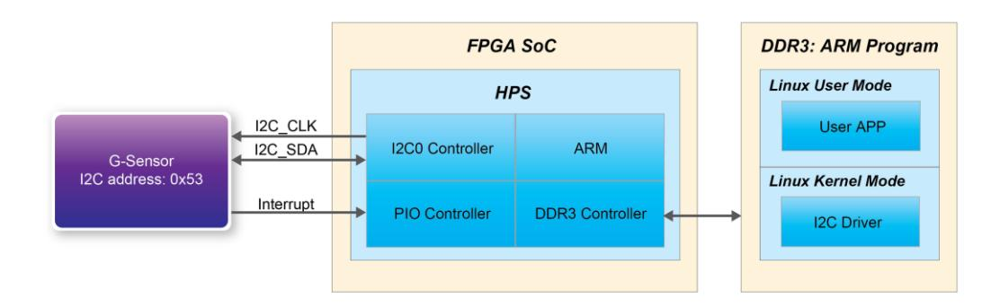

**Figure 6-7 Block Diagram of the G-sensor Demonstration**

#### <span id="page-94-0"></span>**I2C Driver**

Here is the list of procedures in order to read a register value from G-sensor register files by using the existing I2C bus driver in the system:

- 1. Open I2C bus driver "/dev/i2c-0": file = open("/dev/i2c-0", O\_RDWR);
- 2. Specify G-sensor's I2C address 0x53: ioctl(file, I2C\_SLAVE, 0x53);
- 3. Specify desired register index in g-sensor: write(file, &Addr8, sizeof(unsigned char));
- 4. Read one-byte register value: read(file, &Data8, sizeof(unsigned char));

Because the G-sensor I2C bus is connected to the I2C0 controller, as shown in the **[Figure 6-8](#page-94-1)**, the given driver name is '/dev/i2c-0'.

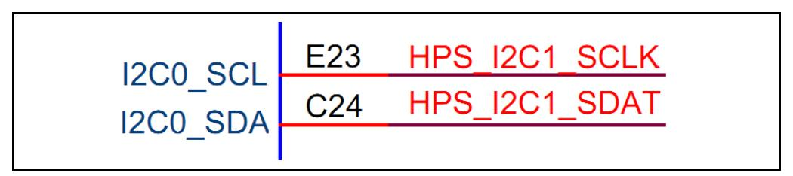

**Figure 6-8 Schematic of I2C**

<span id="page-94-1"></span>To write a value into a register, developer can change step 4 to:

write(file, &Data8, sizeof(unsigned char));

To read multiple byte values, developer can change step 4 to:

read(file, &szData8, sizeof(szData8)); // where szData is an array of bytes


To write multiple byte values, developer can change step 4 to:

write(file, &szData8, sizeof(szData8)); // where szData is an array of bytes

#### **G-sensor Control**

The ADI ADXL345 provides I2C and SPI interfaces. I2C interface is used by setting the CS pin to high on this DE1\_SoC board.

The ADI ADXL345 G-sensor provides user-selectable resolution up to 13-bit ± 16g. The resolution can be configured through the DATA\_FORAMT(0x31) register. In the demonstration, we configure the data format as:

- Full resolution mode
- ± 16g range mode
- Left-justified mode

The X/Y/Z data value can be derived from the DATAX0(0x32), DATAX1(0x33), DATAY0(0x34), DATAY1(0x35), DATAZ0(0x36), and DATAX1(0x37) registers. The DATAX0 represents the least significant byte, and DATAX1 represents the most significant byte. It is recommended to perform multiple-byte read of all registers to prevent change in data between reads of sequential registers. Developer can use the following statement to read 6 bytes of X, Y, or Z value.

read(file, szData8, sizeof(szData8)); // where szData is an array of six-bytes

#### **Demonstration Source Code**

- Build tool: Altera SoC EDS v13.0
- Project directory: \Demonstration\SoC\hps\_gsensor
- Binary file: gsensor
- Build command: make ('make clean' to remove all temporal files)
- Execute command: ./gsensor [loop count]

#### **Demonstration Setup**

- Connect the USB cable to the USB-to-UART connector (J4) on the DE1\_SoC board and host PC.
- Make sure the executable file "**gsensor**" is copied into the SD card under the "**/home/root**" folder in Linux.
- Insert the booting micro sdcard into the DE1\_SoC board.


- Power on the DE1\_SoC board.
- Launch PuTTY to connect to the UART port of DE1\_SoC borad and type "**root**" to login Yocto Linux.
- In the UART terminal of PuTTY,, execute "**./gsensor**" to start the gsensor polling.
- The demo program will show the X, Y, and Z values in the Putty, as shown in **[Figure 6-9](#page-96-1)**. Press "CTRL + C" to terminate the program.

**Figure 6-9 Terminal output of the G-sensor Demonstration**

## <span id="page-96-1"></span><span id="page-96-0"></span>6.4 I2C MUX Test

This demonstration shows how to switch the I2C multiplexer so that HPS can access the I2C bus originally owned by FPGA.

#### **Function Block Diagram**

**[Figure 6-11](#page-96-2) s**hows the function block diagram of this demonstration. The I2C bus from both FPGA and HPS are connected to an I2C multiplexer and I2C multiplexer is controlled by HPS\_I2C\_CONTROL which connected to **GPIO1** controller in HPS. The HPS I2C is connected to the **I2C0** controller in HPS (Gsensor is also connected to I2C0 controller, See **Figure 6-10**).

<span id="page-96-2"></span>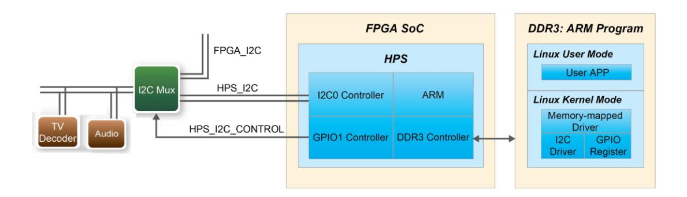

**Figure 6-11 Block Diagram of the I2C MUX Test Demonstration**


#### **HPS\_I2C\_CONTROL Control**

HPS\_I2C\_CONTROL is connected to HPS\_GPIO48, bit 19 of **GPIO1** controller. HPS will own I2C bus and then can access Audio CODEC and TV Decoder when the HPS\_I2C\_CONTROL signal is set to high.

In this demo code, the following mask is defined to control HPS\_I2C\_CONTROL direction and their output value.

```
#define HPS_I2C_CONTROL ( 0x00080000 )
```

The following statement can be used to configure the HPS\_I2C\_CONTROL associated pins as output pin.

```
alt_setbits_word( ( virtual_base + 
( ( uint32_t )( ALT_GPIO1_SWPORTA_DDR_ADDR ) & 
( uint32_t )( HW_REGS_MASK ) ) ), HPS_I2C_CONTROL );
```

The following statement can be used to set HPS\_I2C\_CONTROL high.

```
alt_setbits_word( ( virtual_base + 
( ( uint32_t )( ALT_GPIO1_SWPORTA_DR_ADDR ) & 
( uint32_t )( HW_REGS_MASK ) ) ), HPS_I2C_CONTROL );
```

The following statement can be used to set HPS\_I2C\_CONTROL low.

```
alt_clrbits_word( ( virtual_base + 
( ( uint32_t )( ALT_GPIO1_SWPORTA_DR_ADDR ) & 
( uint32_t )( HW_REGS_MASK ) ) ), HPS_I2C_CONTROL );
```

#### **I2C Driver**

Here is the list of procedures in order to read register value from TV Decoder by using the existing I2C bus driver in the system:

- Set HPS\_I2C\_CONTROL high so that HPS can access I2C bus.
- Open I2C bus driver "/dev/i2c-0": file = open("/dev/i2c-0", O\_RDWR);
- Specify ADV7180 's I2C address 0x20: ioctl(file, I2C\_SLAVE, 0x20);
- Read or write registers;
- Set HPS\_I2C\_CONTROL low to release I2C bus.


#### **Demonstration Source Code**

Build tool: Altera SoC EDS v13.0

Project directory: \Demonstration\SoC\ hps\_i2c\_switch

Binary file: i2c\_switch

Build command: make ('make clean' to remove all temporal files)

Execute command: ./ i2c\_switch

#### **Demonstration Setup**

- Connect the USB cable to the USB-to-UART connector (J4) on the DE1\_SoC board and host PC.
- Make sure the executable file " **i2c\_switch** " is copied into the SD card under the "**/home/root**" folder in Linux.
- Insert the booting micro sdcard into the DE1\_SoC board.
- Power on the DE1\_SoC board.
- Launch PuTTY to connect to the UART port of DE1\_SoC borad and type "**root**" to login Yocto Linux.
- In the UART terminal of PuTTY,, execute "**./ i2c\_switch** " to start the I2C MUX test.
- The demo program will show the result in the Putty, as shown in **[Figure](#page-98-0) 6-12**.

**Figure 6-12 Terminal output of the I2C MUX Test Demonstration**

<span id="page-98-0"></span>Press "CTRL + C" to terminate the program.

<span id="page-99-0"></span>

## Chapter 7 Examples for using both HPS SoC and FGPA

Although the HPS and the FPGA can operate independently, they are tightly coupled via a high-bandwidth system interconnect built from high-performance ARM AMBA® AXITM bus bridges. Both FPGA fabric and HPS can access to each other via these interconnect bridges. This chapter provides demonstrations for how to using these bridges that can achieve superior performance and lower latency when compared to solutions containing a separate FPGA and discrete processor.

## <span id="page-99-1"></span>7.1 HPS Control LED and HEX

This demonstration presents using HPS to control the LED and HEX on the FPGA part through Lightweight HPS-to-FPGA Bridge.

#### **Function Block Diagram**

**[Figure 7-1](#page-100-0)** shows the diagram of this demonstration. The HPS use Lightweight HPS-to-FPGA AXI Bridge to communicate with FPGA. The HPS translate data to the FPGA through the lwaxi bridge. The hardware in FPGA part is built in Qsys. The data translate through Lightweight HPS-to-FPGA Bridge is converted into Avalon-MM master interface. So the IP PIO controller and HEX Controller works as the Avalon-MM slave in the system. They control the pins related to the LED and HEX to change the LED and HEX's state. This is similar to the system using NIOS II processor to control LED and HEX.


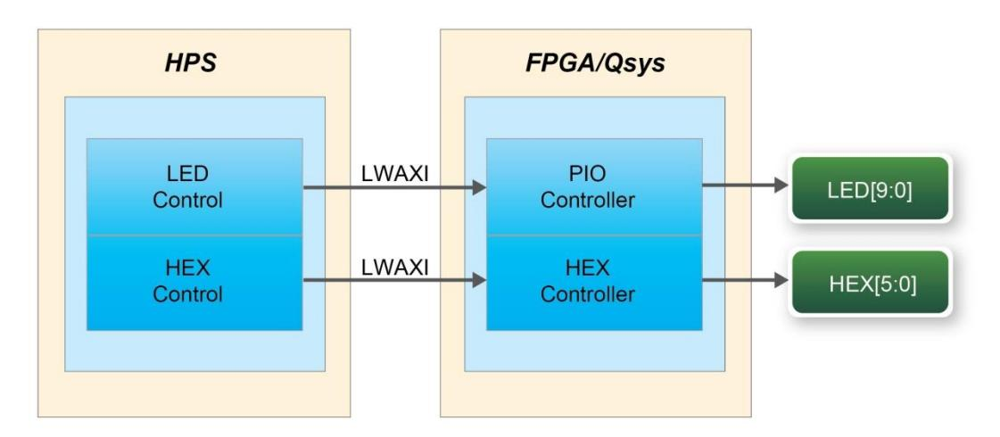

**Figure 7-1 HPS Control FPGA LED and HEX**

#### <span id="page-100-0"></span>**LED and HEX control**

The Lightweight HPS-to-FPGA Bridge is a peripheral of the HPS. The software running on linux operation system can't access the physical address of the HPS peripheral. You must map the physical address to the user space at first then you can access to the peripheral or you can write a device driver module and add it to the kernel. We only show the first method to the users in this demonstration. We actually map in the entire CSR span of the HPS since we want to access various registers within that span. If the users want to access any other peripherals whose physical address is in this span, they can reuse the mapping function and the macro we defined below.

The lwaxi bridge start address after being mapped can be get using the ALT\_LWFPGASLVS\_OFST which is defined in altera\_hps hardware library. Then the slave IP connected to the lwaxi bridge can be accessed through the base address and the register offset in these IPs. For instance, the base address of the PIO slave IP in this system is 0x0001\_0040 and the direction control register offset is 0x01, the data register offset is 0x00. The following statement can be used to get the base address of PIO slave IP.

```
h2p_lw_led_addr=virtual_base+( ( unsigned long )( ALT_LWFPGASLVS_OFST 
+ LED_PIO_BASE ) & ( unsigned long)( HW_REGS_MASK ) );
```

In this demonstration, we just need to set the PIO's direction as output which is the default direction of the PIO IP, so we can skip this step. The following statement is used to set the output state of the PIO.


```
alt_write_word(h2p_lw_led_addr, Mask );
```

The Mask in this statement decides which bit in the data register of the PIO IP is high or low. The bits in data register decide the output state of the pins connected to the LEDs. The program for the HEX controlling is similar to the LED.

Since the linux operate system support mult-thread software. The software for this system creates two threads one for controlling the LED and the other for controlling the HEX. We can use the system call pthread\_create to complete the job. The function is called in the main function and a sub-thread is created. The program running in the sub-thread is to control the led flashing in a loop. And the main-thread in the main function is to control the digital shown on the HEX changing in a loop. The LED and HEX's state changing at the same time when the FPGA is configured and the software is running on HPS.

#### **Demonstration Source Code**

- Build tool: Altera SoC EDS V13.0
- Project directory: \Demonstration\ SoC\_FPGA\HPS\_LED\_HEX
- Quick file directory:\ Demonstration\ SoC\_FPGA\HPS\_LED\_HEX\ quickfile
- Batch File: \ Demonstration\ SoC\_FPGA\HPS\_LED\_HEX\ quickfile \sof\_dwonload\test.bat,
- FPGA Configure File : HPS\_LED\_HEX.sof
- Binary file: HPS\_LED\_HEX
- Build app command: make ('make clean' to remove all temporal files)
- Execute app command: ./ HPS\_LED\_HEX

## **Demonstration Setup**

- Make sure Quartus II and Nios II are installed on your PC.
- Connect the USB blaster cable to the USB blaster connector (J13) on the DE1\_SOC board and host PC install USB Blaster driver II if necessary.
- Connect the USB cable to the USB-to-UART connector (J4) on the DE1\_SOC board and host PC.
- Make sure the executable file " HPS\_LED\_HEX " is copied into the SD card under the "**/home/root**" folder in Linux.
- Insert the booting micro SD card into the DE1\_SOC board.
- Power on the DE1\_SOC board.
- Launch PuTTY to connect to the UART port of SoCKit board and type "**root**" to login Altera Yocto Linux.
- Execute the demo batch file "test.bat" under the \ quickfile \sof\_dwonload


- In the UART terminal of PuTTY, execute "**./**HPS\_LED\_HEX " to start the program.
- The putty will show the message as shown in **[Figure 7-2](#page-62-1)**, and the LED[9:0] will flash , the number on the HEX[5:0] will change at the same time. Press "CTRL + C" to terminate the program.

**Figure 7-2 Running result in putty**

<span id="page-103-0"></span>

Chapter 8 Steps of Programming the Quad Serial Configuration Device

This chapter describes how to program the quad serial configuration device with Serial Flash Loader (SFL) function via the JTAG interface. User can program quad serial configuration devices with a JTAG indirect configuration (.jic) file. To generate JIC programming files with the Quartus II software, users need to generate a user-specified SRAM object file (.sof), which is the input file first. Next, users need to convert the SOF to a JIC file. To convert a SOF to a JIC file in Quartus II software, follow these steps:

## <span id="page-103-1"></span>8.1 Before you Begin

To use the Quad serial flash as a FPGA configuration device, please make sure the FPGA should be set in Asx4 mode. (i. e. , let MSEL[4..0] to be set as "10010")

## <span id="page-103-2"></span>8.2 Convert. SOF File to .JIC file

Choose **Convert Programming Files** on Quartus window (File menu). See **[Figure 8-1](#page-104-0)**


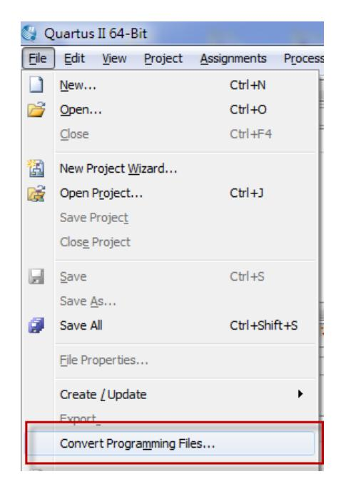

**Figure 8-1 File menu of Quartus**

<span id="page-104-0"></span>In the Convert Programming Files dialog box, scroll to the JTAG Indirect Configuration File (.jic) from the Programming file type field.

In the Configuration device field, choose EPCQ256.

In the **Mode** field, choose **Active Serial X4**.

In the **File name** field, browse to the target directory and specify an output file name.

Highlight the SOF data in the Input files to convert section. See **[Figure 8-2](#page-105-0)**.


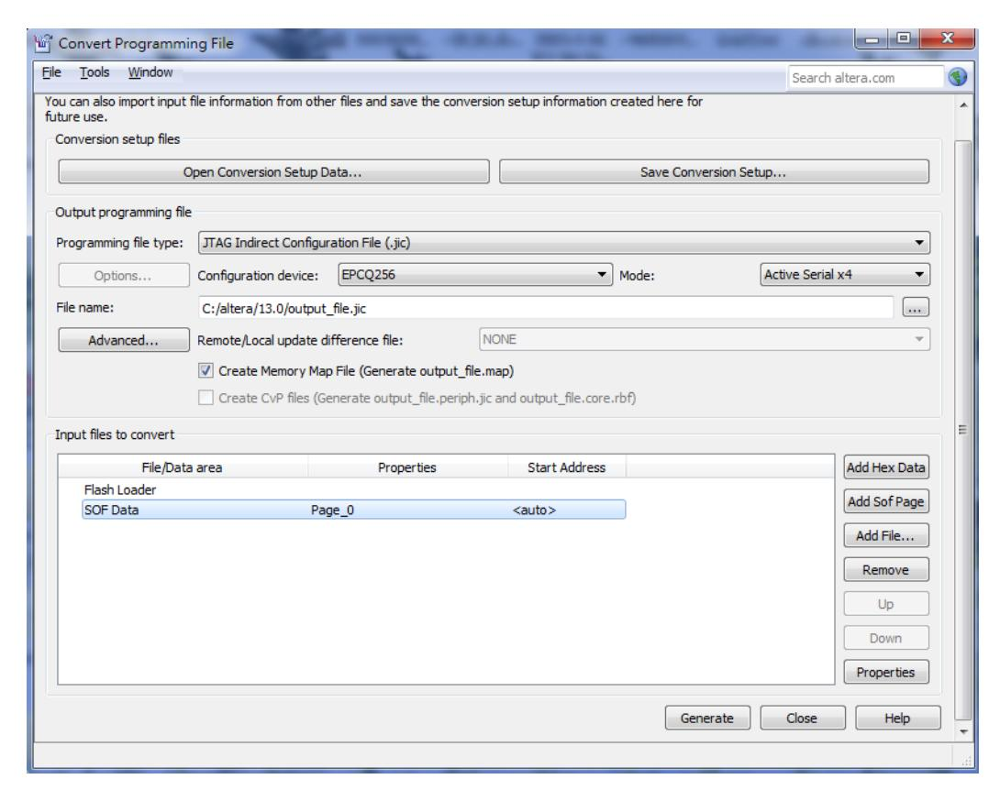

**Figure 8-2 Convert Programming Files Dialog Box**

<span id="page-105-0"></span>Click Add File.

Select the SOF that you want to convert to a JIC file.

Click **Open**.

Highlight the Flash Loader and click Add Device. See **[Figure 8-3.](#page-106-0)**

Click **OK**. The Select Devices page displays.


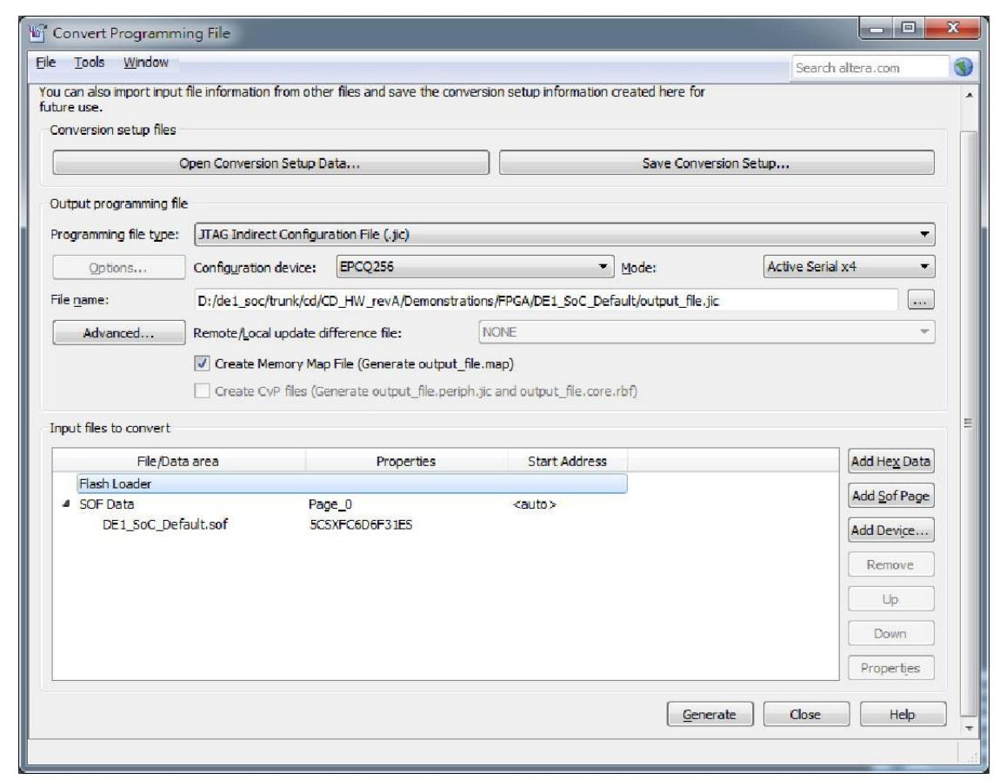

**Figure 8-3 Highlight Flash Loader**

<span id="page-106-0"></span>Select the targeted FPGA that you are using to program the serial configuration device. See **[Figure](#page-107-0)  [8-4](#page-107-0)**.

Click OK. The Convert Programming Files page displays. See **[Figure 8-5](#page-108-1)**.

Click Generate.


<span id="page-107-0"></span>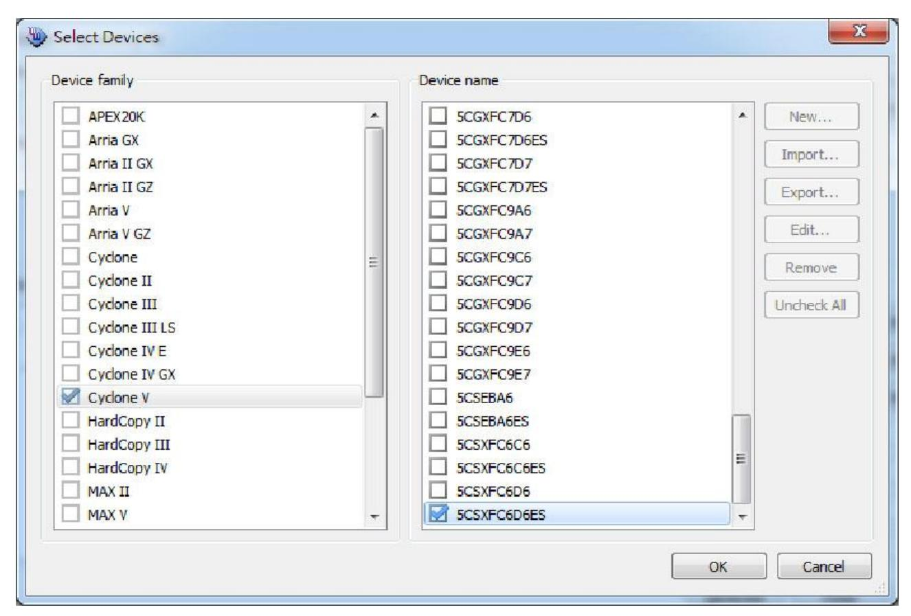

**Figure 8-4 Select Devices Page**


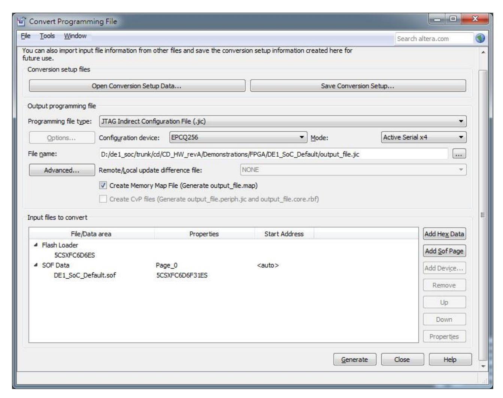

**Figure 8-5 Convert Programming Files Page**

## <span id="page-108-1"></span><span id="page-108-0"></span>8.3 Write JIC File into Quad Serial Configuration Device

To program the serial configuration device with the JIC file that you just created, add the file to the Quartus II Programmer window and follow the steps:

When the SOF-to-JIC file conversion is complete, add the JIC file to the Quartus II Programmer window:

Choose **Programmer** (Tools menu), and the **Chain.cdf** window appears.

Click **Auto Detect**, and then select correct device, both FPGA device and HPS will detected. (See **[Figure 8-6\)](#page-109-0)**

Double click the green rectangle region as shown in **[Figure 8-6](#page-109-0)**, the **Select New Programming File**


page will appear, and then select the correct JIC file.

Program the serial configuration device by clicking the corresponding **Program/Configure** box, a factory default SFL image will be loaded (See **[Figure 8-7\)](#page-110-1)**.

Click **Start** to program serial configuration device.

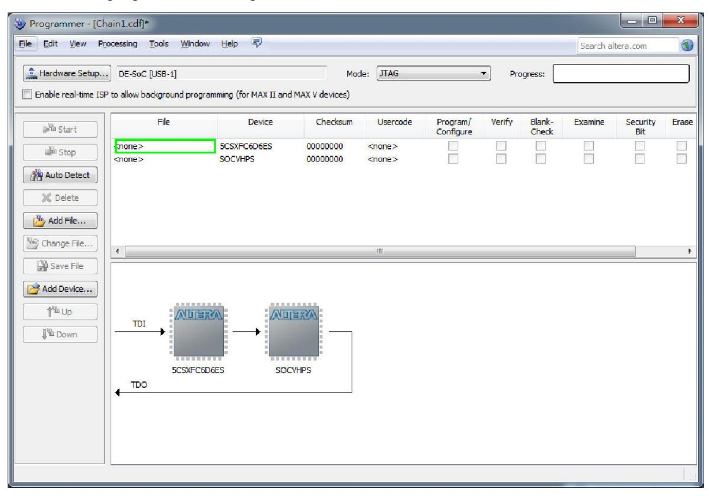

<span id="page-109-0"></span>**Figure 8-6 Quartus II programmer window with two detected devices**


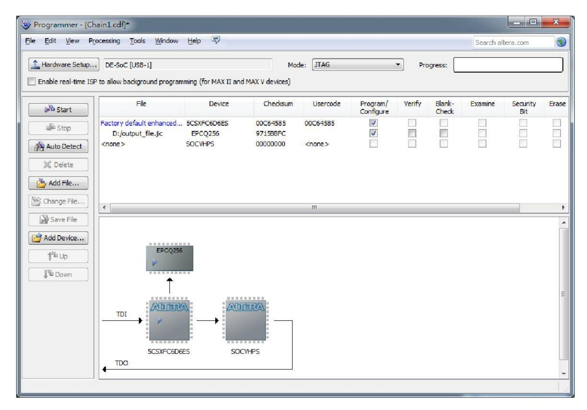

**Figure 8-7 Quartus II programmer window with one JIC file**

## <span id="page-110-1"></span><span id="page-110-0"></span>8.4 Erase the Quad Serial Configuration Device

To erase the existed file in the serial configuration device, follow the steps listed below:

Choose **Programmer** (Tools menu), and the **Chain.cdf** window appears.

Click **Auto Detect**, and then select correct device, both FPGA device and HPS will detected. (See **[Figure 8-6\)](#page-109-0)**

Double click the green rectangle region as shown in **[Figure 8-6](#page-109-0)**, the **Select New Programming File** page will appear, and then select the correct JIC file.

Erase the serial configuration device by clicking the corresponding **Erase** box, a Factory default

110


SFL image will be load (See **[Figure 8-8](#page-111-0)**).

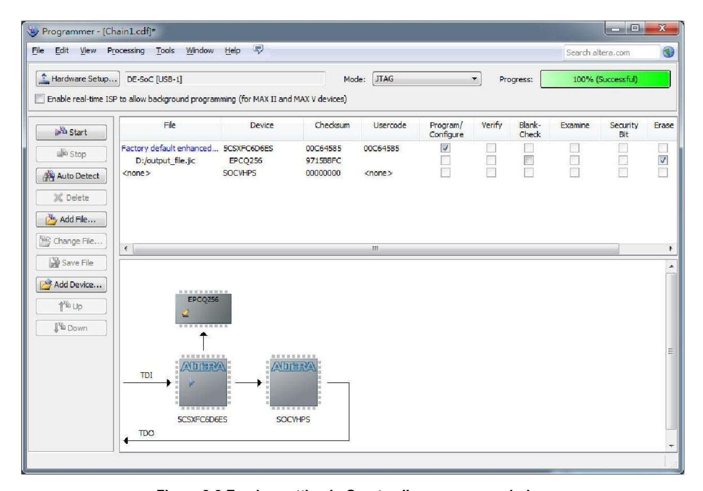

**Figure 8-8 Erasing setting in Quartus II programmer window**

<span id="page-111-0"></span>Click **Start** to erase the serial configuration device.

<span id="page-112-0"></span>

## Chapter 9

## Appendix

## <span id="page-112-1"></span>9.1 Revision History

<span id="page-112-2"></span>

| Version | Change Log                    |  |
|---------|-------------------------------|--|
| V0.1    | Initial Version (Preliminary) |  |
| V0.2    | Add CH5 and CH6               |  |
| V0.3    | Modify CH3                    |  |
| V0.4    | Add CH6 HPS                   |  |

Copyright © 2013 Terasic Technologies. All rights reserved.

112

## **Mouser Electronics**

Authorized Distributor

Click to View Pricing, Inventory, Delivery & Lifecycle Information:

[Terasic](http://www.mouser.com/terasic-technologies): [P0159](http://www.mouser.com/access/?pn=P0159)