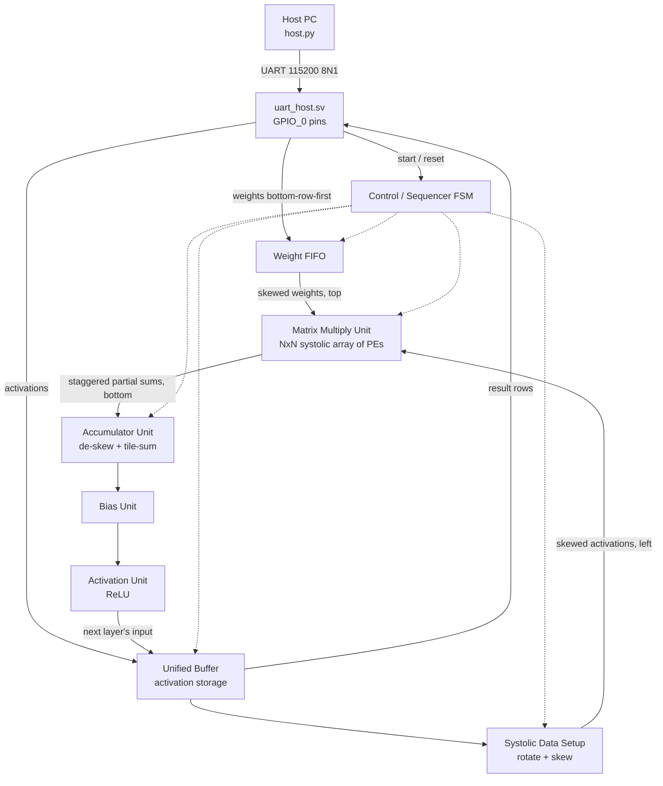

# Reverse-Engineering Google's TPUv1 → DE1-SoC MNIST Inference

Reimplementing the core datapath of Google's first-generation Tensor Processing Unit
(as described in *"In-Datacenter Performance Analysis of a Tensor Processing Unit"*)
as synthesizable SystemVerilog, verifying it in simulation, and deploying it on a
Terasic DE1-SoC (Cyclone V SoC, 5CSEMA5F31C6) to run MNIST digit classification
end-to-end on real hardware.

---

## 1. Status Snapshot

### RTL Modules

| Module | File | Status | Unit Test |
|---|---|---|---|
| Processing Element (PE) | `rtl/pe.sv` | ✅ Implemented | `tests/pe_tb.sv` |
| Matrix Multiply Unit (MMU), 2×2 | `rtl/mmu.sv` | ✅ Implemented | `tests/mmu_tb.sv` |
| Generic FIFO | `rtl/fifo.sv` | ✅ Implemented | `tests/fifo_tb.sv` |
| Weight FIFO | `rtl/weight_fifo.sv` | ✅ Implemented | `tests/weight_fifo_tb.sv` |
| Systolic Data Setup Unit | `rtl/systolic_data_setup.sv` | ✅ Implemented | `tests/systolic_data_setup_tb.sv` |
| Accumulator Unit | `rtl/accumulator.sv` | ✅ Implemented | `tests/accumulator_tb.sv` |
| Bias Unit | `rtl/bias.sv` | ✅ Implemented | `tests/bias_tb.sv` |
| Activation Unit (ReLU) | `rtl/activation.sv` | ✅ Implemented | `tests/activation_tb.sv` |
| Weight Loader | `rtl/weight_loader.sv` | ✅ Implemented | `tests/weight_loader_tb.sv` |
| Unified Buffer | `rtl/unified_buffer.sv` | ✅ Implemented | `tests/unified_buffer_tb.sv` |
| UART RX | `rtl/uart_rx.sv` | ✅ Implemented | `tests/uart_rx_tb.sv` |
| UART TX | `rtl/uart_tx.sv` | ✅ Implemented | `tests/uart_tx_tb.sv` |
| Top-Level FSM (`tpu_top`) | — | ⬜ Not started | — |
| 7-Segment Decoder | — | ⬜ Not started | — |

### Integration Tests

| Test | File | Modules covered | Status |
|---|---|---|---|
| MMU + Accumulator | `tests/mmu_accum_tb.sv` | `mmu`, `accumulator` | ✅ Passing |
| Accumulator + Bias | `tests/accum_bias_tb.sv` | `accumulator`, `bias` | ✅ Passing |
| Bias + Activation | `tests/bias_activation_tb.sv` | `accumulator`, `bias`, `activation` | ✅ Passing |
| Weight FIFO + MMU | `tests/weight_fifo_mmu_tb.sv` | `weight_fifo`, `mmu` | ✅ Passing |
| Weight Loader + FIFO | `tests/weight_loader_fifo_tb.sv` | `weight_loader`, `weight_fifo` | ✅ Passing |
| Full datapath core | `tests/tpu_core_tb.sv` | `unified_buffer`, `weight_fifo`, `systolic_data_setup`, `mmu`, `accumulator`, `bias`, `activation` | ✅ Passing |

### Repo layout
```
TPU/
├── README.md
├── Makefile                          # test automation — one target per testbench, see §1.1
├── run_tests.sh                      # builds + runs every testbench, prints a pass/fail summary
├── rtl/
│   ├── pe.sv                         # single MAC processing element, weight-stationary
│   ├── mmu.sv                        # 2×2 systolic array of PEs
│   ├── fifo.sv                       # generic circular-queue FIFO
│   ├── weight_fifo.sv                # double-buffered weight FIFO; feeds MMU during loading_phase
│   ├── systolic_data_setup.sv        # skews activation rows into MMU from the left
│   ├── accumulator.sv                # de-skews MMU partial-sum outputs into full rows
│   ├── bias.sv                       # adds per-column bias to accumulator output
│   ├── activation.sv                 # ReLU activation unit
│   ├── weight_loader.sv              # dual-port weight ROM → weight_fifo (bottom-row-first)
│   ├── unified_buffer.sv             # double-banked M10K activation store; host + SDS + act-write ports
│   ├── uart_rx.sv                    # 8N1 UART receiver
│   └── uart_tx.sv                    # 8N1 UART transmitter
├── tests/
│   ├── pe_tb.sv                      # self-checking PE testbench
│   ├── mmu_tb.sv                     # self-checking MMU testbench
│   ├── fifo_tb.sv                    # self-checking FIFO testbench
│   ├── weight_fifo_tb.sv             # self-checking weight FIFO testbench
│   ├── systolic_data_setup_tb.sv     # self-checking systolic data setup testbench
│   ├── accumulator_tb.sv             # self-checking accumulator testbench
│   ├── bias_tb.sv                    # self-checking bias unit testbench
│   ├── activation_tb.sv              # self-checking activation unit testbench
│   ├── mmu_accum_tb.sv               # integration: MMU + accumulator
│   ├── accum_bias_tb.sv              # integration: accumulator + bias
│   ├── bias_activation_tb.sv         # integration: bias + activation (with accumulator driver)
│   ├── unified_buffer_tb.sv          # self-checking unified buffer testbench
│   ├── weight_fifo_mmu_tb.sv         # integration: weight FIFO + MMU
│   ├── weight_loader_tb.sv           # self-checking weight loader testbench
│   ├── weight_loader_fifo_tb.sv      # integration: weight loader + weight FIFO
│   ├── uart_rx_tb.sv                 # self-checking UART RX testbench
│   ├── uart_tx_tb.sv                 # self-checking UART TX testbench
│   └── tpu_core_tb.sv                # integration: full datapath (unified_buffer → activation)
└── sim/                              # generated by `make` — gitignored build output
    ├── *.vvp                         # compiled simulation binaries, one per testbench
    ├── *.vcd                         # waveform dumps (testbenches that call $dumpvars)
    └── logs/                         # captured console output per test, e.g. logs/fifo.log
```

### 1.1 Simulation workflow

**Prerequisites** — Icarus Verilog (`iverilog`/`vvp`), and `gtkwave` if you
want to open waveforms via `make wave-<name>`:
```bash
brew install icarus-verilog gtkwave     # macOS
sudo apt install iverilog gtkwave       # Debian/Ubuntu
```

**Run everything:**
```bash
make test            # build + run all 18 testbenches, print a pass/fail summary table
# or, equivalently and usable outside make:
./run_tests.sh
./run_tests.sh fifo mmu     # ...or just a subset
```

**Per-testbench commands** — every testbench gets a matching `build-`,
`test-`, and `wave-` target. RTL dependencies are resolved automatically.

**Other targets:**
```bash
make list      # print every registered test name and its available targets
make clean     # remove sim/ (compiled binaries, logs, waveform dumps)
```

---

## 2. Reference Architecture

The TPUv1 die is organized around one big idea: keep the weights stationary inside a
systolic multiply-accumulate array and stream activations through it, so weights
(which are reused many times) never have to be re-fetched from memory between uses.
The major blocks, and how data moves between them:

- **Host I/O** — in the original TPUv1, a PCIe link to the host and DDR3 channels. In
  this implementation, a 115 200-baud UART over two GPIO pins replaces the PCIe/DDR path.
  A `host.py` Python script sends weights and activations from the PC.
- **Weight FIFO (weight fetcher)** — in the original TPUv1, pulls weight tiles from DRAM.
  Here, weights are streamed over UART and pushed directly into the shadow bank of the
  Weight FIFO, then swapped in before each tile's compute phase.
- **Unified Buffer** — on-chip SRAM holding activations: the layer's input matrix
  going in, and the new layer output coming back in from the activation pipeline.
  This is also what makes multi-layer networks possible — layer *N*'s output becomes
  layer *N+1*'s input without ever leaving the chip.
- **Systolic Data Setup** — reads an activation vector out of the Unified Buffer,
  rotates and skews it, and streams it into the MMU from the left.
- **Matrix Multiply Unit (MXU)** — the systolic array of PEs itself. Each PE holds one
  weight value, multiplies it against a streaming activation, and accumulates a
  partial sum that gets passed to the PE below it.
- **Accumulators** — collect the staggered partial sums exiting the bottom of the
  array, de-skew them back into a proper matrix, and — critically — sum across
  multiple passes when the real weight matrix is larger than the array itself (tiling).
- **Bias unit → Activation unit → Normalize/Pool** — post-processing applied to each
  accumulated output before it's written back into the Unified Buffer as the next
  layer's input.
- **Control / instruction buffer** — sequences all of the above (when to load weights,
  when to stream activations, which tile is active) instead of a testbench wiggling
  signals by hand.



---

## 3. Module Task List

### 3.1 Weight FIFO ✅
- **Input:** a weight matrix (one tile, up to N×N where N is the array dimension),
  either from on-chip BRAM (MNIST-sized weights are small enough to live entirely
  on-chip) or, later, from off-chip DRAM via the HPS.
- **Work done:** buffers the upcoming weight tile and streams it into the MMU from
  the top, skewed by row, asserting `loading_phase`/`capture_weight_*` for exactly N
  cycles. Double-buffered — the *next* tile can be queued while the *current* tile is
  still in use.
- **Output:** `loading_phase`, `capture_weight_col[0..N-1]`, `weight_col[0..N-1]` into
  the MMU's top row.

### 3.2 Systolic Data Setup Unit ✅
- **Input:** an activation matrix read from the Unified Buffer.
- **Work done:** rotates the matrix 90° and skews it so row *i* of the array starts
  receiving data *i* cycles after row 0, then streams it into the MMU from the left
  during the compute phase.
- **Output:** `row_in[0..N-1]` into the MMU's left column.

### 3.3 Accumulator Unit ✅
- **Input:** staggered partial-sum outputs from the bottom of each MMU column.
- **Work done:** un-staggers the outputs back into a proper matrix, and sums results
  across multiple tile passes into a wider running total before handing off to the
  Bias Unit.
- **Output:** the full product matrix, one row per accumulated tile-sum.

### 3.4 Bias Unit ✅
- **Input:** the de-skewed, fully-accumulated output matrix from the Accumulator Unit;
  a per-output-channel bias vector.
- **Work done:** adds the bias term to each accumulated value, per column.
- **Output:** biased pre-activation values.

### 3.5 Activation Unit ✅
- **Input:** biased pre-activation values from the Bias Unit.
- **Work done:** applies ReLU element-wise: `out[c] = max(0, in[c])`.
- **Output:** the finished layer output.

### 3.6 Unified Buffer ✅
- **Input:** activation matrices from the host (input image) or from the Activation
  Unit (layer output).
- **Work done:** double-banked on-chip M10K storage. One bank is read by
  Systolic Data Setup while the other is written by the Activation Unit. Banks swap
  at each layer boundary. Host write/read ports enable ARM pre-loading of input
  activations and readback of results. `act_write_ptr` auto-increments and resets
  on `act_write_addr_reset`. UB read models M10K 2-cycle registered latency.
- **Output:** activation row tiles to Systolic Data Setup; result matrix to host.

### 3.7 UART Host Interface ⬜

Replaces the original AXI4-Lite LWH2F host interface and the ROM-based weight loader with
a single UART command decoder wired to two GPIO pins. A cheap USB-UART adapter
(CP2102/CH340, ~$3) connects the PC directly to the FPGA fabric; no ARM HPS software
or AXI bus is involved.

- **Physical:** `GPIO_0[0]` (PIN_AC18) = FPGA TX, `GPIO_0[1]` (PIN_Y17) = FPGA RX, 3.3 V, 115 200 8N1.
- **Modules:** `rtl/uart_rx.sv` (8N1 receiver) + `rtl/uart_tx.sv` (serializer) + `rtl/uart_host.sv` (command decoder FSM).
- **Protocol:** fixed 4-byte frames `[opcode][addr][d0][d1]`; single-byte ACK per command. Opcodes: WRITE_UB, WRITE_WF, SWAP_WF, START, READ_UB, RESET.
- **Host side:** `host.py` (~100-line Python, `pyserial`) — streams weights and activations, triggers inference, reads results.
- See `docs/uart_host_interface.md` for the full implementation plan.

### 3.9 Top-Level FSM (`tpu_top`) ⬜
- **Work done:** instantiates all modules; sequences IDLE → LOAD_WEIGHTS →
  WEIGHT_DRAIN → STREAM_ACT → WAIT_DRAIN → CHECK_TILE → CHECK_LAYER → DONE;
  drives 7-segment displays (predicted digit), LEDs (status), and connects to
  DE1-SoC physical pins.
- See `docs/tpu_top_fsm.md` for the full implementation plan.

---

## 4. Matrices Bigger Than the Array (Tiling)

A 2×2 (or even 8×8/16×16) array can only natively multiply matrices up to
its own dimension. MNIST layer sizes blow past that immediately — a 784→128 fully
connected layer is a 784×128 weight matrix.

The fix is **tiling**: split the big weight matrix into N×N blocks, run each block
through the array as a separate weight-load + compute pass, and have the Accumulator
Unit sum the partial results from each pass into a wider running total. For a 784×128
layer with an 8×8 array, the contraction dimension alone takes `ceil(784/8) = 98`
tile passes per output tile.

**Bit-width** should be a parameter — the accumulator width (`PSUM_WIDTH`) must be
wide enough to hold the sum of `K/N` partial products without overflow.

---

## 5. Two-Phase → Pipelined

The current design is strictly **load-then-compute**: `loading_phase` blocks compute,
and compute blocks the next weight load. Two follow-on pipelining steps are worth
scoping for later (after the full unpipelined path is verified on hardware):

1. **Double-buffered weights in each PE.** Add a shadow weight register that the
   Weight FIFO can fill while the *current* tile is still computing.
2. **Pipelined Bias + Activation.** Already implemented as registered stages; the
   Unified Buffer write-back adds no stall as long as `act_write_valid` is wired
   directly to `unified_buffer.act_write_*`.

---

## 6. FPGA Target: DE1-SoC Resource Budget

Target device: **Cyclone V 5CSEMA5F31C6** on the Terasic DE1-SoC board.
See `docs/de1_soc_hardware.md` for the full board reference.

| Resource | DE1-SoC (Cyclone V) | 2×2 array estimate | 8×8 array estimate |
|---|---|---|---|
| Adaptive Logic Modules (ALMs) | 32,070 (~85K LE equiv.) | ~500 | ~2,000 |
| M10K block RAM | 553 blocks (707 KB total) | ~2 blocks | ~12 blocks |
| DSP 18×18 MAC blocks | 87 | 4 (one per PE) | 64 (one per PE) |
| Fractional PLLs | 6 | 1 (50→100 MHz) | 1–2 |
| HPS-side DDR3 | 1 GB | not needed for v1 | not needed for v1 |
| FPGA-side SDRAM | 64 MB | not needed for v1 | not needed for v1 |

**MNIST weight memory:** 784×128 + 128×10 ≈ **99 KB** — fits in ~10 M10K blocks,
leaving 543 of the 553 blocks free for the Unified Buffer and other structures.
The entire network runs from on-chip BRAM; no DDR3 plumbing required for v1.

---

## 7. Roadmap

- [x] **Phase 0** — PE + 2×2 MMU implemented and simulated
- [x] **Phase 1** — Self-checking testbenches for all 8 RTL modules; full datapath integration test (`tpu_core_tb.sv`) covering weight_fifo → systolic_data_setup → MMU → accumulator → bias → activation
- [x] **Phase 2** — Unified Buffer: double-banked M10K activation store; host read/write ports; bank-swap interface; testbench; integrated into `tpu_core_tb.sv`
- [ ] **Phase 3** — UART Host Interface: `uart_rx.sv` + `uart_tx.sv` + `uart_host.sv`; 4-byte command protocol (WRITE_UB, WRITE_WF, SWAP_WF, START, READ_UB, RESET); replaces AXI host interface and ROM-based weight loader; testbenches; `host.py` Python driver
- [ ] **Phase 4** — Top-Level FSM (`tpu_top`): sequences LOAD_WEIGHTS → WEIGHT_DRAIN → STREAM_ACT → WAIT_DRAIN → DONE; tile and layer counters; 7-seg digit display; LED status; GPIO UART pin assignments; Quartus project
- [ ] **Phase 5** — Train MNIST MLP in PyTorch, quantize to int8; simulate the full pipeline against real MNIST test images; verify accuracy vs. floating-point reference; stream weights to FPGA via `host.py`
- [ ] **Phase 6** — Synthesize in Quartus Prime Lite targeting 5CSEMA5F31C6; meet timing at 50 MHz; program via USB Blaster II; connect CP2102 USB-UART adapter to GPIO_0 header; run `host.py` to drive end-to-end MNIST inference; verify predicted digit on 7-segment display
- [ ] **Phase 8 (stretch)** — Double-buffered weight pipelining (§5), pipelined bias/activation; scale array to 8×8; explore H2F bridge DMA for bulk weight/activation transfer

---

## 8. Open Design Decisions

- Array dimension (`N`) — bigger reduces tile-pass count but costs LEs/DSPs faster;
  prototype at 4×4 or 8×8 once parameterized.
- Fixed-point widths beyond int8/int16 (accumulator width with deep tiling — see §4).
- MLP-only vs. adding a small conv front end for MNIST.
- UART baud rate — 115 200 is conservative; 921 600 baud cuts weight-load time ~8× and
  is within CP2102/FT232 specs. Tradeoff: tighter timing margin on `CLK_PER_BIT` counter.
- Whether the 7-segment argmax is computed in RTL (zero-latency, ~10 LEs) or
  reported back to the host PC via the UART READ_UB response and computed in `host.py`.
