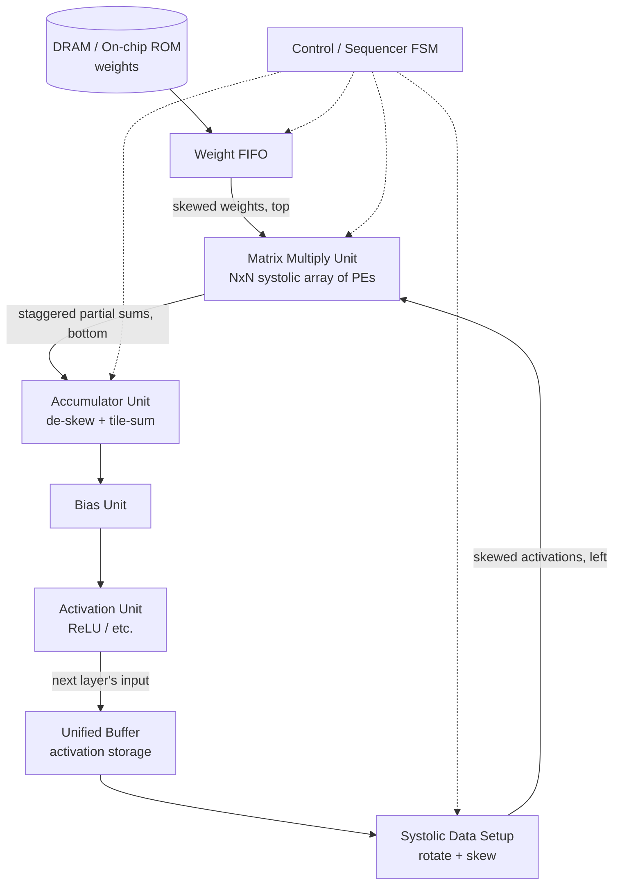

# Reverse-Engineering Google's TPUv1 → DE1-SoC MNIST Inference

Reimplementing the core datapath of Google's first-generation Tensor Processing Unit
(as described in *"In-Datacenter Performance Analysis of a Tensor Processing Unit"*)
as synthesizable SystemVerilog, verifying it in simulation, and deploying it on a
Terasic DE1-SoC (Cyclone V SoC, 5CSEMA5F31C6) to run MNIST digit classification
end-to-end on real hardware.

---

## 1. Status Snapshot

| Module | File | Status | Verification |
|---|---|---|---|
| Processing Element (PE) | `rtl/pe.sv` | ✅ Implemented | `tests/pe_tb.sv`|
| Matrix Multiply Unit (MMU), 2×2 | `rtl/mmu.sv` | ✅ Implemented | `tests/mmu_tb.sv`|
| Weight FIFO | `rtl/weight_fifo.sv` | ✅ Implemented | `tests/weight_fifo_tb.sv` |
| Systolic Data Setup Unit | `rtl/systolic_data_setup.sv` | ✅ Implemented | `tests/systolic_data_setup_tb.sv` |
| Accumulator Unit | `rtl/accumulator.sv` | ✅ Implemented | `tests/accumulator_tb.sv` |
| Bias Unit | `rtl/bias.sv` |  ✅ Implemented | `tests/bias_tb.sv` |
| Activation Unit | — | ⬜ Not started | — |
| Unified Buffer | — | ⬜ Not started | — |
| Control / Sequencer FSM | — | ⬜ Not started | — |
| HPS↔FPGA / host interface | — | ⬜ Not started | — |

### Repo layout
```
TPU/
├── README.md
├── Makefile                          # test automation — one target per testbench, see §1.1
├── run_tests.sh                      # builds + runs every testbench, prints a pass/fail summary
├── rtl/
│   ├── pe.sv                         # single MAC processing element, weight-stationary
│   ├── mmu.sv                        # 2x2 systolic array of PEs
│   ├── fifo.sv                       # fifo queue
│   ├── accumulator.sv                # accumulates mmu outputs
│   ├── systolic_data_setup.sv        # prepares and sends activations into mmu
│   └── weight_fifo.sv                # double buffered weight fifo queues to load weights into mmu
│   └── bias.sv                       # bias unit, adds bias to accumulator output
├── tests/
│   ├── pe_tb.sv                      # self checking PE testbench
│   ├── mmu_tb.sv                     # self checking MMU testbench
│   ├── accumulator_tb.sv             # self checking accumulator testbench
│   ├── fifo_tb.sv                    # self checking fifo queue testbench
│   ├── systolic_data_setup_tb.sv     # self checking systolic data setup unit testbench
│   ├── weight_fifo_tb.sv             # self checking weight fifo unit testbench
│   └── bias_tb.sv                    # self checking bias unit testbench
│   ├── mmu_accum_tb.sv         # self checking mmu + accumulator testbench
│   └── accum_bias_tb.sv              # self checking accumulator + bias testbench
│   ├── weight_fifo_mmu_tb.sv         # self checking weight fifo + mmu testbench
│   └── tpu_core_tb.sv                # self checking weight_fifo + systolic data setup + mmu + accumulators + bias
└── sim/                              # generated by `make` — gitignored build output
    ├── *.vvp                         # compiled simulation binaries, one per testbench
    ├── *.vcd                         # waveform dumps (testbenches that call $dumpvars)
    └── logs/                         # captured console output per test, e.g. logs/fifo.log
```

### 1.1 Simulation workflow

**Prerequisites** — Icarus Verilog (`iverilog`/`vvp`), and `gtkwave` if you
want to open waveforms via `make wave-<name>`:
```bash
brew install icarus-verilog gtkwave     # macOS
sudo apt install iverilog gtkwave       # Debian/Ubuntu
```

**Run everything:**
```bash
make test            # build + run all 9 testbenches, print a pass/fail summary table
# or, equivalently and usable outside make:
./run_tests.sh
./run_tests.sh fifo mmu     # ...or just a subset
```

**Per-testbench commands** — every testbench gets a matching `build-`,
`test-`, and `wave-` target. RTL dependencies are resolved automatically:

| Test name | Testbench file | RTL files compiled in | Compile only | Build + run | Run + open waveform |
|---|---|---|---|---|---|
| `fifo` | `tests/fifo_tb.sv` | `fifo.sv` | `make build-fifo` | `make test-fifo` | `make wave-fifo` |
| `pe` | `tests/pe_tb.sv` | `pe.sv` | `make build-pe` | `make test-pe` | `make wave-pe` |
| `mmu` | `tests/mmu_tb.sv` | `mmu.sv`, `pe.sv` | `make build-mmu` | `make test-mmu` | `make wave-mmu` |
| `accumulator` | `tests/accumulator_tb.sv` | `accumulator.sv`, `fifo.sv` | `make build-accumulator` | `make test-accumulator` | `make wave-accumulator` |
| `systolic_data_setup` | `tests/systolic_data_setup_tb.sv` | `systolic_data_setup.sv` | `make build-systolic_data_setup` | `make test-systolic_data_setup` | `make wave-systolic_data_setup` |
| `weight_fifo` | `tests/weight_fifo_tb.sv` | `weight_fifo.sv`, `fifo.sv` | `make build-weight_fifo` | `make test-weight_fifo` | `make wave-weight_fifo` |
| `accum_mmu` | `tests/accum_mmu_tb.sv` | `mmu.sv`, `pe.sv`, `accumulator.sv`, `fifo.sv` | `make build-accum_mmu` | `make test-accum_mmu` | `make wave-accum_mmu` |
| `weight_fifo_mmu` | `tests/weight_fifo_mmu_tb.sv` | `weight_fifo.sv`, `fifo.sv`, `mmu.sv`, `pe.sv` | `make build-weight_fifo_mmu` | `make test-weight_fifo_mmu` | `make wave-weight_fifo_mmu` |
| `tpu_core` | `tests/tpu_core_tb.sv` | `weight_fifo.sv`, `systolic_data_setup.sv`, `mmu.sv`, `pe.sv`, `accumulator.sv`, `fifo.sv` | `make build-tpu_core` | `make test-tpu_core` | `make wave-tpu_core` |

**Other targets:**
```bash
make list      # print every registered test name and its available targets
make clean     # remove sim/ (compiled binaries, logs, waveform dumps)
```

**Pass/fail detection** follows the convention already used across every
testbench: `$error(...)` on any mismatch ⇒ FAIL, a final
`>>> ... PASSED <<<` banner with zero errors ⇒ PASS. `run_tests.sh` exits
non-zero if anything fails or fails to compile, so it's safe to wire into CI
(e.g. a GitHub Actions step that just runs `./run_tests.sh`). Logs land in
`sim/logs/<name>.log` (simulation output) and `sim/logs/<name>.build.log`
(compile errors only).

**Adding a new testbench:** add its name to `TESTS` in the `Makefile`, list
its RTL dependencies in a `DEPS_<name>` variable, and add the matching
`$(SIM_DIR)/<name>.vvp` build rule — the existing entries are templates to
copy.

> **Toolchain note:** a couple of testbenches (`fifo_tb.sv`, `accumulator_tb.sv`,
> `accum_mmu_tb.sv`) use SystemVerilog `'{...}` array-literal assignment for
> unpacked arrays, which some Icarus Verilog builds only partially support
> (`sorry: Assignment to an entire array... not yet supported`). If a test
> fails to *compile* rather than fails to *pass*, check `iverilog -V` against
> whatever version this was last verified on.

---

## 2. Reference Architecture

The TPUv1 die is organized around one big idea: keep the weights stationary inside a
systolic multiply-accumulate array and stream activations through it, so weights
(which are reused many times) never have to be re-fetched from memory between uses.
The major blocks, and how data moves between them:

- **Off-chip I/O** — a PCIe link to the host, and DDR3 channels that hold weights too
  large to fit on-chip.
- **Weight FIFO (weight fetcher)** — pulls weight tiles from DRAM (or, in our case,
  on-chip block RAM) ahead of when they're needed and streams them into the top of
  the Matrix Multiply Unit, skewed by row so each row's weights land one cycle apart.
- **Unified Buffer** — on-chip SRAM holding activations: the layer's input matrix
  going in, and the new layer output coming back in from the activation pipeline.
  This is also what makes multi-layer networks possible — layer *N*'s output becomes
  layer *N+1*'s input without ever leaving the chip.
- **Systolic Data Setup** — reads an activation vector out of the Unified Buffer,
  rotates and skews it, and streams it into the MMU from the left.
- **Matrix Multiply Unit (MXU)** — the systolic array of PEs itself. Each PE holds one
  weight value, multiplies it against a streaming activation, and accumulates a
  partial sum that gets passed to the PE below it.
- **Accumulators** — collect the staggered partial sums exiting the bottom of the
  array, de-skew them back into a proper matrix, and — critically — sum across
  multiple passes when the real weight matrix is larger than the array itself (tiling).
- **Bias unit → Activation unit → Normalize/Pool** — post-processing applied to each
  accumulated output before it's written back into the Unified Buffer as the next
  layer's input.
- **Control / instruction buffer** — sequences all of the above (when to load weights,
  when to stream activations, which tile is active) instead of a testbench wiggling
  signals by hand.



### Current 2×2 MMU prototype

The `mmu.sv` is the MXU box above, hard-coded to 2×2. The testbench currently plays
the role of the Weight FIFO, Systolic Data Setup, *and* Accumulator all at once — it
manually drives `col0_in`/`col1_in` with skewed weights, manually drives
`row0_in`/`row1_in` with rotated/skewed activations, and dumps the staggered output
without de-skewing it. That's the right way to bring up the MXU in isolation; the
modules below are what take over each of those jobs so the array can eventually run
itself.

---

## 3. Module Task List

### 3.1 Weight FIFO
- **Input:** a weight matrix (one tile, up to N×N where N is the array dimension),
  either from on-chip BRAM (MNIST-sized weights are small enough to live entirely
  on-chip) or, later, from off-chip DRAM via the HPS.
- **Work done:** buffers the upcoming weight tile and streams it into the MMU from
  the top, skewed by row, asserting `loading_phase`/`capture_weight_*` for exactly N
  cycles. In the real TPU this is double-buffered — the *next* tile can be queued
  while the *current* tile is still in use — which is the basis for the pipelining
  work in §5.
- **Output:** `loading_phase`, `capture_weight_col[0..N-1]`, `weight_col[0..N-1]` into
  the MMU's top row.
- **Example (N=2):**
  ```
  Weight matrix:
    [w1, w2]
    [w3, w4]
  
  ```
  ```
  MMU After Loading:
    [w1, w2]
    [w3, w4]
  ```

### 3.2 Systolic Data Setup Unit
- **Input:** an activation matrix read from the Unified Buffer.
- **Work done:** rotates the matrix 90° and skews it so row *i* of the array starts
  receiving data *i* cycles after row 0, then streams it into the MMU from the left
  during the compute phase.
- **Output:** `row_in[0..N-1]` into the MMU's left column.
- **Example (N=2):**
  ```
  Activation matrix:      Step 1 — rotate:      Step 2 — stagger by row:
    [x1, x2]                 [x3, x1]              row0:     x3, x1
    [x3, x4]                 [x4, x2]              row1: x4, x2
  ```

### 3.3 Accumulator Unit
- **Input:** staggered partial-sum outputs from the bottom of each MMU column.
- **Work done:** un-staggers the outputs back into a proper matrix (collect, then
  flip), **and**, when the true weight/activation matrices are bigger than the array
  (see §4), sums results across multiple tile passes into a wider running total
  before handing off to the Bias Unit.
- **Output:** the full product matrix, one row per accumulated tile-sum.
- **Example (N=2):**
  ```
  MMU output (staggered):     Step 1 — collect as matrix:    Step 2 — flip:
         [p4]                      [p3, p4]                    [p1, p2]
     [p3, p2]                      [p1, p2]                    [p3, p4]
     [p1]
  ```

### 3.4 Bias Unit
- **Input:** the de-skewed, fully-accumulated output matrix from the Accumulator Unit;
  a per-output-channel bias vector (one bias value per output column / neuron).
- **Work done:** adds the bias term to each accumulated value, per column. Needs to
  track which output column (and, once tiling is in play, which column-tile) each
  value belongs to so the right bias is added.
- **Output:** biased pre-activation values, same shape as the accumulator output.

### 3.5 Activation Unit
- **Input:** biased pre-activation values from the Bias Unit.
- **Work done:** applies the nonlinearity — ReLU is the obvious choice for hidden
  layers on an MNIST MLP (cheap: just a sign check + mux, no LUT/divider needed).
  The output layer can likely skip activation entirely and let an external `argmax`
  pick the predicted digit, avoiding a softmax implementation altogether.
- **Output:** the finished layer output, written into the Unified Buffer as the next
  layer's input (or, for the final layer, as the result to read out).

### 3.6 Unified Buffer
- **Input:** activation matrices, either the network's external input (e.g. a
  flattened 28×28 MNIST image) or a previous layer's output from the Activation Unit.
- **Work done:** on-chip storage (M10K-backed) for activations between layers.
  Should be double-buffered — one bank being read out to the Systolic Data Setup
  Unit while the other is being written by the Activation Unit — both so a layer's
  output doesn't have to fully land before the next layer can start reading
  (needed for §5 pipelining), and to avoid read/write port conflicts.
- **Output:** activation matrix tiles, addressed by layer / tile index, to the
  Systolic Data Setup Unit.

### 3.7 Control / Sequencer FSM
Everything above is currently driven by hand in a testbench. On real hardware
nothing is poking `loading_phase` from the outside — something on-chip has to: walk
through weight tiles, assert load/compute phases for the right number of cycles,
advance through column-tiles of a wide layer, and signal the Accumulator/Bias/
Activation chain when a tile-sum is final vs. partial. Worth treating as its own
module (a small FSM + tile counters) rather than baking it into the Weight FIFO or
MMU.

---

## 4. Matrices Bigger Than the Array (Tiling)

This is worth calling out explicitly because it changes how the Accumulator Unit has
to work. A 2×2 (or even 8×8/16×16) array can only natively multiply matrices up to
its own dimension. MNIST layer sizes blow past that immediately — a 784→128 fully
connected layer is a 784×128 weight matrix, nowhere close to fitting in a small
array.

The fix (same one the real TPU uses) is **tiling**: split the big weight matrix into
N×N blocks, run each block through the array as a separate weight-load + compute
pass, and have the Accumulator Unit sum the partial results from each pass into a
wider running total (e.g. 32-bit, vs. the 16-bit partial sum your PE currently
carries internally — that 16-bit width only needs to cover one array's worth of
accumulation, not the full 784-deep dot product). Concretely, for a 784×128 layer
with an 8×8 array, the contraction dimension alone takes `ceil(784/8) = 98` tile
passes per output tile.

This also means **bit-width should be a parameter, not a hardcoded width** once you
move past the 2×2 prototype — both array dimension (`ROWS`, `COLS`) and accumulator
width (`PSUM_WIDTH`) should scale with how deep the tiled contraction goes.

---

## 5. Two-Phase → Pipelined

Right now the design is strictly **load-then-compute**: `loading_phase` blocks
compute (PE forces `out_activation`/`out_partial_sum` to 0 while loading), and
compute blocks the next weight load. That's the right way to get the datapath
correct first, but it idles the array during every weight swap, and idles weight
loading during every compute pass.

Two follow-on pipelining steps are worth scoping out for later, both straight from
how the real TPU does it:

1. **Double-buffered weights in each PE.** Add a shadow weight register that the
   Weight FIFO can fill with the *next* tile's weights while the *current* tile is
   still computing, then swap the active register in one cycle on a `weight_swap`
   pulse. This removes the load-blocks-compute stall entirely.
2. **Pipelined Bias + Activation.** Currently implied as a blocking step between
   tiles. Once the Accumulator Unit is emitting one finished row per cycle, the
   Bias and Activation units should be simple combinational-or-1-cycle-pipelined
   stages so they don't stall the Unified Buffer write-back.

Worth treating as a stretch milestone after the full feed-forward path is correct
and verified — get a correct unpipelined version of every module working end-to-end
first, then go back and pipeline.

---

## 6. FPGA Target: DE1-SoC Resource Budget

| Resource | DE1-SoC (Cyclone V 5CSEMA5F31C6) | Relevance here |
|---|---|---|
| Logic elements | ~85K LEs | Array size + control logic |
| Embedded memory | ~4,450 Kbit (~390 M10K blocks, ~556 KB) | Unified Buffer + Weight FIFO storage |
| On-board SDRAM (FPGA side) | 64 MB | Headroom if weights don't fit on-chip |
| HPS-side DDR3 | 1 GB | Training data / larger weight sets via HPS |
| Hard ARM Cortex-A9 (HPS) | dual-core | Could host the control sequencer / image loading in software instead of pure RTL, at least for v1 |

A small MNIST MLP (e.g. 784→128→10, int8 weights) is roughly **101 KB of weights**
total — comfortably inside the ~556 KB of on-chip memory, meaning the Weight FIFO
and Unified Buffer can both be pure on-chip BRAM for the first working version with
no DDR3 plumbing required at all. That's worth treating as the first deployment
target before bothering with off-chip weight fetch.

---

## 7. Roadmap

- [x] **Phase 0** — PE + 2×2 MMU implemented and simulated
- [ ] **Phase 1** — Self-checking `mmu_tb.sv` (port the `check_compute`-style task
      from `pe_tb.sv`); parameterize `mmu.sv`/`pe.sv` for arbitrary `ROWS`×`COLS`
- [ ] **Phase 2** — Accumulator Unit (de-skew/flip + tile-sum) with its own testbench
- [ ] **Phase 3** — Bias Unit + Activation Unit (ReLU) with testbenches
- [ ] **Phase 4** — Unified Buffer + Systolic Data Setup Unit (handles rotation,
      skew, and tiling automatically) with testbenches
- [ ] **Phase 5** — Weight FIFO + Control/Sequencer FSM, replacing manual testbench
      stimulus with self-driven control
- [ ] **Phase 6** — Train MNIST MLP in PyTorch, quantize to int8, export weights/bias
      as `$readmemh`-compatible files; simulate the full pipeline against real MNIST
      test images and check accuracy vs. the floating-point reference model
- [ ] **Phase 7** — Port to a Quartus project targeting the DE1-SoC; map memories to
      M10K; decide on HPS-FPGA bridge vs. switch/button control for v1; display
      predicted digit (7-seg / LEDs / HDMI); validate on physical hardware
- [ ] **Phase 8 (stretch)** — Double-buffered weight pipelining (§5), pipelined
      bias/activation, array size and clock optimization, possibly a small CNN
      front end instead of pure MLP

---

## 8. Open Design Decisions

- Array dimensions (`N`) — bigger reduces tile-pass count but costs LEs/DSPs faster;
  worth prototyping at 4×4 or 8×8 once parameterized, before committing.
- Fixed-point widths beyond the prototype's int8/int16 (esp. accumulator width once
  tiling is in play — see §4).
- MLP-only vs. adding a small conv front end for MNIST.
- Where the sequencer lives: pure RTL FSM vs. leaning on the HPS (ARM Cortex-A9) for
  the top-level control loop and image feed, with RTL only handling the array
  datapath.
- Instruction/tile-descriptor format once the Control FSM exists — even a minimal
  one (tile address, row/col counts, weight-tile pointer) will make Phase 5 much
  cleaner than ad hoc signal sequencing.
